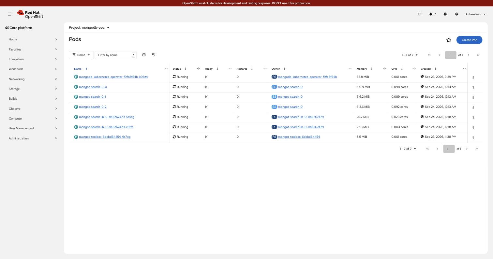

# Demo runbook

**Audience:** anyone running this for the first time. No prior context assumed.
Every command below has its **expected output** underneath — if yours differs, jump to
[§8 Troubleshooting](#8-troubleshooting).

**Time:** ~15 minutes.

---

## 1. What this demonstrates

MongoDB runs **outside** Kubernetes. Search (`mongot`) runs **inside** it, as three pods.
An application talks only to MongoDB — it has never heard of `mongot`.

```text
  application ──▶ MongoDB (external) ──▶ Envoy ──▶ mongot ×3
                       gRPC over one long-lived HTTP/2 connection
```

**The thing worth proving:** `mongod` opens **one** connection, so a normal load balancer
would pin every query to a single `mongot` pod — and it would still *look* healthy. We
prove all three pods actually serve traffic.

---

## 2. Before you start

```bash
cd ~/gitRepos/mongodb-poc
export KUBECONFIG="$HOME/.crc/machines/crc/kubeconfig"
export DOCKER_CONTEXT=colima-bgp-fabric
```

Three checks. All three must pass before continuing.

```bash
oc get mongodbsearch mongot -n mongodb-poc
```
```text
NAME     PHASE     AGE
mongot   Running   3h
```

```bash
oc get pods -n mongodb-poc
```
```text
NAME                                  READY   STATUS    RESTARTS   AGE
mongodb-kubernetes-operator-...       1/1     Running   0          3h
mongot-search-0-0                     1/1     Running   0          20m
mongot-search-0-1                     1/1     Running   0          20m
mongot-search-0-2                     1/1     Running   0          20m
mongot-search-lb-0-...                1/1     Running   0          15m     <- Envoy
mongot-search-lb-0-...                1/1     Running   0          15m     <- Envoy
mongot-toolbox-...                    1/1     Running   0          1h
```

```bash
docker compose -f mongodb/compose.yaml --env-file mongodb/.env ps
```
```text
NAME     IMAGE                                             SERVICE  STATUS
mongo1   docker.io/mongodb/mongodb-community-server:8.3.4-ubi9   mongo1   Up 2 hours
mongo2   docker.io/mongodb/mongodb-community-server:8.3.4-ubi9   mongo2   Up 2 hours
mongo3   docker.io/mongodb/mongodb-community-server:8.3.4-ubi9   mongo3   Up 2 hours
```
(There is no `STATE` column; check `STATUS` reads `Up`.)

> **If `PHASE` is not `Running`**, stop here. Nothing below will work. See §8.

---

## 3. Step 1 — see the platform

<!-- markdownlint-disable MD033 -->

<!-- markdownlint-enable MD033 -->

Seven pods, all `Running`, **`RESTARTS 0`**. The three `mongot` are the search engines;
the two `mongot-search-lb-0-*` are the Envoy proxies that spread queries across them.

<!-- markdownlint-disable MD033 -->

<!-- markdownlint-enable MD033 -->

`Phase: Running` · `Version: 1.70.1` · `LoadBalancer: Running`.

> `LoadBalancer: Running` means Envoy was deployed and promoted. It does **not** mean
> traffic is being balanced — that is what §6 measures.

---

## 4. Step 2 — load the data

Two datasets: **24 curated** documents that the correctness assertions depend on, and
**20,000 generated** ones for load testing.

```bash
cd mongodb
./scripts/load-data.sh          # the curated 24 + both search indexes
```
```text
documents loaded: 24
index requested: default (search)
index requested: vector_index (vectorSearch)
waiting for indexes to become queryable...
QUERYABLE: default, vector_index
```

```bash
./scripts/load-bulk.sh          # + 20,000 generated documents
```
```text
loading 20000 documents from data/bulk-movies.json in batches of 2000
  inserted 20000/20000
  collection count: 20024
  load took 8s
waiting for mongot to index...
  both indexes queryable
```

> **Why this step already tests the path.** Creating a search index is *not* a local
> operation — `mongod` forwards it to the load-balancer endpoint. If you reach
> `QUERYABLE`, the whole chain works.

---

## 5. Step 3 — search it, as an application would

`app/search-cli.sh` talks **only to MongoDB**. It contains no reference to `mongot`,
Envoy or Kubernetes.

> **Flags go before the query.** `-v space -y 1990` will not work — `getopts` stops at
> the first non-flag. The script catches this and tells you.

### Full-text

```bash
cd .. && ./app/search-cli.sh detective
```
```text
  query   : "detective"   mode: text
  corpus  : 20,024 documents
  latency : 24ms   results: 5

  TITLE                         YEAR  GENRE     SCORE
  ------------------------------------------------------------
  The Stolen Verdict 1880       2006  noir      1.5300
  ...
```

### Vector, with a filter

```bash
./app/search-cli.sh -v -y 1990 -n 4 space
```
```text
  query   : "space"   mode: vector   filter: year >= 1990
  corpus  : 20,024 documents
  latency : 131ms   results: 4

  TITLE                         YEAR  GENRE     SCORE
  ------------------------------------------------------------
  The Stolen Season 3814        2006  sci-fi    1.0000
  The Pale Signal 1829          2009  sci-fi    1.0000
  ...
```

**Check two things:** every `GENRE` is `sci-fi` (the vector found the right theme), and
every `YEAR` is ≥ 1990 (the filter is live).

---

## 6. Step 4 — prove the load balancing ★

The important step. Everything so far would look identical if one pod were serving
everything.

```bash
cd mongodb && ./scripts/verify-search.sh
```
```text
=== 1. correctness: $search ===
  PASS  $search "karate" -> The Karate Kid  score=8.308
=== 2. correctness: $vectorSearch (curated corpus) ===
  PASS  The Karate Kid  score=0.9992
  PASS  The Wrestler    score=0.9905
  PASS  Rocky           score=0.9892
=== 2b. correctness: $vectorSearch WITH filter ===
  PASS  filter year>=1980 -> The Thing (1982), Predator (1987), Aliens (1986)
=== 5. distribution (delta per mongot) ===
  mongot-search-0-0       13  #############
  mongot-search-0-1       13  #############
  mongot-search-0-2       14  ##############
  --------------------------------------------
  TOTAL                   40
  PASS  every query accounted for, spread across 3 pods
```

> **Scores move with the corpus.** BM25 relevance depends on collection statistics, so
> `score=8.308` is what you get after `load-bulk.sh`. Before the bulk load it is ~2.3.
> Assert on the *title*, never the score.

### How to read this

| Line | Means |
|---|---|
| roughly equal thirds | ✅ Envoy is distributing per request |
| `40 / 0 / 0` | ❌ **broken** — one pod serving everything |
| `TOTAL` < queries issued | some still in flight, or errors |

The counters come from each `mongot`'s own Prometheus endpoint, snapshotted before and
after — not from the proxy's self-report.

> **The filter assertion is proven by absence.** *Jaws* (1975) is the nearest
> creature-horror match in the corpus. If the `year >= 1980` filter were ignored it would
> appear. It does not.

---

## 7. Step 5 — load test

```bash
./scripts/load-test.sh -c 4 -n 100          # 4 workers x 100 queries
```
```text
=== load test: 4 workers x 100 text queries = 400 total ===
    corpus: 20024 documents

  queries ok : 400   errors: 0
  wall clock : 6.1s      throughput: 65 q/s
  latency ms : min 22  p50 43  p90 93  p99 180  max 218

  distribution across mongot:
    mongot-search-0-0      134  #####
    mongot-search-0-1      133  #####
    mongot-search-0-2      133  #####
    TOTAL                  400
  envoy retries during run: 0
    upstream_rq_timeout: 0
```

Then push it until it hurts:

```bash
./scripts/load-test.sh -c 12 -n 250         # 3,000 queries
```
```text
  queries ok : 3,000   errors: 0
  wall clock : 194.6s     throughput: 15 q/s
  latency ms : min 18  p50 197  p90 1290  p99 16291  max 27590

    mongot-search-0-0     1000  ########################################
    mongot-search-0-1     1000  ########################################
    mongot-search-0-2     1000  ########################################
    TOTAL                 3000
  envoy retries during run: 0
```

### What this tells you

**Distribution stays exact under load** — 1000/1000/1000. Saturation does not break
fairness.

**It degrades in latency, not in errors.** p99 went from 180ms to 16s and throughput
*fell* from 65 to 15 q/s, with **zero errors, retries or timeouts**. That is the expected
shape: `mongot` is capped at 1 CPU per pod here, so 12 concurrent workers queue rather
than fail.

> Do not read 65 q/s as a capacity figure. It is three `mongot` pods limited to 1 CPU
> each on a laptop, against a 20k corpus. Benchmark on real hardware with real data.

Vector queries are heavier — try `-m vector` and expect higher latency.

---

## 8. Troubleshooting

| Symptom | Cause | Fix |
|---|---|---|
| `MongoServerError: ... gRPC channel before deadline` | `mongot`/Envoy restarting, or a cert mismatch | wait 60s; then `oc get pods -n mongodb-poc` |
| All queries on one pod (`40/0/0`) | entry Service selector points at `mongot`, not Envoy | selector must be `app=mongot-search-lb-0` |
| `load-data.sh` hangs before `QUERYABLE` | `mongot` cannot sync from `mongod` | `oc logs mongot-search-0-0 -n mongodb-poc \| grep -i auth` |
| `flags must come BEFORE the query` | `./search-cli.sh -v space -y 1990` | `./search-cli.sh -v -y 1990 space` |
| `upstream connect error`, phase still `Running` | TLS half-configured | see [TLS.md §2](TLS.md) |
| Envoy serving an old certificate | Envoy does not reload certs | `oc rollout restart deploy/mongot-search-lb-0 -n mongodb-poc` |
| `/clusters` returns 403 | expected — MCK restricts the admin listener | use `/stats` |

### Useful one-liners

```bash
# per-pod query counts, from inside the cluster
TB=$(oc get pods -n mongodb-poc -l app=mongot-toolbox -o jsonpath='{.items[0].metadata.name}')
oc exec -n mongodb-poc $TB -- sh -c '
for i in 0 1 2; do printf "mongot-search-0-$i  "
  curl -s http://mongot-search-0-$i.mongot-search-0-svc:9946/metrics \
    | grep "^mongot_command_searchCommandTotalLatency_seconds_count"; done'

# Envoy's own counters
oc exec -n mongodb-poc $TB -- curl -s http://mongot-envoy-stats:9901/stats \
  | grep -E "mongot_rs_cluster\.(upstream_rq_total|upstream_cx_active)"
```

---

## 9. Resetting

```bash
cd mongodb && ./scripts/load-data.sh && ./scripts/load-bulk.sh   # reload from scratch
```

Both scripts drop and recreate the collection, so they are safe to re-run.

To tear the cluster side down completely:

```bash
NS=mongodb-poc
oc delete mongodbsearch mongot -n $NS                      # mongot + Envoy + their PVCs? NO - see below
oc delete svc mongot-grpc-lb mongot-envoy-stats mongod-external -n $NS
oc delete route mongot-grpc -n $NS
oc delete deploy mongot-toolbox -n $NS
oc delete endpointslice mongod-external-v4 -n $NS
# certificates and the CA - none of these are owned by the CR
oc delete certificate --all -n $NS
oc delete secret lab-mongot-search-cert lab-mongot-search-lb-0-cert \
                 lab-mongot-search-lb-0-client-cert external-mongod-cert -n $NS
oc delete configmap external-mongod-ca -n $NS
oc delete clusterissuer enterprise-ca enterprise-selfsigned-bootstrap
oc delete certificate enterprise-root-ca -n cert-manager
# PVCs survive the StatefulSet by design - delete them explicitly to reclaim disk
oc delete pvc -l app=mongot-search-0-svc -n $NS
```

> `mongot-grpc-lb` and `mongot-envoy-stats` have **no ownerReference**, so deleting the
> `MongoDBSearch` leaves them behind holding the VIP. Delete them explicitly.

---

## 10. Where to go next

| Document | For |
|---|---|
| [README.md](README.md) | the architecture and why it is shaped this way |
| [TESTING.md](TESTING.md) | the measurement method in depth |
| [TLS.md](TLS.md) | certificates: cert-manager, enterprise signer, or your own CSRs |
| [DEPLOYMENT.md](DEPLOYMENT.md) | building this from nothing |
| [mongoT-setup.md](mongoT-setup.md) | design notes and operator findings |
