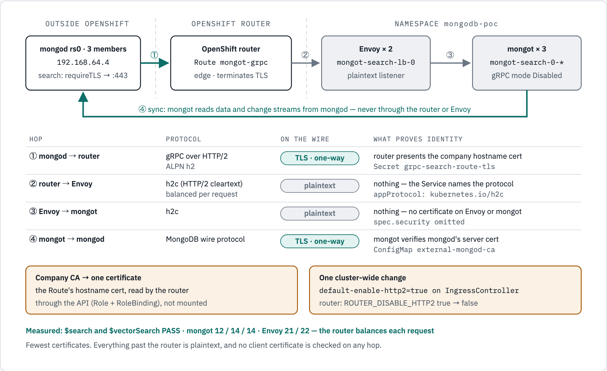

# Enterprise TLS: two options when the company CA signs only hostnames

Two ways to put MongoDB Search behind an OpenShift Route when **the company CA issues
certificates only for hostnames that clients dial**, and never for in-cluster services.
Both were deployed and measured end to end on this lab.

| | **Option 77: edge Route** | **Option 88: passthrough + internal CA** |
|---|---|---|
| Files | `manifests/77-*.yaml` | `manifests/88-*.yaml` + `80-route-passthrough.yaml` |
| Who terminates the client's TLS | the OpenShift router | Envoy |
| Encryption | mongod → router only; **plaintext** inside the cluster | **every hop** |
| mTLS | none | mongod ↔ Envoy and Envoy ↔ mongot |
| Company CA issues | the Route's hostname cert | Envoy's hostname cert + mongod's cert |
| cert-manager issues | nothing | Envoy client cert + mongot cert (namespace `Issuer`) |
| Cluster-wide change | HTTP/2 on the default IngressController | none |
| Balancing across Envoy replicas | **both** (21 / 22) | **pinned** to one (43 / 0) |
| Balancing across mongot | 12 / 14 / 14 | 13 / 13 / 14 |
| Result | **PASS** | **PASS** |

Pick **88** when policy requires encryption and mutual authentication on every hop.
Pick **77** when TLS to the cluster edge is enough and you want the fewest certificates.

> **Environment measured.** CRC on macOS, OpenShift 4.22.7, MongoDB Controllers for
> Kubernetes 1.12.0, `mongot` 1.70.1, CRC at 12 vCPU. The external replica set `rs0` runs
> in colima at `192.168.64.4`. The lab's `enterprise-ca` root stands in for the company CA.
> Every number below comes from these runs; statements taken from reading the operator
> source or the router template, rather than from a run, say so.

---

## 1. Why there are only these two

Of the three Route types (edge, passthrough, reencrypt), **passthrough** and
**reencrypt** keep traffic encrypted all the way to the pod. Only passthrough keeps the
*client's* certificate end to end, because with reencrypt the router decrypts and is the
client on the second leg.

**Reencrypt does not work with the operator's Envoy** (from code and the router template,
not run):

- Envoy's listener hardcodes `RequireClientCertificate: true`
  (`envoy_config_builder.go`, `buildDownstreamTLSTransportSocket`). No CRD field turns it off.
- The router's reencrypt backend line renders as
  `ssl alpn h2,http/1.1 … verifyhost … verify required ca-file …` — it presents **no
  client certificate** (`crt`), and the Route API has no field to give it one.

So the router would verify Envoy and then be refused for having no client certificate.
That leaves passthrough (option 88) for end-to-end, and edge (option 77) for TLS at the
router only.

## 2. One switch, one CA file

Two operator facts drive both designs (operator 1.12.0 source):

- **`spec.security.tls` is a single switch.** `IsTLSConfigured()` is just
  `Security.TLS != nil`, and it turns on TLS for Envoy's listener, Envoy's upstream to
  mongot, and mongot's listener together. They cannot be split.
- **Every verifier reads one CA file.** The ConfigMap in `spec.source.external.tls.ca`
  is mounted into Envoy as `ca-cert` and into mongot as `ca`. Envoy's listener, Envoy's
  upstream, mongot in mTLS mode, and mongot's sync leg all verify against that one
  `ca.crt`.

---

## 3. Option 77 — edge Route, TLS ends at the router

<!-- markdownlint-disable MD033 -->

<!-- markdownlint-enable MD033 -->

*Option 77: one company certificate, on the Route. Everything past the router is plaintext
HTTP/2, and no client certificate is checked on any hop.*

```text
① mongod --TLS one-way, ALPN h2--> router (edge, Secret grpc-search-route-tls)
② router --h2c, balanced per request--> Envoy x2   (Service appProtocol kubernetes.io/h2c)
③ Envoy  --h2c--> mongot x3 :27028                 (no certificates; gRPC mode Disabled)
④ mongot --MongoDB wire protocol, TLS one-way--> mongod   (ConfigMap external-mongod-ca)

company CA -> 1 certificate · cluster-wide change: default-enable-http2=true on IngressController
measured: $search and $vectorSearch PASS · mongot 12 / 14 / 14 · Envoy 21 / 22
```

No certificate on Envoy or mongot. The only certificate in the cluster is the Route's.

### What makes it work

| Piece | Why | Measured |
|---|---|---|
| **HTTP/2 on the IngressController** | without it the router offers no ALPN and gRPC cannot get `h2` | before: `No ALPN negotiated`; after: `ALPN protocol: h2` |
| `appProtocol: kubernetes.io/h2c` on the Service | the router emits `proto h2` to the backend only when this is set | backend line: `… proto h2 check inter 5000ms` |
| `haproxy.router.openshift.io/timeout: 1h` | edge runs HAProxy in HTTP mode, default `timeout server 30s` | backend line: `timeout server  1h` |
| `spec.tls.externalCertificate` + Role/RoleBinding | keeps the key out of the Route; the router reads the Secret with its own service account | the Route API rejects the Route until the router can get/list/watch the Secret |
| CR with **no** `spec.security` | mongot gRPC stays `Disabled`, Envoy gets no cert mounts | mongot `mode: Disabled`, Envoy only `envoy-config`, 0 TLS sockets |
| `spec.source.external.tls.ca` kept | TLS on the sync leg only; mTLS is not switched on because gRPC is not TLS | sync `tls: enabled: true` |

**HTTP/2 is an annotation, not an env var.** The ingress operator owns the router
Deployment and turns the annotation into `ROUTER_DISABLE_HTTP2=false` (measured `true` →
`false` on the new router pod). Setting the env var yourself is reverted. There is no
per-Route switch: it covers every edge/reencrypt Route with its own certificate on that
IngressController; the default certificate stays `no-alpn`.

### Deploy

```bash
NS=mongodb-poc

# 1. HTTP/2 on the default router (cluster-wide)
oc annotate ingresscontroller default -n openshift-ingress-operator \
  ingress.operator.openshift.io/default-enable-http2=true
oc rollout status deploy/router-default -n openshift-ingress --timeout=300s
oc exec -n openshift-ingress deploy/router-default -- printenv ROUTER_DISABLE_HTTP2   # false

# 2. the company hostname certificate - a single serving cert, not a chain
oc create secret tls grpc-search-route-tls -n $NS --cert=grpc-search.crt --key=grpc-search.key

# 3. the three files - the Secret must exist first, the Route API checks it at admission
oc apply -f manifests/77-envoy-h2c-service.yaml
oc apply -f manifests/77-route-edge.yaml
oc apply -f manifests/77-search-plaintext-sync-tls.yaml
```

> **`oc apply` will not remove `spec.security` if it was added with `kubectl patch`.**
> Client-side apply deletes only fields recorded in its last-applied-configuration.
> Measured here: the apply reported `configured` and changed nothing, leaving Envoy on TLS
> behind a router sending h2c. Remove it explicitly:
>
> ```bash
> oc patch mongodbsearch mongot -n $NS --type=json -p '[{"op":"remove","path":"/spec/security"}]'
> ```

### Verify

```bash
openssl s_client -connect <router>:443 -servername grpc-search.apps-crc.testing \
  -alpn h2 -CAfile company-root.crt </dev/null 2>/dev/null | grep -E 'ALPN|Verify return'
#   ALPN protocol: h2
#   Verify return code: 0 (ok)
cd mongodb && ./scripts/verify-search.sh
```

Measured: `$search`, `$vectorSearch` and filtered `$vectorSearch` PASS; 40 queries split
**12 / 14 / 14** across mongot and **21 / 22** across the two Envoy replicas — in HTTP mode
the router balances each gRPC request, not each connection. Envoy's access log shows
`/mongodb.CommandService/UnauthenticatedCommandStream grpc_status=OK`. A query after 75s
idle (router `timeout client 30s`) succeeded in 20ms. **Not measured:** a single query
running longer than 30s.

### What it gives up

Router → Envoy → mongot is plaintext. mongod's client certificate is not checked: the
router does not request one. `IngressController.spec.clientTLS` can require client
certificates, but only per IngressController — `Required` would apply to every edge and
reencrypt Route on it.

---

## 4. Option 88 — passthrough, company cert at the edge, internal CA inside

<!-- markdownlint-disable MD033 -->

<!-- markdownlint-enable MD033 -->

*Option 88: mutual TLS on both search hops. The company CA signs the hostname and mongod
certificates, cert-manager's internal CA signs Envoy's client and mongot's certificates, and
every check inside the cluster reads the two-root `ent-trust-bundle`. The dashed box is a
proposal, not deployed.*

```text
① mongod <--mTLS, ALPN h2, SNI match--> Envoy x2   through the router, never decrypted
     Envoy presents the company hostname cert; mongod presents its company client cert
② Envoy  <--mTLS--> mongot x3 :27028   both certificates from the internal CA
③ mongot --MongoDB wire protocol, TLS one-way--> mongod

issuers: company CA (hostname cert, mongod cert) · cert-manager Issuer internal-ca (Envoy client, mongot)
trust:   ConfigMap ent-trust-bundle = company root + internal root, built by hand
         (proposed, not built: a trust-manager Bundle)
measured: search PASS · mongot 13 / 13 / 14 · Envoy 43 / 0
          only the company root in the bundle: ssl.fail_verify_error 12, every pod still Ready
```

The same topology as `20-tls-search-managed-envoy.yaml`. The CR differs in two fields:

```text
certsSecretPrefix:           lab                -> ent
source.external.tls.ca.name: external-mongod-ca -> ent-trust-bundle
```

Both fields change only which Secrets and CA ConfigMap are mounted, so Envoy's side of the
two mTLS legs is the one [ENVOY-FLOW.md](ENVOY-FLOW.md#figure-1--one-request-config-line-by-line)
walks through, dumped from the `20-` deployment: the SNI filter chain (step 3), the listener's
`DownstreamTlsContext` requiring a client certificate (step 4), and the
`UpstreamTlsContext` toward mongot (step 10).

### Who issues what

| Secret / file | Role | Issuer |
|---|---|---|
| `ent-mongot-search-lb-0-cert` | Envoy server cert; first SAN = `externalHostname` = Route host | **company CA**, imported |
| mongod's certificate (on the mongod hosts) | server + client auth | **company CA** |
| `ent-mongot-search-lb-0-client-cert` | Envoy → mongot client | `internal-ca` (`88-internal-certs.yaml`) |
| `ent-mongot-search-cert` | mongot server | `internal-ca` |
| `ent-trust-bundle` ConfigMap, key `ca.crt` | trust for every in-cluster verifier | company root **+** internal root |

`internal-ca` is a namespace-scoped `Issuer` (`88-internal-ca.yaml`); its root never
leaves the cluster. mongod needs no change: it sees only the company-issued hostname cert.

### The hostname certificate: from the company CA to `ent-mongot-search-lb-0-cert`

This is the one certificate the company CA issues for the cluster. It is the certificate
for the **external hostname** — the name mongod dials — and Envoy presents it to every
mongod connection.

**One name, five places.** They must all be the same string:

| # | Place | Measured on this lab |
|---|---|---|
| 1 | mongod `mongotHost` (`MONGOT_ENDPOINT` in `mongodb/.env`) | `grpc-search.apps-crc.testing:443` |
| 2 | DNS for that name (here `extra_hosts` in `mongodb/compose.yaml`) | → `192.168.64.1`, the router |
| 3 | Route `spec.host` | `grpc-search.apps-crc.testing` |
| 4 | CR `spec.clusters[].loadBalancer.managed.externalHostname` | Envoy filter chain `server_names: ["grpc-search.apps-crc.testing"]` |
| 5 | **the first SAN on this certificate** | `DNS:grpc-search.apps-crc.testing` |

In an enterprise all five are the company FQDN, e.g. `grpc-search.corp.example`, and #2 is
real DNS pointing at the router or F5 VIP.

**1. Request it from the company CA.** Generate the key and a CSR that carries the SAN —
the SAN must be in the CSR, so use a config file ([TLS.md §6.1](TLS.md) has one). What
to ask for:

| Field | Value |
|---|---|
| CN and first DNS SAN | the external hostname, exactly as in #1–#4 |
| `extendedKeyUsage` | `serverAuth`. Envoy's *client* identity is a separate certificate, so this one needs no `clientAuth` — which a public CA would no longer issue anyway |
| Key | PEM, **unencrypted** (Envoy reads `tls.key` directly) |

The company returns the signed leaf and its intermediates. The company **root** goes into
two places: the mongod hosts' `--tlsCAFile` (to verify this certificate) and, because in
this lab the same root also signed mongod, the trust bundle.

**2. Load it under the name the operator reads.** A `kubernetes.io/tls` Secret with
`tls.crt` and `tls.key`. `tls.crt` is served as the chain, so put the leaf **first**, then
the intermediates; leave the root out.

```bash
cat grpc-search.crt company-intermediate.crt > grpc-search-fullchain.crt
oc create secret tls ent-mongot-search-lb-0-cert -n mongodb-poc \
  --cert=grpc-search-fullchain.crt --key=grpc-search.key
```

The name is not free choice in 88: the operator derives `<prefix>-<CR name>-search-lb-<cluster
index>-cert`, here `ent` + `mongot` + `0`. A wrong name is not an error — the operator just
does not find it. `89-tls-search-managed-envoy.yaml` shows how to set the name explicitly,
through the `loadBalancer.managed.deployment` override of the `envoy-server-cert` volume.

**3. How Envoy uses it — measured.** The operator mounts the whole Secret, certificate
**and** key, read-only into Envoy:

```text
Secret ent-mongot-search-lb-0-cert   type kubernetes.io/tls, keys tls.crt,tls.key
  -> volume envoy-server-cert          all keys, readOnly, defaultMode 420 (0644)
  -> /etc/envoy/tls/server/tls.crt     listener certificate_chain
     /etc/envoy/tls/server/tls.key     listener private_key
```

The certificate mongod receives through the passthrough Route has the same SHA-256
fingerprint as the Secret (`6F:14:58:DA:…:D6:F4:BA:98`). Envoy presents it only on the
filter chain whose `server_names` matches `externalHostname`; a different SNI gets no
certificate at all.

**Two things to manage:**

- **The key file is `-rw-r--r--`** inside the Envoy container: the operator sets no
  `defaultMode`, so the Kubernetes default 0644 applies. `merge.Volume` accepts
  `defaultMode` from the `deployment` override. Measured ownership: Envoy runs under the
  `restricted-v2` SCC as UID `1001060000` (from the namespace's range) with supplementary
  group `1001060000`; the Secret files are `uid=0 gid=1001060000` (the pod's `fsGroup`).
  So `0440` keeps Envoy's read access through the group, while `0400` would leave only
  root able to read. Not applied or tested.
- **Renewal is manual and needs an Envoy restart.** There is no cert-manager machinery
  for an imported certificate, and Envoy does not reload a changed Secret. Replace the
  Secret, then `oc rollout restart deploy/mongot-search-lb-0 -n mongodb-poc`. Put the
  expiry on a calendar:

  ```bash
  oc get secret ent-mongot-search-lb-0-cert -n mongodb-poc -o jsonpath='{.data.tls\.crt}' \
    | base64 -d | openssl x509 -noout -subject -enddate -ext subjectAltName
  ```

**In option 77** the same company certificate goes on the **Route** instead
(`grpc-search-route-tls`, referenced by `spec.tls.externalCertificate`). The router reads
it through the API — it is not mounted — which is why 77 needs the Role and RoleBinding,
and the Route CRD asks for a single serving certificate there, not a chain. Envoy has no
certificate in 77, so `ent-mongot-search-lb-0-cert` is not used.

### The trust bundle needs both roots — tested

| Root in `ent-trust-bundle` | Needed for |
|---|---|
| **the CA that signed mongod** | Envoy verifying mongod's client cert; mongot verifying mongod's server cert |
| **the internal CA** | Envoy and mongot verifying each other |

The hostname cert's CA is not needed in the bundle for its own sake — mongod verifies that
cert with its own `--tlsCAFile`. It is in the bundle here only because the same company
root also signed mongod.

Measured with **only the company root** in the bundle, after restarting Envoy and mongot:

| Hop | Result |
|---|---|
| mongod → Envoy | still works; Envoy's acceptable client CAs list only the company root |
| Envoy → mongot | **fails**: `ssl.fail_verify_error: 12`, `upstream_cx_connect_fail: 12`, `ssl.handshake: 0` |
| mongod's search | `HostUnreachable … TLS_error … CERTIFICATE_VERIFY_FAILED` |
| Envoy access log | `grpc=Unavailable flags=URX,UF` |
| Pods | **all Ready** — a trust failure never shows in pod status |

Restoring both roots and restarting brought search back.

### Automating the bundle with trust-manager — not tested here

The deploy steps below build `ent-trust-bundle` by hand (`cat company-root.crt
internal-root.crt`). trust-manager, a cert-manager project since 2021 (v0.1.0 on
2021-11-08; v0.25.0 on 2026-09-11), does that with a `Bundle`.

What it would do for 88. A `Bundle` replaces the manual `cat company-root internal-root > ca.crt`:

```yaml
apiVersion: trust.cert-manager.io/v1alpha1
kind: Bundle
metadata:
  name: ent-trust-bundle              # the target ConfigMap gets this name
spec:
  sources:
  - configMap: { name: company-root-ca, key: ca.crt }   # the company root
  - secret:    { name: internal-root-ca, key: ca.crt }  # cert-manager's internal root
  target:
    configMap: { key: ca.crt }                          # key the MongoDBSearch CR expects
    namespaceSelector:
      matchLabels: { kubernetes.io/metadata.name: mongodb-poc }
```

It re-syncs the target whenever a source changes, so a CA rotation no longer means
rebuilding the file. Two constraints for this design:

1. **Sources must live in the trust-manager namespace.** The docs define `configMap` and
   `secret` sources as *"a … resource in the trust-manager namespace"* (installed into
   `cert-manager`). `88-internal-ca.yaml` creates `internal-root-ca` in `mongodb-poc`, so
   the internal root would have to be issued in the trust-manager namespace instead — the
   way `65-enterprise-ca.yaml` keeps its root in `cert-manager` — and the company root
   stored there as `company-root-ca`.
2. **It updates the ConfigMap, not the pods.** mongot reads certificates only at startup
   (MongoDB FAQ) and Envoy does not reload them (measured, TLS.md section 8), so a bundle
   change still needs both restarted.

**Status on this stack.** The `Bundle` API is still `v1alpha1` and the project is 0.x;
the docs warn that a future release **will** change what an empty `namespaceSelector`
does. On OpenShift, the cert-manager Operator for Red Hat OpenShift ships it as the
trust-manager operand, **Technology Preview**. On this cluster the `Bundle` CRD is already
installed by that operator (`managed-by: cert-manager-operator`, `version: v0.20.3`) but no
trust-manager controller runs, so a `Bundle` would do nothing until the operand is enabled.
The upstream Helm chart (`oci://quay.io/jetstack/charts/trust-manager`) would collide with
that operator-owned CRD here, and is outside Red Hat support.

### Deploy

```bash
NS=mongodb-poc

# 1. the internal CA and the two internal certificates
oc apply -f manifests/88-internal-ca.yaml
oc wait certificate/internal-root-ca -n $NS --for=condition=Ready --timeout=120s
oc apply -f manifests/88-internal-certs.yaml
oc wait certificate/ent-mongot-search-lb-0-client-cert certificate/ent-mongot-search-cert \
  -n $NS --for=condition=Ready --timeout=120s

# 2. the company hostname certificate, under the name the operator derives
oc create secret tls ent-mongot-search-lb-0-cert -n $NS \
  --cert=grpc-search-fullchain.crt --key=grpc-search.key

# 3. the trust bundle: company root + internal root, key ca.crt
oc get secret internal-root-ca -n $NS -o jsonpath='{.data.ca\.crt}' | base64 -d > internal-root.crt
cat company-root.crt internal-root.crt > ca.crt
oc create configmap ent-trust-bundle -n $NS --from-file=ca.crt=ca.crt

# 4. passthrough Route, then the CR
oc apply -f manifests/80-route-passthrough.yaml
oc apply -f manifests/88-tls-search-managed-envoy.yaml
oc rollout restart deploy/mongot-search-lb-0 -n $NS    # Envoy does not reload certificates
```

### Verify

```bash
# Envoy demands a client cert, and names the roots it accepts
openssl s_client -connect <router>:443 -servername grpc-search.apps-crc.testing -alpn h2 \
  </dev/null 2>/dev/null | sed -n '/Acceptable client certificate CA names/,/Requested/p'
cd mongodb && ./scripts/verify-search.sh
```

Measured: Envoy mounts `ent-mongot-search-lb-0-cert`, `ent-…-client-cert` and
`ent-trust-bundle`; mongot runs `mode: mTLS` and presents the internal-CA cert; ALPN `h2`;
**both** roots listed as acceptable client CAs; `$search`, `$vectorSearch` and filtered
`$vectorSearch` PASS; 40 queries **13 / 13 / 14** across mongot; Envoy **43 / 0** —
passthrough pins mongod's one connection to one Envoy, which still spreads requests over
every mongot. Through the search GUI (`95-search-gui.yaml`), six text queries rotated
across pods `1 → 0 → 2 → 1 → 0 → 2`.

### Risks to manage

- **Trust widening.** Envoy's listener has no SAN match, so it accepts a client cert from
  **either** root — measured: both roots listed. Anyone who can use `internal-ca` can
  connect to the front door as if they were mongod. Restrict who may create Certificates
  and use Issuers in the namespace.
- **mongod needs a client certificate** with `clientAuth`. A private company CA can issue
  it. Public CAs are dropping `clientAuth` from TLS certificates: Sectigo and DigiCert
  stopped on 2026-05-01, and the Chrome Root Program requires serverAuth-only for all new
  public TLS certificates from 2027-03-15.
- **Envoy does not reload renewed certificates.** mongot restarts on its own (hash-named
  PEM); Envoy keeps the old certificate until `oc rollout restart deploy/mongot-search-lb-0`.
  The internal certificates last one year and renew 30 days before expiry.
- **Avoiding the two-root bundle** would need the internal CA to be a subordinate of the
  company CA, so the bundle holds only the company root. Not tested.

---

## 5. Where each CA must be trusted

| Place | Option 77 | Option 88 |
|---|---|---|
| CA ConfigMap (`spec.source.external.tls.ca`) | the CA that signed mongod | the CA that signed mongod **+** the internal CA |
| mongod hosts, `--tlsCAFile` | the CA that signed the Route's hostname cert | the CA that signed Envoy's hostname cert |

## 6. Switching between them

The two options share the Route name and host (`mongot-grpc`,
`grpc-search.apps-crc.testing`), so mongod never changes: `mongotHost` stays
`grpc-search.apps-crc.testing:443` with `searchTLSMode=requireTLS`.

| From → to | Steps |
|---|---|
| 77 → 88 | the 88 deploy steps above; `oc apply -f manifests/80-route-passthrough.yaml` removes the edge-only fields |
| 88 → 77 | the 77 deploy steps, including the explicit `oc patch … remove /spec/security` |

HTTP/2 on the router does not affect a passthrough Route, so it can stay on for either.

## 7. Caveats worth knowing

- **Pod readiness does not cover TLS between tiers.** Every pod stayed Ready while search
  was down with `CERTIFICATE_VERIFY_FAILED`. Check with a query or with Envoy's
  `cluster.mongot_rs_cluster.ssl.fail_verify_error`.
- **`verify-search.sh` does not check the spread.** Its PASS line tests only
  `TOTAL >= QUERIES`, so it prints "spread across 3 pods" even when one pod got 0 —
  observed once, right after a rolling restart. Read the per-pod numbers.
- **The operator reports `Running` with 0 mongot.** `clusters[].replicas: 0` reconciles to
  a green status.

See [TLS.md](TLS.md) for the Secret naming contract, the source-TLS coupling, and
certificate rotation in general.

The two figures come from `docs/diagrams/route-tls-options/source.html`, rendered to a
light and a dark PNG each; this document embeds the light one. To change a figure, edit the
page, re-render both PNGs, and update its `alt` text and its `text` twin in the same commit.
