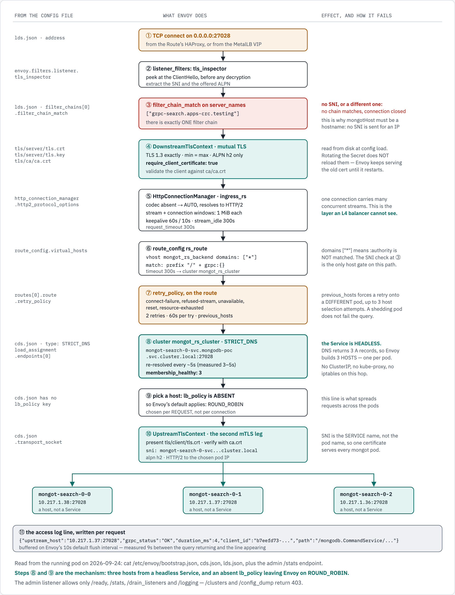
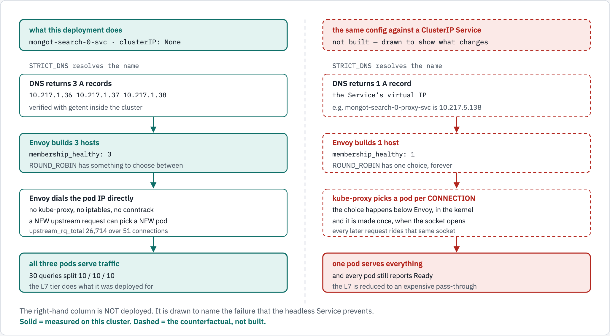

# The Envoy configuration, and what it does to a request

The operator-managed Envoy is configured by three files mounted from a ConfigMap. This
document reads them out of the running pod and walks a single request through them.

> **The question this answers:** does Envoy load balance to the `mongot` **Service** or to the
> **pods**? It balances across the **pods**. `STRICT_DNS` resolves a *headless* Service, which
> returns one A record per pod, and Envoy builds one host per address. No ClusterIP and no
> kube-proxy are involved on that hop.

---

## Getting the config out of the pod

```bash
NS=mongodb-poc
P=$(oc get pods -n $NS -l app=mongot-search-lb-0 -o jsonpath='{.items[0].metadata.name}')

mkdir -p docs/envoy
for f in bootstrap.json cds.json lds.json; do
  oc exec -n $NS "$P" -- cat /etc/envoy/$f | python3 -m json.tool > docs/envoy/$f
done
```

The committed copies are in [`docs/envoy/`](docs/envoy/). They are a snapshot for reading, not
a source of truth — the operator owns the ConfigMap, so re-dump before trusting them.

```bash
oc exec -n $NS "$P" -- ls -R /etc/envoy       # what is actually mounted
```

```text
/etc/envoy:          bootstrap.json  cds.json  lds.json  tls/
/etc/envoy/tls/ca:      ca.crt
/etc/envoy/tls/client:  ca.crt  tls.crt  tls.key      <- Envoy as a CLIENT, to mongot
/etc/envoy/tls/server:  ca.crt  tls.crt  tls.key      <- Envoy as a SERVER, to mongod
```

Two separate keypairs. Both legs are mutually authenticated; neither is cleartext.

### How the three files relate

```text
bootstrap.json    node id envoy-search-proxy, cluster search-proxy
                  admin 0.0.0.0:9901, allow_paths: /ready /stats /drain_listeners /logging
                  dynamic_resources:
                    cds_config -> path /etc/envoy/cds.json  + watched_directory /etc/envoy
                    lds_config -> path /etc/envoy/lds.json  + watched_directory /etc/envoy

lds.json          listener mongod_listener on 0.0.0.0:27028
                    listener_filters: tls_inspector
                    filter_chains[0].filter_chain_match.server_names
                    filter_chains[0].transport_socket  (DownstreamTlsContext)
                    filters[0] http_connection_manager -> route_config -> retry_policy

cds.json          cluster mongot_rs_cluster, type STRICT_DNS
                    load_assignment -> the headless Service FQDN
                    transport_socket (UpstreamTlsContext)
```

**`watched_directory` matters, and it is about filenames.** Envoy watches `/etc/envoy` and
reloads `cds.json` / `lds.json` when the ConfigMap changes — no restart needed. The
**certificates do not work this way**: they are referenced by filename inside the TLS contexts
and read when the config loads.

The difference between Envoy and `mongot` here is entirely in how their Secrets project:

```text
Envoy    secret lab-mongot-search-lb-0-cert        -> /etc/envoy/tls/server/tls.crt, tls.key
mongot   secret mongot-search-certificate-key      -> /var/lib/tls/server/c515fd27...af5.pem
```

`mongot`'s PEM is **named after its content hash**, so rotating it produces a *different
filename*; the operator updates the pod spec, and the pod restarts with the new certificate.
Envoy's filenames are **fixed** — `tls.crt` and `tls.key` — so after a rotation the bytes on
disk differ but nothing Envoy watches has changed. No config change, no reload, and Envoy keeps
presenting the old certificate.

That is the failure seen after a CA rotation, and why [TLS.md](TLS.md) calls for an explicit
`oc rollout restart deploy/mongot-search-lb-0`.

---

## Figure 1 — one request, config line by line

<!-- markdownlint-disable MD033 -->
<picture>
  <source media="(prefers-color-scheme: dark)" srcset="docs/diagrams/envoy-flow/request-lifecycle.dark.png">
  <source srcset="docs/diagrams/envoy-flow/request-lifecycle.light.png">
  
</picture>
<!-- markdownlint-enable MD033 -->

```text
 (1) TCP connect 0.0.0.0:27028                    lds.json . address
      |
 (2) listener_filters: tls_inspector              peek at the ClientHello, pre-decryption
      |                                           extract SNI and offered ALPN
 (3) filter_chain_match.server_names              ["grpc-search.apps-crc.testing"]
      |                                           ONE filter chain exists
      |   no SNI, or a different one -> NO chain matches -> connection closed
      |   (this is why mongotHost must be a hostname: no SNI is sent for an IP literal)
      v
 (4) DownstreamTlsContext                         TLS 1.3 exactly (min == max), ALPN h2
      |                                           require_client_certificate: true
      |                                           server cert tls/server/*, trust tls/ca/ca.crt
      v
 (5) HttpConnectionManager  stat_prefix ingress_rs
      |   codec_type absent -> AUTO -> HTTP/2
      |   initial_stream_window_size = initial_connection_window_size = 1 MiB
      |   connection_keepalive 60s / 10s, stream_idle_timeout 300s, request_timeout 300s
      |   <- one connection, many concurrent streams: the layer an L4 balancer cannot see
      v
 (6) route_config rs_route                        vhost mongot_rs_backend, domains ["*"]
      |                                           match { prefix "/", grpc {} }
      |                                           timeout 300s -> cluster mongot_rs_cluster
      |   domains ["*"] means :authority is NOT matched - step (3) is the only host gate
      v
 (7) retry_policy (on the route)
      |   retry_on: connect-failure, refused-stream, unavailable, reset, resource-exhausted
      |   num_retries 2, per_try_timeout 60s
      |   retry_host_predicate: previous_hosts, host_selection_retry_max_attempts 3
      |   <- a retry lands on a DIFFERENT pod; a shedding pod does not fail the query
      v
 (8) cluster mongot_rs_cluster  type STRICT_DNS   cds.json
      |   mongot-search-0-svc.mongodb-poc.svc.cluster.local:27028
      |   HEADLESS -> DNS returns 3 A records -> Envoy builds 3 HOSTS
      |   re-resolved continuously (measured 3-5s apart; no dns_refresh_rate set,
      |   so Envoy's 5s default applies).  membership_healthy: 3
      v
 (9) pick a host                                  lb_policy is ABSENT from cds.json
      |   -> Envoy's default, ROUND_ROBIN, chosen per REQUEST, not per connection
      v
(10) UpstreamTlsContext                           present tls/client/tls.crt, verify with ca.crt
      |   sni: mongot-search-0-svc.mongodb-poc.svc.cluster.local   (the SERVICE name)
      |   alpn h2 -> HTTP/2 straight to the chosen POD IP
      v
     mongot-search-0-0        mongot-search-0-1        mongot-search-0-2
     10.217.1.38:27028        10.217.1.37:27028        10.217.1.36:27028

(11) one access-log line per request, carrying upstream_host
     buffered on Envoy's 10s default flush interval (measured 9s)
```

Steps **(8)** and **(9)** are the mechanism: three hosts from a headless Service, and an
absent `lb_policy` leaving Envoy on its round-robin default.

---

## Figure 2 — why it must be the headless Service

<!-- markdownlint-disable MD033 -->
<picture>
  <source media="(prefers-color-scheme: dark)" srcset="docs/diagrams/envoy-flow/headless-vs-clusterip.dark.png">
  <source srcset="docs/diagrams/envoy-flow/headless-vs-clusterip.light.png">
  
</picture>
<!-- markdownlint-enable MD033 -->

```text
  headless Service (what is deployed)        |  ClusterIP Service (the counterfactual)
  mongot-search-0-svc, clusterIP: None       |  not built - drawn to name the failure
  -------------------------------------------|------------------------------------------
  DNS -> 3 A records                          |  DNS -> 1 A record (the virtual IP)
     10.217.1.36 .37 .38                      |     e.g. 10.217.5.138
  Envoy builds 3 hosts                        |  Envoy builds 1 host
     membership_healthy: 3                    |     membership_healthy: 1
  Envoy dials the pod IP directly             |  kube-proxy picks a pod per CONNECTION,
     no kube-proxy, no iptables, no conntrack |     in the kernel, once, at socket open
     a new request can pick a new pod         |     every later request rides that socket
  ALL THREE pods serve traffic                |  ONE pod serves everything
     30 queries split 10 / 10 / 10            |     and every pod still reports Ready
```

This is one form of [the failure that produces no
error](README.md#the-failure-that-produces-no-error). Point the same Envoy config at a ClusterIP
Service and it forwards every request to the same pod. Readiness probes stay green, because
nothing is unhealthy.

Two other Services select the Envoy pods rather than the mongot pods, and neither is what
Envoy dials: `mongot-search-lb`, the headless Service the Route targets, and the operator's
own `mongot-search-0-proxy-svc` (`10.217.5.138`, ClusterIP). Both sit **in front of** Envoy.

---

## Reading it live

The MCK Envoy restricts its admin listener to four paths, so `/clusters` and `/config_dump`
return 403. `/stats` is the one that matters:

```bash
P=$(oc get pods -n mongodb-poc -l app=mongot-search-lb-0 -o jsonpath='{.items[0].metadata.name}')
IP=$(oc get pod -n mongodb-poc "$P" -o jsonpath='{.status.podIP}')
TB=$(oc get pods -n mongodb-poc -l app=mongot-toolbox -o jsonpath='{.items[0].metadata.name}')
oc exec -n mongodb-poc "$TB" -- curl -s http://$IP:9901/stats \
  | grep -E '^cluster\.mongot_rs_cluster\.(membership|upstream_rq_total|update_)'
```

```text
cluster.mongot_rs_cluster.membership_degraded: 0
cluster.mongot_rs_cluster.membership_healthy: 3      <- one host per mongot pod
cluster.mongot_rs_cluster.membership_total: 3
cluster.mongot_rs_cluster.update_failure: 0
cluster.mongot_rs_cluster.update_success: 1622       <- continuous DNS re-resolution
cluster.mongot_rs_cluster.upstream_rq_total: 26714
```

| Stat | Reads as |
|---|---|
| `membership_healthy` | how many pods Envoy can choose between — 3 means every pod is selectable |
| `membership_total` − `healthy` | pods resolved but failing health checks |
| `update_success` climbing | DNS is being re-resolved, so pod restarts are picked up |
| `update_failure` non-zero | DNS is broken; membership is frozen at its last good answer |
| `upstream_rq_total` | requests forwarded — compare against the sum of the per-pod counters |
| `upstream_cx_active` | **not a health signal.** 0 is normal between bursts; `idle_timeout` is 300s |

To confirm the resolution itself:

```bash
oc exec -n mongodb-poc "$TB" -- \
  getent ahostsv4 mongot-search-0-svc.mongodb-poc.svc.cluster.local | awk '{print $1}' | sort -u
```

```text
10.217.1.36
10.217.1.37
10.217.1.38
```

Three addresses, one per pod. If this ever returns a single address, the Service has stopped
being headless and the L7 tier has quietly become a pass-through.

---

## What would break each step

| Change | Symptom |
|---|---|
| `mongotHost` set to an IP | no SNI sent → no filter chain matches → connection closed at the TLS handshake |
| Route host ≠ `server_names` | same: the chain never matches |
| Route switched to `edge` / `reencrypt` | no HTTP/2 at the router, and `timeout server` 30s cuts search cursors |
| Certificate Secret rotated, no restart | Envoy keeps serving the old certificate — `watched_directory` covers the JSON, not the PEMs |
| `mongot-search-0-svc` given a ClusterIP | `membership_healthy: 1`; one pod serves everything, nothing alerts |
| `lb_policy` set to something sticky | round robin lost; distribution collapses toward one pod |
| `previous_hosts` removed | retries can land on the same shedding pod they just failed on |

The test suite asserts the ones that are cheap to check; `./test/run.sh tls` and
`./test/run.sh distribution` cover the first, fourth and fifth rows.

---

## Diagram sources

```bash
python3 ~/.claude/skills/visual/render.py \
  docs/diagrams/envoy-flow/source.html \
  docs/diagrams/envoy-flow \
  request-lifecycle,headless-vs-clusterip
```

Names are assigned in **DOM order**; see [Diagram sources](README.md#diagram-sources).
