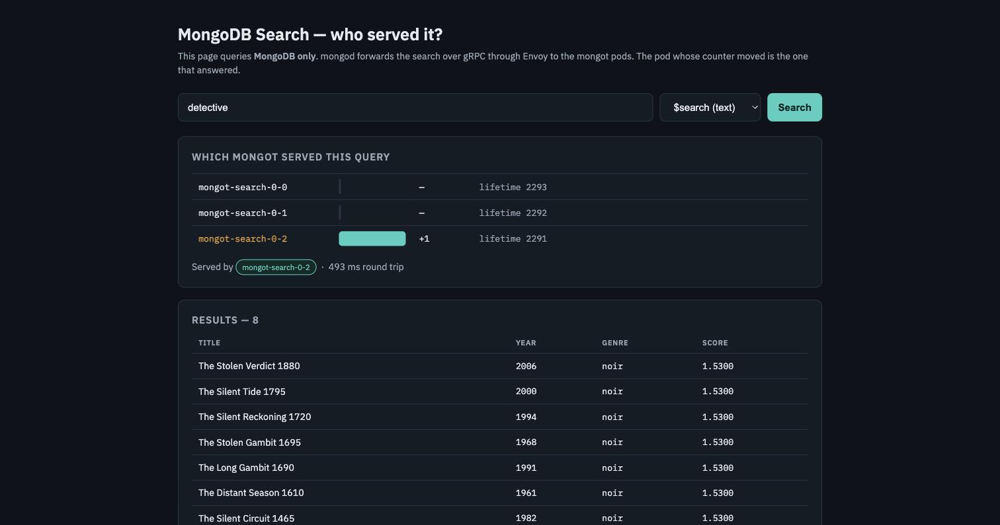
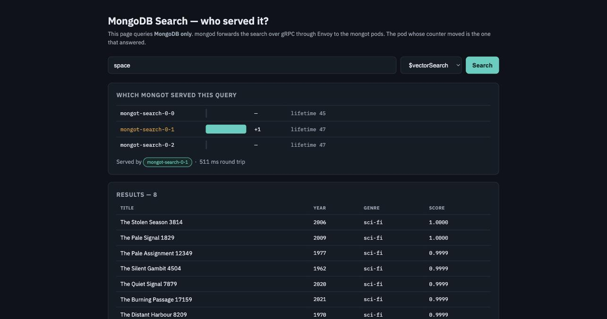
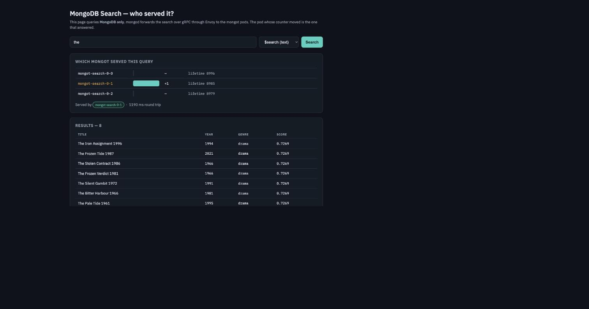
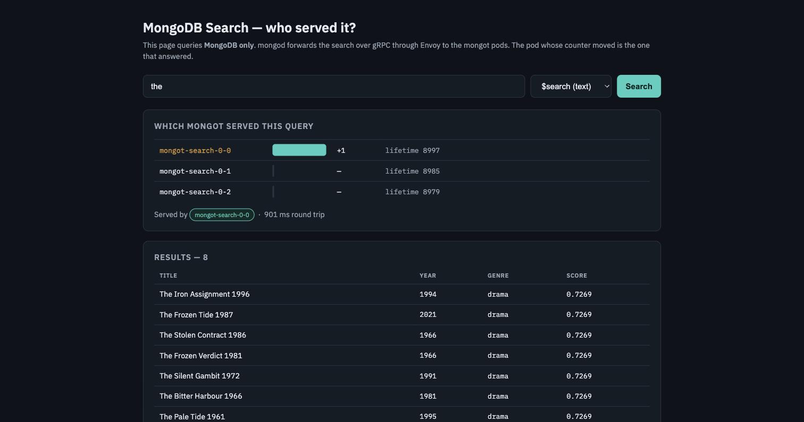
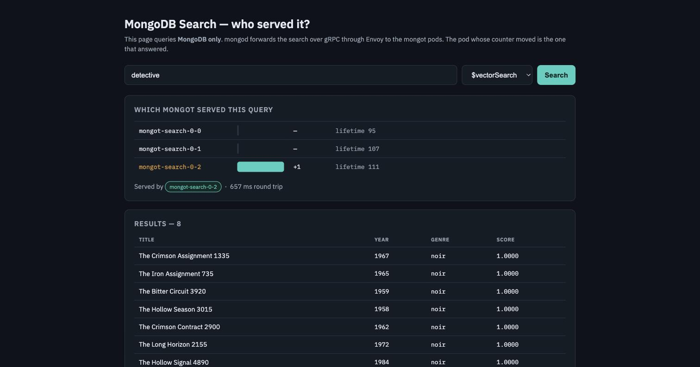
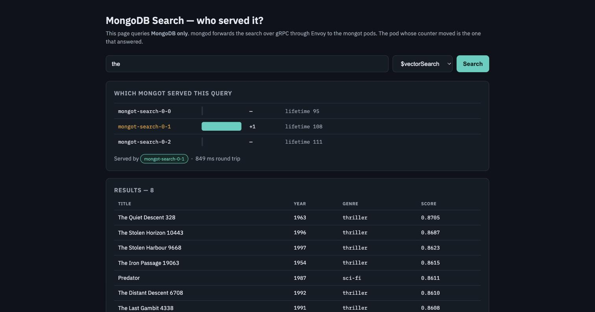
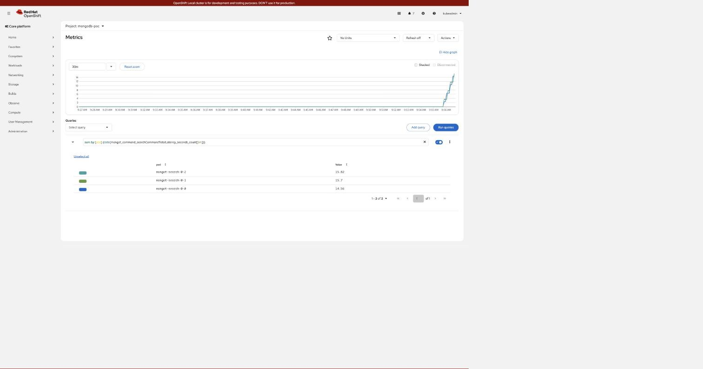
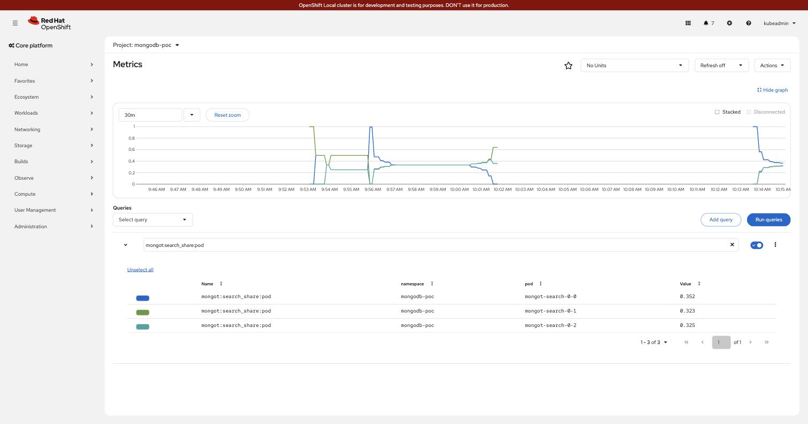
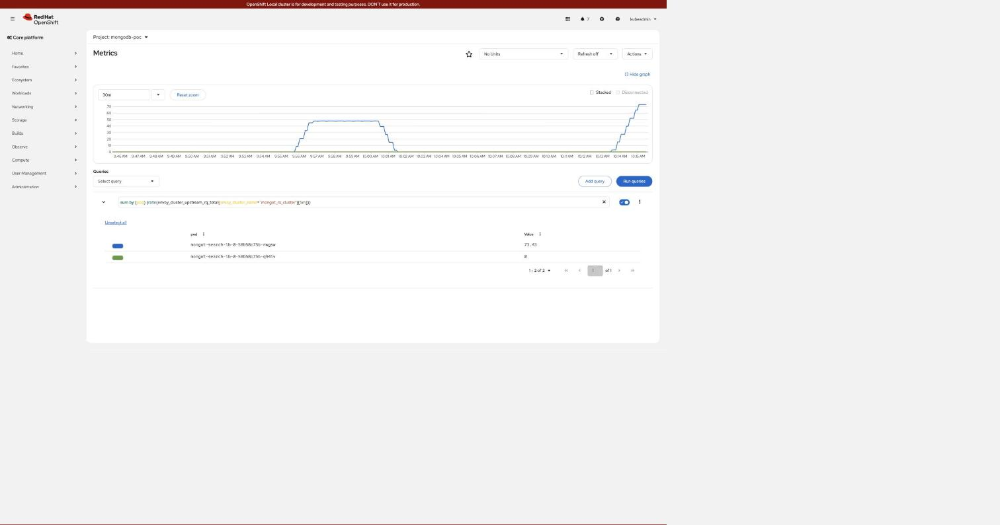

# Seeing request distribution to the `mongot` pods

Three ways to watch traffic reach the search pods, from a live graph down to individual
requests. Use the graph to monitor, the access log to debug.

---

## 0. First, the data

Nothing below shows anything until the corpus exists and `mongot` has indexed it. Two
datasets with different jobs — see [`mongodb/data/README.md`](mongodb/data/README.md).

```bash
cd mongodb
./scripts/load-data.sh          # 24 curated documents + both search indexes
./scripts/load-bulk.sh          # + 20,000 generated, for volume
```

```text
documents loaded: 24
index requested: default (search)
index requested: vector_index (vectorSearch)
waiting for indexes to become queryable...
QUERYABLE: default, vector_index

loading 20000 documents from data/bulk-movies.json in batches of 2000
  inserted 20000/20000
  collection count: 20024
  load took 8s
waiting for mongot to index...
  both indexes queryable
```

Confirm what you have:

```text
documents : 20,024
curated   : 24       (_id 1-24, the correctness assertions depend on these)
bulk      : 20,000   (_id >= 1001, volume for load testing)

default        queryable=true   status=READY
vector_index   queryable=true   status=READY
```

> **Creating an index is itself a test of the whole path.** It is not a local operation —
> `mongod` forwards it to `searchIndexManagementHostAndPort`, so the call traverses the
> VIP (or Route) and Envoy exactly as a query does. Reaching `QUERYABLE` means the chain
> works before you have run a single search.

> **Why two datasets.** The curated 24 are positioned so nearest-neighbour ordering is
> assertable. The bulk 20,000 are generated from the *same five theme vectors*, so an
> unscoped vector assertion would start failing once they are loaded — which is why the
> assertions filter on `_id < 25`, and why `vector_index.json` declares `_id` as a filter
> field.

---

## 1. The GUI — trigger a request and watch it land

The most direct answer to "show me a request going from MongoDB to `mongot`": type a
query, get results, and see **which pod answered**.

```bash
oc apply -f manifests/95-search-gui.yaml
echo "https://$(oc get route mongot-gui -n mongodb-poc -o jsonpath='{.spec.host}')"
#   https://mongot-gui-mongodb-poc.apps-crc.testing
```

<!-- markdownlint-disable MD033 -->

<!-- markdownlint-enable MD033 -->

```text
WHICH MONGOT SERVED THIS QUERY
  mongot-search-0-0      —     lifetime 2293
  mongot-search-0-1      —     lifetime 2292
  mongot-search-0-2     +1     lifetime 2291      <- served by
  Served by mongot-search-0-2 · 493 ms round trip
```

**Search again and a different pod lights up.** Same query, `$vectorSearch` this time:

<!-- markdownlint-disable MD033 -->

<!-- markdownlint-enable MD033 -->

That alternation **is** the load balancing — one request at a time, visible.

### Linkable queries

The GUI reads its state from the query string, so a search is a URL you can paste into a
ticket, a runbook or a chat message and have someone land on the same result:

```text
https://mongot-gui-mongodb-poc.apps-crc.testing/?q=the&mode=text
https://mongot-gui-mongodb-poc.apps-crc.testing/?q=detective&mode=vector
```

The same URL, loaded twice in a row. Nothing changed but the pod that answered:

<!-- markdownlint-disable MD033 -->


<!-- markdownlint-enable MD033 -->

```text
first load    mongot-search-0-1   +1   lifetime 8985   1190 ms
second load   mongot-search-0-0   +1   lifetime 8997    901 ms
```

Same query, same URL, same eight results — a different pod each time. That is the round
robin at step (9) of [ENVOY-FLOW.md](ENVOY-FLOW.md), one request at a time.

| Parameter | Values | Default |
|---|---|---|
| `q` | any string | empty — the page renders with no query run |
| `mode` | `text` or `vector` | `text`; **anything that is not exactly `vector` is treated as text** |

There is also `/healthz`, which returns `ok` and runs no query. It is what the Deployment's
`readinessProbe` hits (`httpGet: { path: /healthz, port: 8080 }`) — so it must stay cheap.

What each mode issues, from `app/gui/server.py`:

```text
mode=text     $search       index "default",      path {wildcard: "*"}
mode=vector   $vectorSearch index "vector_index", path "plot_embedding",
                            numCandidates 200, limit 8
```

The pod attribution panel follows the mode, reading
`mongot_command_searchCommandTotalLatency_seconds_count` for text and
`...vectorSearchCommandTotalLatency_seconds_count` for vector. Using the wrong counter is why
a vector query can look like it served nothing — see [TESTING.md](TESTING.md).

**It searches the film corpus**, `sample_mflix.movies` — not `platform_ops.incidents`. The
incident corpus from [USECASE.md](USECASE.md) is queried through
`app/trace-query.sh`, not this GUI. Both are overridable by the `DB` and `COLL` environment
variables in `manifests/95-search-gui.yaml`.

### One honest limit of `mode=vector`

This GUI has **no embedding model**. Vector mode looks the query up in a small hand-written
table and falls back to a uniform vector when it misses:

```python
vec = THEMES.get(q.lower().strip(), [0.2, 0.2, 0.2, 0.2, 0.2])
```

The table knows exactly ten words, mapping to five themes:

| Query | Theme |
|---|---|
| `underdog`, `karate` | the Karate Kid axis |
| `americana`, `baseball` | small-town Americana |
| `creature`, `horror` | creature features |
| `space`, `astronaut` | science fiction |
| `noir`, `detective` | film noir |

Anything else — `?q=the&mode=vector`, for example — returns `[0.2, 0.2, 0.2, 0.2, 0.2]`, which
is equidistant from every theme. **It does not fail. It returns eight results in a
meaningless order**, and the pod-attribution panel still works, because the request really did
travel `mongod` → Envoy → `mongot` and come back.

The difference is visible side by side — a word the table knows, against one it does not:

<!-- markdownlint-disable MD033 -->


<!-- markdownlint-enable MD033 -->

```text
?q=detective&mode=vector   8 results, ALL noir,          every score 1.0000
?q=the&mode=vector         8 results, thriller + sci-fi, scores 0.8608 - 0.8705
```

`detective` lands exactly on the noir axis, so eight noir films score a perfect 1.0. `the`
lands nowhere, so the ranking is arbitrary — but the lifetime counters moved in both cases.
The *transport* works perfectly; only the *ranking* is meaningless.

That is fine for what this GUI is for — showing one request landing on one pod — but the
*ranking* in vector mode is only meaningful for those ten words. Real semantic search needs an
embedding model; the hand-set vectors in `mongodb/data/incidents.json` are the same
simplification, documented in [USECASE.md](USECASE.md).


### How it works, and why that matters

**The app connects only to MongoDB.** Its single data dependency is `MONGO_URI`,
pointing at the external replica set. It contains no reference to `mongot`, Envoy, the
VIP or the Route — `mongod` forwards the `$search` stage over gRPC, exactly as a real
application would.

```text
GUI ──▶ mongod (outside the cluster) ──one long-lived HTTP/2 conn──▶ Envoy ──▶ mongot ×3
```

The per-pod attribution is done by reading each `mongot`'s Prometheus counter
immediately **before and after** the query — the pod whose counter moved is the one that
answered. That is observability, deliberately separate from the data path.

It switches metric with the mode (`searchCommand…` for text,
`vectorSearchCommand…` for vector), which is why the lifetime numbers differ between the
two screenshots.

**No build, no registry, no dependencies.** It runs on the
`mongodb-community-server` image, which already ships `python3` and `mongosh`; the code
is mounted from a ConfigMap. Point it at another corpus with `DB` and `COLL`.

---

## 2. The console graph (best for watching)

<!-- markdownlint-disable MD033 -->

<!-- markdownlint-enable MD033 -->

```text
sum by (pod) (rate(mongot_command_searchCommandTotalLatency_seconds_count[5m]))

mongot-search-0-2   15.82 req/s
mongot-search-0-1   15.70 req/s     three lines, one per pod, essentially superimposed
mongot-search-0-0   14.56 req/s
                    ------------
                    46.08 req/s     the three summed
```

**Read the window, not the burst.** That run issued 13,663 queries in 60 seconds — about
228 q/s while it lasted. The graph shows ~46 because `rate(...[5m])` averages over 300
seconds: `13663 / 300 = 45.5`, which is what the three lines sum to. A `[5m]` window will
always understate a short burst by roughly the ratio of burst length to window length.

**Three lines sitting on top of each other is the proof.** One line carrying everything while
two sit at zero is the [L4 bypass](README.md#the-failure-that-produces-no-error) — and note
that in that failure every pod still reports `Ready`, so this graph is the only place it shows.

**Open it directly** — CRC, already URL-encoded:

```text
https://console-openshift-console.apps-crc.testing/monitoring/query-browser?query0=sum%20by%20%28pod%29%20%28rate%28mongot_command_searchCommandTotalLatency_seconds_count%5B5m%5D%29%29
```

Or: **Observe → Metrics**, then paste:

```promql
sum by (pod) (rate(mongot_command_searchCommandTotalLatency_seconds_count[5m]))
```

`[5m]` is what the capture above used — it smooths well for a screenshot. Drop to `[2m]` when
you are watching live and want the lines to react quickly, or to `[1m]` to see a single burst.
Vector queries need the other counter, `...vectorSearchCommandTotalLatency_seconds_count`; a
`$vectorSearch` load read through the text counter looks like no traffic at all.

### The share, as a recording rule

Rates are hard to compare at a glance. `mongot:search_share:pod`, from
[`manifests/96-alerts.yaml`](manifests/96-alerts.yaml), normalises them to a fraction of total:

<!-- markdownlint-disable MD033 -->

<!-- markdownlint-enable MD033 -->

```promql
mongot:search_share:pod
```

```text
mongot-search-0-0   0.352
mongot-search-0-1   0.323          three shares, summing to 1.0
mongot-search-0-2   0.325
```

**The wild swings on the left of that graph are not a fault.** When almost nothing is being
queried, one stray request makes a pod's share 1.0 and the others 0. That is why
`MongotTrafficNotDistributed` is guarded by `and on() (mongot:search_rate:total > 0.2)` — a
share alone would page you every quiet night.

### Envoy's own view — and why it looks lopsided

The same window, counted at Envoy instead of at `mongot`:

<!-- markdownlint-disable MD033 -->

<!-- markdownlint-enable MD033 -->

```promql
sum by (pod) (rate(envoy_cluster_upstream_rq_total{envoy_cluster_name="mongot_rs_cluster"}[5m]))
```

```text
mongot-search-lb-0-...-nwgsw   73.43 req/s     lifetime upstream_rq_total  35,203
mongot-search-lb-0-...-q94lv       0 req/s     lifetime upstream_rq_total      13
```

**This is the architecture in one picture.** One Envoy carries everything and the other sits at
zero, because `mongod` holds a single long-lived connection and the L4 hop in front can only
pin it to one replica. That same Envoy then spreads the individual gRPC streams across all
three `mongot` pods — the flat, even lines in the first graph above.

So the two graphs should look different, and both are healthy:

```text
Envoy tier    1 of 2 busy     expected - connections are pinned, the second is failover
mongot tier   3 of 3 busy     the point of the L7 - requests are distributed
```

A second Envoy replica earns its keep on restart and reconnection, not on throughput. If you
ever see the *mongot* graph look like the Envoy one — one line carrying everything — that is
the [L4 bypass](README.md#the-failure-that-produces-no-error), and nothing else will alert.

### Queries worth keeping

| What | Query |
|---|---|
| text search rate per pod | `sum by (pod) (rate(mongot_command_searchCommandTotalLatency_seconds_count[2m]))` |
| **vector** search rate per pod | `sum by (pod) (rate(mongot_command_vectorSearchCommandTotalLatency_seconds_count[2m]))` |
| share of total per pod | `sum by (pod) (rate(mongot_command_searchCommandTotalLatency_seconds_count[2m])) / ignoring(pod) group_left sum(rate(mongot_command_searchCommandTotalLatency_seconds_count[2m]))` |
| Envoy → `mongot` request rate | `sum(rate(envoy_cluster_upstream_rq_total{envoy_cluster_name="mongot_rs_cluster"}[2m]))` |
| Envoy retries (load shedding) | `sum(rate(envoy_cluster_upstream_rq_retry[2m]))` |
| Envoy upstream errors | `sum(rate(envoy_cluster_upstream_rq_xx{envoy_response_code_class!="2"}[2m]))` |

> **`mongot` counts text and vector queries separately.** A text-only query shows `0` for
> a pure vector workload, which reads as "nothing is being served". Use the matching
> metric.

---

## 3. Setting it up

User-workload monitoring must be on. On CRC it already is; elsewhere:

```bash
oc -n openshift-monitoring get cm cluster-monitoring-config -o jsonpath='{.data.config\.yaml}'
#   enableUserWorkload: true
```

Then apply the scrape configuration:

```bash
oc apply -f manifests/90-servicemonitors.yaml
```

Two `ServiceMonitor`s — `mongot` on port `prometheus` (9946) and `mongot-envoy` on port
`admin` (9901, path `/stats/prometheus`). Confirm all five targets come up:

```bash
oc exec -n openshift-user-workload-monitoring prometheus-user-workload-0 -c prometheus -- \
  sh -c 'curl -s "http://localhost:9090/api/v1/targets?state=active"' \
  | python3 -c "
import sys,json;d=json.load(sys.stdin)
for t in d['data']['activeTargets']:
    if t['labels'].get('namespace')=='mongodb-poc':
        print(t['labels'].get('pod'), t['labels'].get('endpoint'), t['health'])"
```

```text
mongot-search-lb-0-...-5r4qg  admin       up        <- Envoy
mongot-search-lb-0-...-v5ffh  admin       up        <- Envoy
mongot-search-0-0             prometheus  up
mongot-search-0-1             prometheus  up
mongot-search-0-2             prometheus  up
```

**Allow ~2 minutes.** The operator writes the scrape config into a Secret promptly, but
Prometheus reloads on its own cycle — targets read `0` for a while and that is not a
fault. Check the Secret to tell "not yet" from "never":

```bash
oc get secret prometheus-user-workload -n openshift-user-workload-monitoring \
  -o jsonpath='{.data.prometheus\.yaml\.gz}' | base64 -d | gunzip | grep -c mongodb-poc
#   non-zero => config generated, Prometheus has not reloaded yet
```

> **Envoy does not block the scrape.** MCK restricts its admin listener to `/stats`,
> `/ready`, `/logging` and `/drain_listeners`, but that is a **prefix** match, so
> `/stats/prometheus` returns 200. Verified from the monitoring namespace:
> `mongot-envoy-stats.mongodb-poc:9901/stats/prometheus → http=200`. There are no
> NetworkPolicies in the namespace either.

---

## 4. The Envoy access log (best for debugging)

One record **per request**, each carrying the `mongot` that served it. This is the only
instrument that shows per-request *ordering* — the counters give totals, not sequence.

```bash
# only ONE Envoy replica carries the connection; find it, then read it
for p in $(oc get pods -n mongodb-poc -l app=mongot-search-lb-0 -o name); do
  echo "$p: $(oc logs -n mongodb-poc $p | grep -c '"logger":"access"')"
done

oc logs -n mongodb-poc <the-busy-pod> | grep '"logger":"access"' \
  | grep -o 'upstream=[0-9.]*' | sort | uniq -c
```

```text
  14 upstream=10.217.1.38
  13 upstream=10.217.1.36
  13 upstream=10.217.1.37
```

Map an IP to a pod with:

```bash
oc get pods -n mongodb-poc -l app=mongot-search-0-svc -o custom-columns=NAME:.metadata.name,IP:.status.podIP
```

**Do not aggregate with `-l app=mongot-search-lb-0`** — that mixes in the idle replica,
which has `downstream_cx_total: 0` for its entire life.

Each record also carries `grpc_status`, `duration_ms`, `response_flags` and a
`client_id` that matches `mongod`'s own `attr.session.clientId`, so a slow query can be
joined across both sides without time-guessing.

---

## 5. The script (best for a one-off check)

```bash
cd mongodb && ./scripts/verify-search.sh
```

Snapshots each pod's counter before and after a fixed number of queries and prints the
delta, so the result is attributable to that run rather than to history.

---

## 6. `trace-query.sh` — who answered *this* query

The one instrument that names the pod for a single query, at the CLI:

```bash
./app/trace-query.sh "CrashLoopBackOff"          # one text search, traced
./app/trace-query.sh -n 12 "pods"                # twelve searches + a pod census
./app/trace-query.sh -m vector -d performance    # a vector search, by failure domain
./app/trace-query.sh -n 12 -q "pods"             # census only, no per-query detail
```

```text
text search "CrashLoopBackOff"  index=incidents_text
entry grpc-search.apps-crc.testing:443  ->  Envoy  ->  3 mongot pods

query 1
    INC-1002  CrashLoopBackOff after a config change  [scheduling]  2.545
    served by: mongot-search-0-1 (10.217.1.37)  OK  19ms

query 2
    INC-1002  CrashLoopBackOff after a config change  [scheduling]  2.545
    served by: mongot-search-0-0 (10.217.1.38)  OK  5ms

query 3
    INC-1002  CrashLoopBackOff after a config change  [scheduling]  2.545
    served by: mongot-search-0-2 (10.217.1.36)  OK  14ms

──────────────────────────────────────────────
who answered (3 gRPC requests over 3 queries)
  mongot-search-0-0       1   33%  ###########
  mongot-search-0-1       1   33%  ###########
  mongot-search-0-2       1   33%  ###########
  all 3 pods answered
```

Identical input, three different pods, in order. The query never changed — only the pod
that answered it.

### Why it reads the access log and not `/metrics`

`mongot`'s Prometheus counters are **scraped**, so they lag the response. Measured: issuing
one query and immediately diffing the per-pod counters, **2 of 5 queries were still
invisible** when the query had already returned its results. The counters are correct in
aggregate and wrong for attributing a single request.

Envoy writes one access-log line per gRPC request carrying `upstream_host`, which names the
pod exactly. That is what the script parses.

### The one gotcha: the flush interval

Envoy buffers access logs and flushes on `--file-flush-interval-msec`. The operator does not
set it, so Envoy's **10s default** applies — measured here at **9s** between a query
returning and its line appearing. The script therefore polls against a wall-clock deadline
(`FLUSH_WAIT`, default 15s), not an iteration count:

```bash
FLUSH_WAIT=25 ./app/trace-query.sh -n 5 "etcd"     # slower cluster, longer patience
```

An iteration count is the wrong knob — 60 polls completed in 5s here and still saw nothing.

---

## The commands, briefly

| Command | Answers |
|---|---|
| `./app/trace-query.sh "term"` | which `mongot` pod served **this** query — one line per gRPC request, from Envoy's access log |
| `./app/trace-query.sh -n 12 -q "pods"` | the spread across pods over twelve queries, census only |
| `./app/entry-path.sh` | is traffic entering by the Route or the MetalLB VIP, proven at the hop that carries it |
| `./app/sync-probe.sh -n 3` | how long a write takes to become searchable |
| `./app/index-storage.sh` | what each replica holds on its volume |
| `cd mongodb && ./scripts/verify-search.sh` | a one-off before/after distribution check |

Two results that look wrong and are not: `only 1 of 3 pods answered` is correct for a single
query, and `trace-query.sh` taking a few seconds per query is Envoy's 10s access-log flush,
not a slow search. Full detail in [SYNC.md](SYNC.md#commands-used-in-this-document).

---

## Which to use

| Question | Use |
|---|---|
| Show me one request end to end | **the GUI (§1)** |
| Is traffic spread right now? | the console graph (§2) |
| Which pod served *this* query? | **`trace-query.sh` (§6)** — names the pod at the CLI |
| Which entry path is mongod using? | `entry-path.sh` — Route or MetalLB VIP, proven |
| Did my change break anything? | `./test/run.sh` — 61 assertions, exit code |
| Is Envoy retrying / shedding load? | `envoy_cluster_upstream_rq_retry` (§2) |
| How many pods can Envoy even choose between? | `membership_healthy` — see [ENVOY-FLOW.md](ENVOY-FLOW.md#reading-it-live) |

**One counter to distrust:** `upstream_cx_active` is not a health signal. The cluster's
`idle_timeout` is 300s, so between bursts it is legitimately **0**. Values of 0, 2, 3 and
6 have all been observed on a healthy system.
