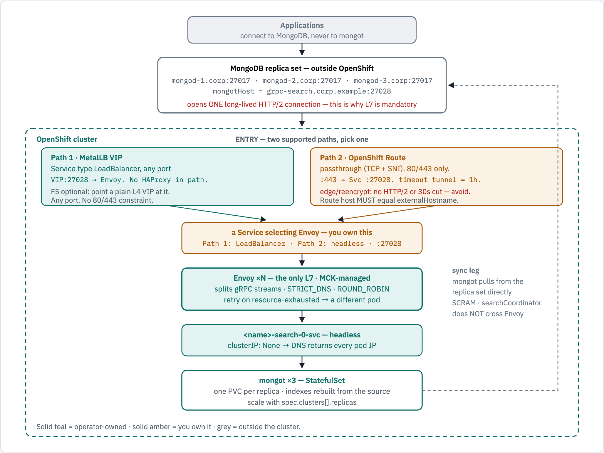
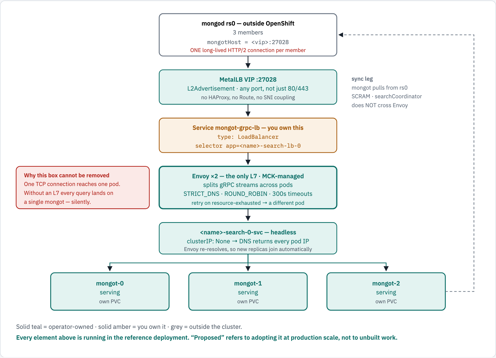
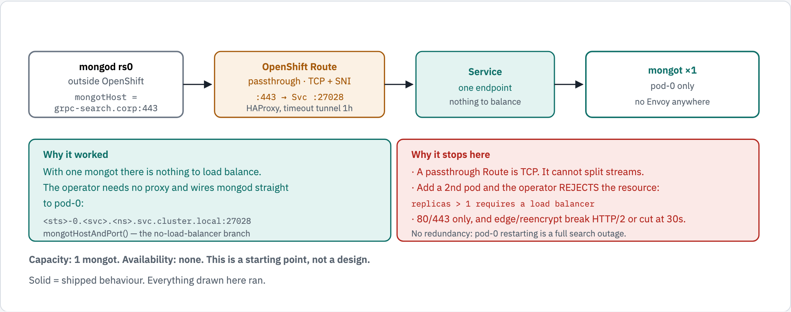
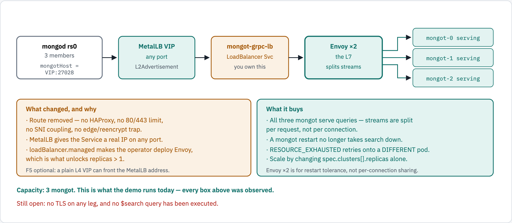
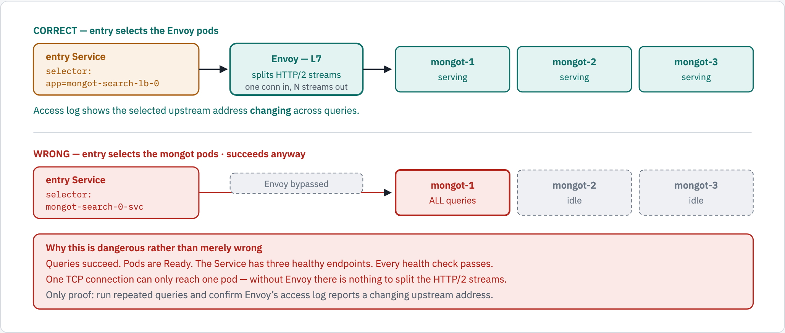
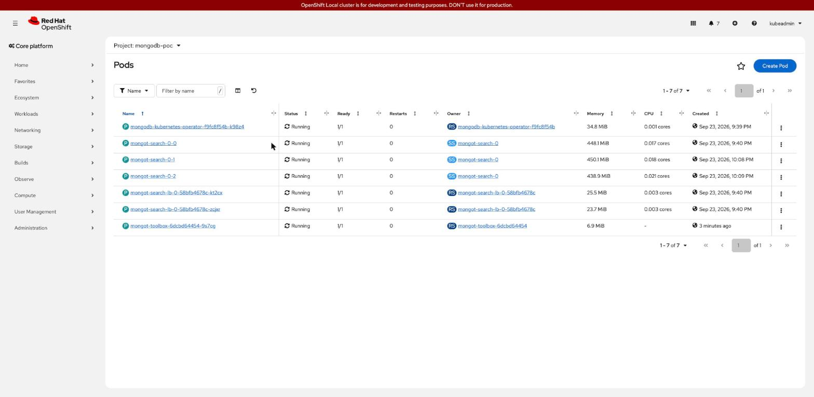
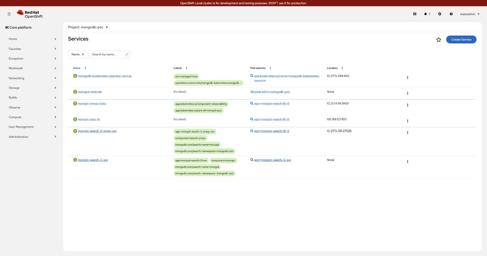

# MongoDB Search (`mongot`) on OpenShift, fronted by Envoy

Reference architecture for running **MongoDB Search on OpenShift against a MongoDB
replica set that lives outside the cluster**, with an L7 proxy load-balancing gRPC
across the `mongot` pods.

> **Scope.** This page is the architecture. It says nothing about where it is running.
> A complete, reproducible walkthrough on a single laptop — including the network
> stitching that only a laptop needs — lives in **[DEPLOYMENT.md](DEPLOYMENT.md)**.

---

## The one constraint everything follows from

`mongod` opens **a single, long-lived TCP connection** to `mongot` and multiplexes every
search query over it as HTTP/2 streams.

A Kubernetes `Service`, a classic load balancer, or an F5 VIP in L4 mode all balance
**connections**. Given one connection, they pick one pod and send everything there — the
other replicas stay idle and add nothing but cost.

An **L7 proxy understands HTTP/2** and distributes **individual gRPC streams**, keeping
each stream on one pod only for the life of that query cursor. That is why MongoDB
requires a proxy in front of more than one `mongot`, and why the Operator refuses a
`MongoDBSearch` with `replicas > 1` and no load balancer.

`mongot` also sheds load by returning gRPC `RESOURCE_EXHAUSTED`, which the proxy is
expected to retry **against a different replica**.

---

## Architecture

<!-- markdownlint-disable MD033 -->
<picture>
  <source media="(prefers-color-scheme: dark)" srcset="docs/diagrams/mongot-openshift/architecture.dark.png">
  <source srcset="docs/diagrams/mongot-openshift/architecture.light.png">
  
</picture>
<!-- markdownlint-enable MD033 -->

### Order of deployment

1. **MongoDB replica set** running and reachable from the cluster network.
2. **MCK** (MongoDB Controllers for Kubernetes) — provides `MongoDBSearch`.
3. **MetalLB** — only if entering by VIP rather than Route.
4. **cert-manager** — only if TLS is on.
5. **Secrets**: the sync-source password; the TLS Secrets if TLS is on.
6. **`MongoDBSearch`** — this creates `mongot`, Envoy, the headless Service and the
   operator's own `ClusterIP` proxy Service.
7. **Your `LoadBalancer` Service** (or `Route`) pointing at the Envoy pods.
8. **Configure the external `mongod`** — the Operator never touches it.

---

## Architecture: proposed

The shape to adopt: **MetalLB in, Envoy as the only L7, three `mongot` out.** No Route,
no HAProxy, no 80/443 constraint.

<!-- markdownlint-disable MD033 -->
<picture>
  <source media="(prefers-color-scheme: dark)" srcset="docs/diagrams/mongot-openshift/architecture-proposed.dark.png">
  <source srcset="docs/diagrams/mongot-openshift/architecture-proposed.light.png">
  
</picture>
<!-- markdownlint-enable MD033 -->

```text
              mongod rs0  -  outside OpenShift
              3 members . mongotHost = <vip>:27028
              ONE long-lived HTTP/2 connection per member
                              |
                              v
              MetalLB VIP :443 (or any port you choose)
              L2Advertisement . the Service maps 443 -> 27028
              no HAProxy, no Route, no SNI coupling
                              |
                              v
              Service mongot-grpc-lb                      <-- YOU own this
              type: LoadBalancer
              selector app=<name>-search-lb-0
                              |
                              v
              Envoy x2  -  the only L7 . MCK-managed      <-- cannot be removed
              splits gRPC streams across pods
              STRICT_DNS . ROUND_ROBIN . 300s timeouts
              retry on resource-exhausted -> a different pod
                              |
                              v
              <name>-search-0-svc  -  headless
              clusterIP: None -> DNS returns every pod IP
              Envoy re-resolves, so new replicas join automatically
                              |
              +---------------+---------------+
              |               |               |
              v               v               v
          mongot-0        mongot-1        mongot-2
          serving         serving         serving
          own PVC         own PVC         own PVC
              |
              +--> sync leg: mongot pulls from rs0 directly
                   SCRAM . searchCoordinator . does NOT cross Envoy
```

**Why Envoy cannot be removed from that column.** One TCP connection reaches one pod.
Take the L7 out and every query lands on a single `mongot` — with no error, and with the
other two Ready and idle.

Every element above is running in the reference deployment. *Proposed* refers to adopting
it at production scale, not to unbuilt work.

## The two things you own

Everything else is operator-managed. These two are not:

**1. The entry point.** `ManagedLBConfig` has no Service-type field, and the Operator
hardcodes its proxy Service to `ClusterIP`:

```go
serviceBuilder.SetServiceType(corev1.ServiceTypeClusterIP)   // no override exists
```

So a `LoadBalancer` Service (or a `Route`) selecting the Envoy pods is the only way in:

```yaml
apiVersion: v1
kind: Service
metadata:
  name: mongot-grpc-lb
  annotations:
    metallb.universe.tf/address-pool: mongot-pool
spec:
  type: LoadBalancer
  externalTrafficPolicy: Local
  selector:
    app: mongot-search-lb-0          # <MongoDBSearch name>-search-lb-<clusterIndex>
  ports:
  - name: grpc
    port: 443           # what clients dial - YOUR choice, 443 is fine
    targetPort: 27028   # what Envoy listens on - fixed by the operator
    protocol: TCP
```

**The port clients dial is yours to pick.** MetalLB supplies the address; the *Service*
maps `port` to `targetPort`, so the VIP can present **443** while Envoy keeps listening
on 27028. Verified by patching the live Service: `VIP:443` returned a 404 from Envoy
while `VIP:27028` stopped answering.

Presenting 443 is usually the better choice — it matches what a Route would have given
you, so `mongotHost` does not change if you ever switch entry method, and it is the port
your firewall rules already describe. Whatever you choose, set `mongotHost` on the
external `mongod` to match; the port is always explicit there.

Two cautions: it has **no `ownerReference`**, so it outlives the CR and is never
reconciled; and the selector is an Operator-internal name, so renaming the CR silently
blackholes traffic.

**2. The external `mongod` configuration.** The Operator does not manage a `mongod` it
did not create, so these are yours to set:

```
setParameter:
  mongotHost:                                      grpc-search.corp.example:27028
  searchIndexManagementHostAndPort:                grpc-search.corp.example:27028
  useGrpcForSearch:                                true
  skipAuthenticationToSearchIndexManagementServer: false
  searchTLSMode:                                   requireTLS   # or disabled
```

Plus a user holding the built-in **`searchCoordinator`** role (MongoDB 8.2+).

---

## Entry point: VIP or Route

|  | **A · MetalLB VIP** | **B · OpenShift Route** |
|---|---|---|
| Ports | **any** — the Service maps `port`→`targetPort` | **80/443 only** |
| Data path | client → VIP → Envoy | client → router (HAProxy) → Svc → Envoy |
| Stream splitting | **at Envoy** — entry is L4 either way | **at Envoy** — the Route cannot split streams |
| Termination | TLS ends at Envoy | must be **passthrough** |
| Timeout | none imposed | `timeout tunnel`, default **1h** |
| SNI | not required | Route host **must** equal `externalHostname` |
| F5 | optional, plain L4 | L4/fastL4 — **never an HTTP profile** |
| Extra objects | a `LoadBalancer` Service you write | **none** — target the operator's proxy Service |
| Needs TLS | no | **yes** — passthrough routes on SNI |

**Avoid `edge` and `reencrypt`.** Edge does not support HTTP/2 at all, so gRPC breaks;
both use `timeout server`, default **30s**, which severs long-running search cursors.
Passthrough uses `timeout tunnel` instead, and its 1h default comfortably covers the
300s per-stream budget Envoy is configured with.

**A passthrough Route is a pipe, not a balancer.** Being pure TCP it cannot split gRPC
streams — it must sit *in front of* Envoy, never instead of it.

---

## How this evolved: one mongot behind a Route, to three behind Envoy

### Before — a passthrough Route, and exactly one `mongot`

<!-- markdownlint-disable MD033 -->
<picture>
  <source media="(prefers-color-scheme: dark)" srcset="docs/diagrams/mongot-openshift/before-route-single.dark.png">
  <source srcset="docs/diagrams/mongot-openshift/before-route-single.light.png">
  
</picture>
<!-- markdownlint-enable MD033 -->

```text
  mongod rs0 ──▶ OpenShift Route ──▶ Service ──▶ mongot x1
  (external)     passthrough          one          pod-0 only
                 :443 -> :27028       endpoint     no Envoy anywhere
```

This worked, and it is worth being precise about *why*: **with one `mongot` there is
nothing to load balance.** The Operator needs no proxy and wires `mongod` straight at
pod-0 — the no-load-balancer branch of `mongotHostAndPort()`:

```text
<sts>-0.<svc>.<ns>.svc.cluster.local:27028
```

It is not a Route that happened to be paired with one pod. **One pod is the only shape
it can take:**

- a passthrough Route is TCP and cannot split gRPC streams
- ask for a second pod and the Operator rejects the resource — `replicas > 1` requires a
  load balancer, and the Route cannot be that load balancer
- 80/443 only, with `edge`/`reencrypt` breaking HTTP/2 or cutting at 30s
- no redundancy: pod-0 restarting is a full search outage

### After — Route removed, MetalLB and Envoy, three `mongot`

<!-- markdownlint-disable MD033 -->
<picture>
  <source media="(prefers-color-scheme: dark)" srcset="docs/diagrams/mongot-openshift/after-metallb-three.dark.png">
  <source srcset="docs/diagrams/mongot-openshift/after-metallb-three.light.png">
  
</picture>
<!-- markdownlint-enable MD033 -->

```text
                                                     ┌──▶ mongot-0  serving
  mongod rs0 ──▶ MetalLB VIP ──▶ mongot-grpc-lb ──▶ Envoy x2 ──▶ mongot-1  serving
  (3 members)    any port        LoadBalancer Svc    the L7   └──▶ mongot-2  serving
  mongotHost=    L2Advertise     you own this        splits streams
  VIP:27028
```

The Route is not reconfigured — it is **removed from the data path entirely**. MetalLB
supplies the address on any port, and `loadBalancer.managed` supplies the Envoy that
makes more than one `mongot` legal in the first place.

| | Before | After |
|---|---|---|
| Entry | Route `:443` passthrough | MetalLB VIP, any port |
| L7 | none | **Envoy ×2, operator-managed** |
| `mongot` | **1** | **3, all serving** |
| Restart of one `mongot` | full search outage | absorbed |
| `RESOURCE_EXHAUSTED` | nowhere to retry | retried on a *different* pod |
| Scaling | blocked by validation | `spec.clusters[].replicas` |

This is what the demo runs today; every box in the "after" figure was observed. Still
open on both: no TLS on any leg, and no `$search` query has been executed.

## The failure that produces no error

<!-- markdownlint-disable MD033 -->
<picture>
  <source media="(prefers-color-scheme: dark)" srcset="docs/diagrams/mongot-openshift/l4-bypass.dark.png">
  <source srcset="docs/diagrams/mongot-openshift/l4-bypass.light.png">
  
</picture>
<!-- markdownlint-enable MD033 -->


The entry point — VIP or Route — is **L4**. One TCP connection lands on exactly one
backend pod. That is harmless here **only because Envoy sits behind it**:

```text
  mongod member --- 1 long-lived TCP conn ---> [ entry ] ---> ONE Envoy pod
                                                                  |
                                                    splits HTTP/2 streams
                                                                  v
                                                          mongot-1 / -2 / -3
```

Two consequences worth stating explicitly:

- **Envoy replicas give availability, not load sharing within a connection.** A single
  `mongod` member's connection uses one Envoy pod for its lifetime. With a 3-member
  replica set each member opens its own connection, so replicas *do* spread load across
  members. Scale Envoy for restart tolerance, not for throughput on one connection.

- **If Envoy is ever bypassed, you silently revert to L4 pinning.** Point the Route or
  the `LoadBalancer` Service at the `mongot` headless Service instead of the Envoy pods
  and everything still works — queries succeed, nothing errors, and **one `mongot` serves
  all of them** while the other two sit idle holding warm indexes.

This is the whole reason the vendor asks for an L7 proxy, and it is invisible in every
health check. The only way to see it is in Envoy's access logs: run a series of queries
and confirm the selected upstream address **changes**. A `Service` with three ready
endpoints proves nothing.

Guard it in review: the entry Service selector must be `app=<name>-search-lb-<idx>`
(the Envoy pods), never `<name>-search-<idx>-svc` (the `mongot` pods).

---

## Running, in the console

Seven pods, all `Running 1/1`, zero restarts — the MCK operator, three `mongot`, two
Envoy replicas and the in-cluster toolbox.

<!-- markdownlint-disable MD033 -->

<!-- markdownlint-enable MD033 -->

The Services view shows the whole wiring in one frame:

<!-- markdownlint-disable MD033 -->

<!-- markdownlint-enable MD033 -->

| Service | Location | Selector | Whose |
|---|---|---|---|
| `mongot-grpc-lb` | **192.168.127.100** — the MetalLB VIP | `app=mongot-search-lb-0` | yours |
| `mongot-search-0-proxy-svc` | `10.217.5.138:27028` — ClusterIP | `app=mongot-search-lb-0` | operator |
| `mongot-search-0-svc` | **None** — headless | `app=mongot-search-0-svc` | operator |
| `mongot-envoy-stats` | `10.217.4.46:9901` | `app=mongot-search-lb-0` | yours |
| `mongod-external` | **None** — selector-less | — | yours |

Two things are visible rather than asserted: the VIP really is attached to a Service that
selects the **Envoy** pods, and `mongot-search-0-svc` really is **headless** (`Location:
None`) — which is what lets DNS return every pod IP for Envoy to fan out across.

### The Route, and why "Accepted" proves nothing

<!-- markdownlint-disable MD033 -->

<!-- markdownlint-enable MD033 -->

A passthrough `Route` pointed at the operator's own proxy Service. Note it can target
`mongot-search-0-proxy-svc` directly — **with a Route you need neither MetalLB nor the
hand-written `LoadBalancer` Service.**

It reports **`Accepted`**, green and healthy. Traffic through it nevertheless fails:

```text
client  ->  error:0A00010B:SSL routines::wrong version number
Envoy   ->  {"resp":400, "response_flags":"DPE", "upstream_host":null}
```

`DPE` is *downstream protocol error*: the request reached Envoy — so the F5-shaped path
of router, SNI match and passthrough all worked — and failed at the last inch because
Envoy is listening **plaintext h2c** and received a TLS `ClientHello`.

**A passthrough Route routes on SNI, and SNI only exists inside a TLS ClientHello.** So a
Route and TLS are the same decision, not two. `Accepted` means the router parsed the
object, nothing about whether the backend can serve it.

---

## Proof that the load balancing is real

The [failure that produces no error](#the-failure-that-produces-no-error) is invisible to
health checks, so it can only be closed by measurement. Measured on the running system:
40 `$search` queries issued from `mongod`, then each `mongot`'s own Prometheus counter
read directly.

```text
mongot-search-0-0   mongot_command_searchCommandTotalLatency_seconds_count = 13
mongot-search-0-1   mongot_command_searchCommandTotalLatency_seconds_count = 14
mongot-search-0-2   mongot_command_searchCommandTotalLatency_seconds_count = 14
                                                                    TOTAL  = 41

Envoy, same window:
  cluster.mongot_rs_cluster.upstream_rq_total:  41    <- matches the sum
  cluster.mongot_rs_cluster.upstream_cx_active:  3    <- a live connection to EACH mongot
```

`mongod` holds **one** connection to the endpoint, yet those 41 requests landed on
**three** pods. That is the whole argument for the L7, demonstrated rather than asserted:
distribution happens **per request**, not per connection.

### Reading the access log will mislead you

Envoy emits **one access-log record per gRPC stream, at stream close** — not per request.
Forty queries over long-lived streams produced three log lines. Counting log lines to
judge distribution will therefore under-report it badly; use `mongot`'s counters or
Envoy's `upstream_rq_total`.

### How to re-run it

Full procedure in **[TESTING.md](TESTING.md)**; the short form:

```bash
# per-pod query counts
for p in mongot-search-0-0 mongot-search-0-1 mongot-search-0-2; do
  oc exec -n <ns> $p -- curl -s localhost:9946/metrics \
    | grep searchCommandTotalLatency_seconds_count
done

# Envoy's view, from the in-cluster toolbox - no port-forward needed
# (MCK restricts the admin listener to /stats, /ready, /logging,
#  /drain_listeners - /clusters returns 403)
oc exec -n <ns> $TB -- curl -s http://mongot-envoy-stats:9901/stats \\
  | grep -E "mongot_rs_cluster\\.(upstream_rq_total|upstream_cx_active)"
```

## Certificates

### Enabling TLS changes no ports

Worth stating plainly, because it is counterintuitive if you think in 80/443 terms:

| | Plaintext | TLS |
|---|---|---|
| Envoy listener | `EnvoyDefaultProxyPort` = **27028** | **same 27028, same single listener** |
| `mongot` gRPC | `MongotDefaultGrpcPort` = **27028** | **same** — no TLS branch in `GetMongotGrpcPort()` |
| Your Service `port` | your choice | **unchanged** |

There is one `mongod_listener` bound to 27028 either way. TLS adds a `transport_socket`
and a `FilterChainMatch` to that same listener; gRPC negotiates TLS in-band over ALPN.
**No new firewall rules are needed to turn TLS on.**

What changes is configuration, not topology:

```text
Envoy    + tls_inspector listener filter   (added only when TLS is on, to read SNI)
         + FilterChainMatch.ServerNames: [externalHostname]
         + downstream TLS transport socket
mongot   server.grpc.tls.mode:  Disabled -> TLS   (-> MTLS when a client CA is set)
mongod   searchTLSMode:         disabled -> requireTLS   (you set this yourself)
         plus three cert Secrets, and a restart - certs are read only at startup
```

### The trap: `mongotHost` must become a hostname

With TLS on, `externalHostname` stops being inert and becomes the **SNI** Envoy matches
on. TLS clients do not send SNI for IP literals, so an IP in `mongotHost` produces no
SNI, no filter-chain match, and a dropped connection — which presents as a certificate
problem rather than a naming one.

```text
mongotHost = 10.20.30.40:27028          plaintext: fine.  TLS: FAILS - no SNI sent
mongotHost = grpc-search.corp:443       required once TLS is on
```

So enabling TLS has a prerequisite that is easy to miss: the external `mongod` must
address `mongot` by **name**, that name must equal `externalHostname`, and it must be a
SAN on Envoy's server certificate. All three, or nothing connects.

### The certificate map


TLS in managed mode is **all-or-nothing**: setting `spec.security.tls` turns it on for
*both* legs (client→Envoy and Envoy→`mongot`). It is not per-leg.

With `spec.security.tls.certsSecretPrefix: <prefix>` the Operator expects these to exist,
by name — cert-manager `Certificate` resources producing standard `kubernetes.io/tls`
Secrets:

| Secret | Role | Required SANs |
|---|---|---|
| `<prefix>-<name>-search-lb-<idx>-cert` | Envoy **server** cert, faces `mongod` | **`externalHostname`** (and the Route host, if used) |
| `<prefix>-<name>-search-lb-<idx>-client-cert` | Envoy **client** cert, Envoy → `mongot` | — |
| `<prefix>-<name>-search-cert` | `mongot` **server** cert | the `mongot` Service FQDNs |

For the **sync leg** (`mongot` → `mongod`), which never crosses Envoy:

| Field | Holds | Purpose |
|---|---|---|
| `spec.source.external.tls.ca` | ConfigMap with `ca.crt` | so `mongot` trusts the external `mongod` |
| `spec.source.tls.clientCertificateSecretRef` | Secret with `tls.crt`/`tls.key` | mTLS to `mongod`, alongside SCRAM |

And outside the cluster, the `mongod` members need their own server certificate and the
CA that signed Envoy's.

Known limits worth designing around: `mongot` validates that a client certificate is
signed by a trusted CA but **does not validate hostname or SAN**; certificates are read
only at startup, so rotation requires a restart; minimum TLS 1.2; no FIPS.

---

## The `MongoDBSearch` resource

This is the live resource from the reference deployment. TLS is deliberately **not** set
here — that is a Phase-A choice, not an oversight:

```yaml
apiVersion: mongodb.com/v1
kind: MongoDBSearch
metadata:
  name: mongot
  namespace: mongodb-poc
spec:
  version: "1.70.1"

  source:                                    # external: the Operator manages no mongod
    external:
      hostAndPorts:                          # SEED list only - see note below
      - "mongod-1.corp:27017"
      - "mongod-2.corp:27017"
      - "mongod-3.corp:27017"
    username: search-sync-source
    passwordSecretRef:
      name: mongot-search-sync-source-password

  clusters:
  - replicas: 3                              # mongot pods; >1 REQUIRES a load balancer
    resourceRequirements:                    # defaults are 2 CPU / 4Gi PER replica
      requests: { cpu: "200m", memory: "1Gi" }
      limits:   { cpu: "1",    memory: "2Gi" }
    persistence:
      single:
        storage: 2Gi
        storageClass: <your-storage-class>
    loadBalancer:
      managed:                               # the Operator deploys + configures Envoy
        externalHostname: grpc-search.corp.example   # bare FQDN - SNI match + cert SAN
        replicas: 2                          # default is 1; use >=2 in production
        retryPolicy:
          numRetries: 2
          perTryTimeout: 60s
```

To enable TLS, add:

```yaml
  security:
    tls:
      certsSecretPrefix: lab                 # turns TLS on for BOTH legs
```

**`hostAndPorts` is a seed list, not the traffic path.** The driver connects to a seed,
reads the replica-set configuration, then uses the **advertised** member hostnames for
everything afterwards. If the set advertises IPs, `mongot` will use IPs regardless of
what you put here. Running on names requires the set to *advertise* names.

---

## Scaling

| Change | How | Notes |
|---|---|---|
| More `mongot` | `spec.clusters[].replicas` | Envoy uses `STRICT_DNS` over the headless Service, so new pods are picked up on re-resolve. Each gets a PVC. |
| More Envoy | `loadBalancer.managed.replicas` | Default **1** — a rolling restart then severs every in-flight cursor. Use ≥2. |
| Readiness gate | `minMongotReadyReplicas` | How many `mongot` must be ready before Envoy is promoted. |
| More DB members | on the replica set | Keep the member count odd for quorum. |

---

## Repository layout

| Path | What |
|---|---|
| `README.md` | this page — the architecture |
| [`TESTING.md`](TESTING.md) | **sample data → load → query → prove the load balancing** |
| [`DEPLOYMENT.md`](DEPLOYMENT.md) | full walkthrough, reproduced on a laptop, with every command and measurement |
| [`mongoT-setup.md`](mongoT-setup.md) | design decisions and findings from building it |
| `manifests/` | OLM subscriptions, MetalLB config, the `MongoDBSearch` CR, the `LoadBalancer` Service |
| `mongodb/` | Compose stack for the external replica set, parameterised by `ADVERTISED_HOST` |
| `mongodb/data/` | sample documents and index definitions |
| `mongodb/scripts/` | `load-data.sh`, `verify-search.sh` and the bootstrap scripts |
| `docs/diagrams/` | figure sources and rendered PNGs |
| `docs/screenshots/` | console evidence: pods, Services, the Route |

---

## Status

| Component | State |
|---|---|
| MCK 1.12.0, `mongot` 1.70.1 | deployed via OLM |
| Envoy, managed | running, `STRICT_DNS` over the headless Service |
| `mongot` ×3 | ready, one PVC each |
| MetalLB VIP | assigned, Envoy answering |
| External replica set | 3 members, `PRIMARY` + 2 `SECONDARY` |
| **TLS** | **not enabled** — plaintext h2c on every leg |
| **`$search` query** | ✅ **verified** — returns correct results with relevance scores |
| **Stream distribution** | ✅ **measured** — 41 queries spread **13 / 14 / 14** across three `mongot` |
