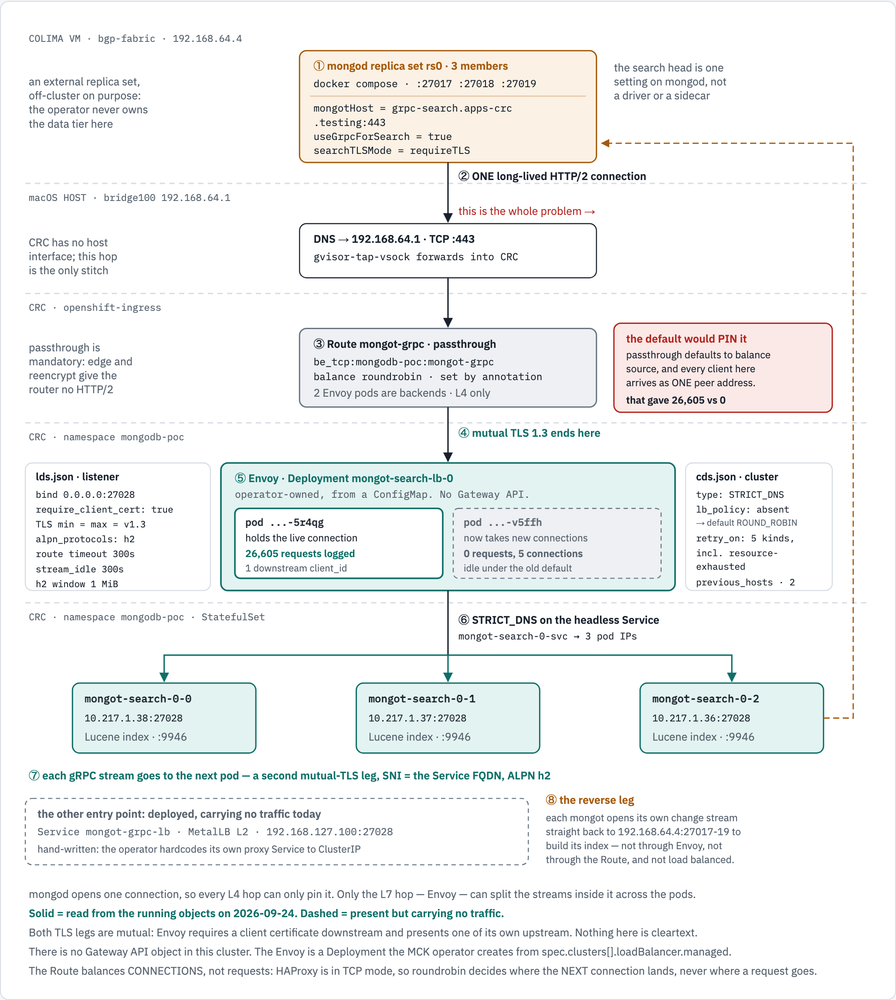
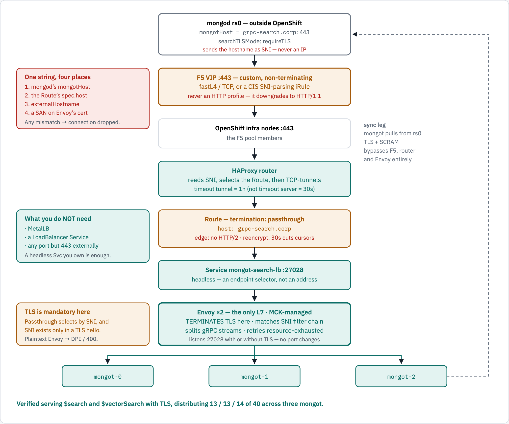

# MongoDB Search (`mongot`) on OpenShift, fronted by Envoy

Reference architecture for running **MongoDB Search on OpenShift against a MongoDB
replica set that lives outside the cluster**, with an L7 proxy load-balancing gRPC
across the `mongot` pods.

> **Scope.** This page is the architecture. It says nothing about where it is running.
> A complete, reproducible walkthrough on a single laptop — including the network
> stitching that only a laptop needs — lives in **[DEPLOYMENT.md](DEPLOYMENT.md)**.

---

## Start here

**Understand it**

| Doc | What it covers |
|---|---|
| this page | the architecture, and the one constraint everything follows from |
| [REQUEST-PATH.md](REQUEST-PATH.md) | the path a request takes, as diagrams, with every label sourced |
| [ENVOY-FLOW.md](ENVOY-FLOW.md) | the Envoy config itself — what each line does, and why it balances across **pods**, not a Service |
| [USECASE.md](USECASE.md) | what a search tier buys you that a keyword index does not |

**Build it**

| Doc | What it covers |
|---|---|
| [DEPLOYMENT.md](DEPLOYMENT.md) | standing it up end to end, including the laptop network stitching |
| [TLS.md](TLS.md) | issuing, rotating and hand-signing the certificates |

**Run and verify it**

| Doc | What it covers |
|---|---|
| [DEMO.md](DEMO.md) | a guided walkthrough with the expected output at every step |
| [TESTING.md](TESTING.md) | the test suite, and the failure each assertion guards against |
| [OBSERVE.md](OBSERVE.md) | watching traffic land on the pods, five different ways |

**Background**

| Doc | What it covers |
|---|---|
| [mongoT-setup.md](mongoT-setup.md) | the original design notes and findings |

Three commands worth knowing before anything else:

```bash
./test/run.sh                      # 61 assertions across 8 suites, exit code
./app/entry-path.sh                # is mongod using the Route, or the MetalLB VIP?
./app/trace-query.sh -n 6 "pods"   # which mongot pod answered each query
```

---

## The one constraint everything follows from

`mongod` opens **a single, long-lived TCP connection** to `mongot` and multiplexes every
search query over it as HTTP/2 streams.

A Kubernetes `Service`, a classic load balancer, or an F5 VIP in L4 mode all balance
**connections**. Given one connection, they pick one pod and send everything there — the
other replicas stay idle and add nothing but cost.

An **L7 proxy understands HTTP/2** and distributes **individual gRPC streams**, keeping
each stream on one pod only for the life of that query cursor. That is why MongoDB
requires a proxy in front of more than one `mongot`, and why the Operator refuses a
`MongoDBSearch` with `replicas > 1` and no load balancer.

`mongot` also sheds load by returning gRPC `RESOURCE_EXHAUSTED`, which the proxy is
expected to retry **against a different replica**.

---

## The request path, end to end

<!-- markdownlint-disable MD033 -->
<picture>
  <source media="(prefers-color-scheme: dark)" srcset="docs/diagrams/grpc-through-envoy/request-path.dark.png">
  <source srcset="docs/diagrams/grpc-through-envoy/request-path.light.png">
  
</picture>
<!-- markdownlint-enable MD033 -->

*Every value in the figure was read from the running objects on 2026-09-24 — `getCmdLineOpts`
on the replica set, the router's `haproxy.config`, ConfigMap `mongot-search-lb-0-config`, and
the Envoy access logs. There is **no Gateway API object** in this cluster: the Envoy is a plain
Deployment the MCK operator creates from `spec.clusters[].loadBalancer.managed`.*

```text
  colima VM 192.168.64.4
    (1) mongod rs0, 3 members          mongotHost = grpc-search.apps-crc.testing:443
         |                             useGrpcForSearch = true, searchTLSMode = requireTLS
         | (2) ONE long-lived HTTP/2 connection   <- an L4 hop cannot split this
         v
  macOS host
    DNS -> 192.168.64.1 : 443          gvisor-tap-vsock forwards into CRC
         |                             (CRC has no host interface; this hop is the only stitch)
         v
  CRC, openshift-ingress
    (3) Route mongot-grpc, passthrough        be_tcp:mongodb-poc:mongot-grpc
         |                                    balance roundrobin  (set by annotation)
         |                                    the passthrough DEFAULT is `source`, which
         |                                    pinned every connection to ONE Envoy:
         | (4) mutual TLS 1.3 ends here       that gave 26,605 requests vs 0
         v
  CRC, namespace mongodb-poc
    (5) Envoy, Deployment mongot-search-lb-0, operator-owned, from a ConfigMap
         pod ...-5r4qg   carries the connection, 26,605 requests, 1 client_id
         pod ...-v5ffh   ready, healthy, idle, 0 requests - failover only
         lds.json: bind :27028, require_client_cert, TLS min=max=v1.3, alpn h2, 300s
         cds.json: STRICT_DNS, lb_policy absent -> Envoy default ROUND_ROBIN,
                   retry_on 5 kinds incl. resource-exhausted, previous_hosts, 2 retries
         |
         | (6) STRICT_DNS on headless mongot-search-0-svc -> 3 pod IPs
         | (7) each gRPC STREAM to the next pod, second mutual-TLS leg, SNI = Service FQDN
         v
    mongot-search-0-0        mongot-search-0-1        mongot-search-0-2
    10.217.1.38:27028        10.217.1.37:27028        10.217.1.36:27028

    (8) reverse leg: each mongot opens its OWN change stream straight back to
        192.168.64.4:27017-19 - not through Envoy, not through the Route, not balanced.

    also deployed, carrying no traffic today:
        Service mongot-grpc-lb, MetalLB L2, 192.168.127.100:27028
```

mongod opens **one** connection, so every L4 hop can only pin it. Only the L7 hop — Envoy —
can split the streams *inside* that connection across the pods.

Both figures, the provenance of every label, and what they deliberately do **not** claim are
in **[REQUEST-PATH.md](REQUEST-PATH.md)**. For the proxy's own configuration — what each line
of `lds.json` and `cds.json` does to a request, and why Envoy dials the **pods** rather than a
Service ClusterIP — see **[ENVOY-FLOW.md](ENVOY-FLOW.md)**.

---

## Architecture

<!-- markdownlint-disable MD033 -->
<picture>
  <source media="(prefers-color-scheme: dark)" srcset="docs/diagrams/mongot-openshift/architecture.dark.png">
  <source srcset="docs/diagrams/mongot-openshift/architecture.light.png">
  
</picture>
<!-- markdownlint-enable MD033 -->

### Order of deployment

1. **MongoDB replica set** running and reachable from the cluster network.
2. **MCK** (MongoDB Controllers for Kubernetes) — provides `MongoDBSearch`.
3. **MetalLB** — only if entering by VIP rather than Route.
4. **cert-manager** — only if TLS is on.
5. **Secrets**: the sync-source password; the TLS Secrets if TLS is on.
6. **`MongoDBSearch`** — this creates `mongot`, Envoy, the headless Service and the
   operator's own `ClusterIP` proxy Service.
7. **Your `LoadBalancer` Service** (or `Route`) pointing at the Envoy pods.
8. **Configure the external `mongod`** — the Operator never touches it.

---

## Architecture: proposed

The shape to adopt: **MetalLB in, Envoy as the only L7, three `mongot` out.** No Route,
no HAProxy, no 80/443 constraint.

<!-- markdownlint-disable MD033 -->
<picture>
  <source media="(prefers-color-scheme: dark)" srcset="docs/diagrams/mongot-openshift/architecture-proposed.dark.png">
  <source srcset="docs/diagrams/mongot-openshift/architecture-proposed.light.png">
  
</picture>
<!-- markdownlint-enable MD033 -->

```text
              mongod rs0  -  outside OpenShift
              3 members . mongotHost = <vip>:27028
              ONE long-lived HTTP/2 connection per member
                              |
                              v
              MetalLB VIP :443 (or any port you choose)
              L2Advertisement . the Service maps 443 -> 27028
              no HAProxy, no Route, no SNI coupling
                              |
                              v
              Service mongot-grpc-lb                      <-- YOU own this
              type: LoadBalancer
              selector app=<name>-search-lb-0
                              |
                              v
              Envoy x2  -  the only L7 . MCK-managed      <-- cannot be removed
              splits gRPC streams across pods
              STRICT_DNS . ROUND_ROBIN . 300s timeouts
              retry on resource-exhausted -> a different pod
                              |
                              v
              <name>-search-0-svc  -  headless
              clusterIP: None -> DNS returns every pod IP
              Envoy re-resolves, so new replicas join automatically
                              |
              +---------------+---------------+
              |               |               |
              v               v               v
          mongot-0        mongot-1        mongot-2
          serving         serving         serving
          own PVC         own PVC         own PVC
              |
              +--> sync leg: mongot pulls from rs0 directly
                   SCRAM . searchCoordinator . does NOT cross Envoy
```

**Why Envoy cannot be removed from that column.** One TCP connection reaches one pod.
Take the L7 out and every query lands on a single `mongot` — with no error, and with the
other two Ready and idle.

Every element above is running in the reference deployment. *Proposed* refers to adopting
it at production scale, not to unbuilt work.

## Architecture: OpenShift Route behind an F5

The alternative entry, and the shape that fits an enterprise where an F5 already fronts
the OpenShift infra nodes. Same Envoy, same `mongot` — only the way in differs.

<!-- markdownlint-disable MD033 -->
<picture>
  <source media="(prefers-color-scheme: dark)" srcset="docs/diagrams/mongot-openshift/architecture-route-f5.dark.png">
  <source srcset="docs/diagrams/mongot-openshift/architecture-route-f5.light.png">
  
</picture>
<!-- markdownlint-enable MD033 -->

```text
              mongod rs0  -  outside OpenShift
              mongotHost = grpc-search.corp:443 . searchTLSMode: requireTLS
              sends the HOSTNAME as SNI - never an IP
                              |
                              v
              F5 VIP :443  -  custom, NON-terminating
              fastL4 / TCP, or a CIS SNI-parsing iRule
              never an HTTP profile - it downgrades to HTTP/1.1
                              |
                              v
              OpenShift infra nodes :443       (the F5 pool members)
                              |
                              v
              HAProxy router
              reads SNI, selects the Route, then TCP-tunnels
              timeout tunnel = 1h   (NOT timeout server = 30s)
                              |
                              v
              Route  -  termination: passthrough
              host: grpc-search.corp
              edge: no HTTP/2 . reencrypt: 30s cuts cursors
                              |
                              v
              mongot-search-lb :27028
              a ClusterIP you own - endpoint selector only
              (the operator's <name>-search-<idx>-proxy-svc works
               too, but is deleted with the CR and named after it)
                              |
                              v
              Envoy x2  -  the only L7 . MCK-managed
              TERMINATES TLS here . matches the SNI filter chain
              splits gRPC streams . retries resource-exhausted
                              |
              +---------------+---------------+
              v               v               v
          mongot-0        mongot-1        mongot-2
              |
              +--> sync leg: mongot pulls from rs0 over TLS + SCRAM,
                   bypassing F5, the router and Envoy entirely
```

**Why this shape needs no extra Kubernetes objects.** The Route targets the operator's
own `ClusterIP` proxy Service, so you need neither MetalLB nor a hand-written
`LoadBalancer` Service. What you own is the F5 VIP and the Route.

**TLS is mandatory here, not optional.** Passthrough selects the backend by SNI, and SNI
exists only inside a TLS `ClientHello`. Against a plaintext Envoy this returns `DPE`/400 —
the request reaches Envoy and dies on the protocol. See [TLS.md](TLS.md).

**One string in four places** — `mongod`'s `mongotHost`, the Route's `spec.host`,
`externalHostname`, and a SAN on Envoy's certificate. Any mismatch drops the connection,
and because `mongod` must send a hostname as SNI, **`mongotHost` cannot be an IP**.

Manifest: `manifests/80-route-passthrough.yaml`. Verified serving `$search` and
`$vectorSearch` with TLS, distributing **13 / 13 / 14** of 40 across three `mongot`.


## Behind a custom F5

The lab reaches the Route through a gvproxy forwarder. In an enterprise the same Route sits
behind an F5 VIP fronting the infra nodes. Nothing about the cluster side changes.

```text
  mongod
    |  TLS, SNI = grpc-search.<domain>
    v
  F5 VIP                    passthrough / L4 - does NOT terminate TLS
    |                       fastL4 or standard TCP virtual server
    |                       no client-SSL profile, no server-SSL profile
    v
  OpenShift infra nodes :443
    |
  passthrough Route         selected by SNI - does NOT terminate TLS
    |                       holds no spec.tls.certificate or spec.tls.key
    v
  Service mongot-search-lb  endpoint selector only; HAProxy dials the pod IPs
    |
    v
  Envoy  :27028             <-- TLS TERMINATES HERE, and only here
    |                           certificate from the MongoDBSearch CR
    |                           (security.tls.certsSecretPrefix)
    v
  mongot x3                 second mutual-TLS leg, Envoy -> pods
```

**TLS is terminated exactly once, at Envoy.** Neither the F5 nor the router decrypts. Both
are L4 hops that forward the ClientHello untouched, which is what lets a single certificate —
held by the workload, not by the ingress — serve the whole path.

### What the F5 virtual server needs

| Setting | Value | Why |
|---|---|---|
| Profile | `fastL4`, or standard TCP | An HTTP profile parses the stream and breaks gRPC |
| Client-SSL profile | **none** | Adding one terminates TLS at the F5 and the SNI is lost |
| Server-SSL profile | **none** | The F5 must not re-originate TLS |
| Persistence | source address, or none | One `mongod` holds one connection; there is nothing to persist across |
| Idle timeout | ≥ 300s | Envoy's `stream_idle_timeout` and route `timeout` are both 300s |
| Health monitor | TCP | An HTTPS monitor would require the F5 to terminate |
| Pool members | infra nodes, port 443 | The Route is selected by SNI at the router |

This is a **dedicated VIP with its own FQDN**, not the default wildcard VIP. Wildcard VIPs
commonly carry an HTTP profile and a client-SSL profile, both of which break this path.

### The SNI risk on this path, and how to check for it

Port 443 on the infra nodes is shared between the passthrough and terminating flows, and the
router decides which by looking the SNI up in `os_sni_passthrough.map`. A name that is not in
that map does not fail — it is served by the router's own default certificate. On an F5 path
the practical consequence is:

> A typo'd or stale SNI produces a **successful TLS handshake carrying the wrong certificate**,
> not a connection failure. A health check that only asserts "TLS connects" stays green while
> no traffic reaches the search tier.

So check the certificate, not the handshake:

```bash
HOST=grpc-search.apps-crc.testing
echo | openssl s_client -connect "$HOST:443" -servername "$HOST" -alpn h2 2>/dev/null \
  | openssl x509 -noout -subject -issuer
```

```text
subject=CN=grpc-search.apps-crc.testing
issuer=O=Enterprise POC, CN=Enterprise Root CA
```

Two things make this unambiguous. The subject must be your name, not a wildcard; and the
handshake must negotiate **ALPN `h2`** — the router's terminating flow binds with `no-alpn`,
so a missing ALPN means the connection never reached Envoy.

`./test/run.sh entry` asserts both, plus that the served certificate is issued by the
enterprise CA rather than the ingress default.

---

## The two things you own

Everything else is operator-managed. These two are not:

**1. The entry point.** `ManagedLBConfig` has no Service-type field, and the Operator
hardcodes its proxy Service to `ClusterIP`:

```go
serviceBuilder.SetServiceType(corev1.ServiceTypeClusterIP)   // no override exists
```

So a `LoadBalancer` Service (or a `Route`) selecting the Envoy pods is the only way in:

```yaml
apiVersion: v1
kind: Service
metadata:
  name: mongot-grpc-lb
  annotations:
    metallb.universe.tf/address-pool: mongot-pool
spec:
  type: LoadBalancer
  externalTrafficPolicy: Local
  selector:
    app: mongot-search-lb-0          # <MongoDBSearch name>-search-lb-<clusterIndex>
  ports:
  - name: grpc
    port: 443           # what clients dial - YOUR choice, 443 is fine
    targetPort: 27028   # what Envoy listens on - fixed by the operator
    protocol: TCP
```

**The port clients dial is yours to pick.** MetalLB supplies the address; the *Service*
maps `port` to `targetPort`, so the VIP can present **443** while Envoy keeps listening
on 27028. Verified by patching the live Service: `VIP:443` returned a 404 from Envoy
while `VIP:27028` stopped answering.

Presenting 443 is usually the better choice — it matches what a Route would have given
you, so `mongotHost` does not change if you ever switch entry method, and it is the port
your firewall rules already describe. Whatever you choose, set `mongotHost` on the
external `mongod` to match; the port is always explicit there.

Two cautions: it has **no `ownerReference`**, so it outlives the CR and is never
reconciled; and the selector is an Operator-internal name, so renaming the CR silently
blackholes traffic.

**2. The external `mongod` configuration.** The Operator does not manage a `mongod` it
did not create, so these are yours to set:

```
setParameter:
  mongotHost:                                      grpc-search.corp.example:27028
  searchIndexManagementHostAndPort:                grpc-search.corp.example:27028
  useGrpcForSearch:                                true
  skipAuthenticationToSearchIndexManagementServer: false
  searchTLSMode:                                   requireTLS   # or disabled
```

Plus a user holding the built-in **`searchCoordinator`** role (MongoDB 8.2+).

---

## Entry point: VIP or Route

|  | **A · MetalLB VIP** | **B · OpenShift Route** |
|---|---|---|
| Ports | **any** — the Service maps `port`→`targetPort` | **80/443 only** |
| Data path | client → VIP → Envoy | client → router (HAProxy) → Svc → Envoy |
| Stream splitting | **at Envoy** — entry is L4 either way | **at Envoy** — the Route cannot split streams |
| Termination | TLS ends at Envoy | must be **passthrough** |
| Timeout | none imposed | `timeout tunnel`, default **1h** |
| SNI | not required | Route host **must** equal `externalHostname` |
| F5 | optional, plain L4 | L4/fastL4 — **never an HTTP profile** |
| Extra objects | a `LoadBalancer` Service you write | **none** — target the operator's proxy Service |
| Needs TLS | no | **yes** — passthrough routes on SNI |

**Avoid `edge` and `reencrypt`.** Edge does not support HTTP/2 at all, so gRPC breaks;
both use `timeout server`, default **30s**, which severs long-running search cursors.
Passthrough uses `timeout tunnel` instead, and its 1h default comfortably covers the
300s per-stream budget Envoy is configured with.

**A passthrough Route is a pipe, not a balancer.** Being pure TCP it cannot split gRPC
streams — it must sit *in front of* Envoy, never instead of it.

### One hostname, two entry paths

A tempting instinct is to give each entry path its own FQDN — `vip-grpc-search...` for the
MetalLB VIP and `grpc-search...` for the Route. **Don't.** Two reasons, one technical and one
about how this is actually run in production.

**The operator gives a replica-set source exactly one SNI name.** From
`mongodbsearchenvoy_controller.go`:

```go
sniHostname := fmt.Sprintf("%s.%s.svc.cluster.local", sniServiceName, namespace)
if endpoint := search.GetManagedLBEndpointForCluster(clusterName); endpoint != "" {
    sniHostname = endpoint      // externalHostname REPLACES it - it does not add
}
```

`buildRoutesForCluster` returns one route for a replica set, `buildLDSJSON` builds one filter
chain per route, and `buildFilterChain` sets `ServerNames` to a **one-element** list. There is
a `routerHostname` field in the CRD, but it is documented as *ignored for ReplicaSet sources* —
it exists for sharded clusters.

**And a second name would be wrong anyway.** Both paths terminate on the same Envoy, and every
L4 hop in front of it — a passthrough Route here, an F5 passthrough VIP in an enterprise —
forwards the ClientHello untouched. The hostname is the **service's identity**; the entry path
is chosen by IP and port. That is the enterprise pattern: one FQDN per service per environment,
and moving traffic to a different VIP is a DNS change, not a new name. Separate FQDNs are for
separate environments or genuinely separate backends, not for two doors into one service.

So both labs use the same `externalHostname` and the same certificate, and differ only in the
port they dial:

| | Lab 1 — MetalLB VIP | Lab 2 — OpenShift Route |
|---|---|---|
| `mongotHost` | `grpc-search.apps-crc.testing:27028` | `grpc-search.apps-crc.testing:443` |
| resolves to | `192.168.64.1` | `192.168.64.1` |
| then | gvproxy forwarder → VIP `192.168.127.100` | router (HAProxy) → Envoy |
| `externalHostname` | `grpc-search.apps-crc.testing` | *unchanged* |
| certificate | *the same one* | *the same one* |

**Both work at the same time.** Switching labs means changing `MONGOT_ENDPOINT` in
`mongodb/.env` and restarting the replica set — the `MongoDBSearch` CR does not change:

```bash
# Lab 1 - the MetalLB VIP
MONGOT_ENDPOINT=grpc-search.apps-crc.testing:27028
# Lab 2 - the OpenShift Route
MONGOT_ENDPOINT=grpc-search.apps-crc.testing:443
```

Verified with `openssl s_client`, both serving `CN=grpc-search.apps-crc.testing` and ALPN `h2`:

```text
:443    SNI grpc-search.apps-crc.testing   -> CN=grpc-search.apps-crc.testing  ALPN h2
:27028  SNI grpc-search.apps-crc.testing   -> CN=grpc-search.apps-crc.testing  ALPN h2
```

### Where TLS terminates, and what never touches this path

Before the failure modes, the normal path stated plainly:

- The Route is **`passthrough`** and carries **no** `spec.tls.certificate` or `spec.tls.key`.
  The router holds no key material for it and **cannot** terminate it — it forwards the
  ClientHello and the encrypted stream straight through.
- TLS terminates at **Envoy**, which is a component the `MongoDBSearch` CR deploys:
  `Deployment mongot-search-lb-0`, `ownerReferences: MongoDBSearch/mongot`, created from
  `spec.clusters[].loadBalancer.managed`. It mounts the key itself as `envoy-server-cert`.
- The certificate it presents is the **enterprise-CA one**, not a wildcard:

  ```text
  subject = CN=grpc-search.apps-crc.testing
  issuer  = O=Enterprise POC, CN=Enterprise Root CA
  ```

- A passthrough Route is a pure TCP pipe, and the router takes no part in its TLS
  negotiation. Its default certificate (`router-certs-default` in `openshift-ingress`) serves
  the cluster's terminating routes and is not used here.

That certificate appears only in the misconfiguration below, where it signals that traffic
never reached the search tier.

### What a wrong SNI does, by path

`vip-grpc-search.apps-crc.testing` is kept as a **spare SAN** on the certificate, so the cert is
ready if the VIP is ever split onto its own name and its own `MongoDBSearch`. Using it as
`mongotHost` today fails, and the two paths fail *differently*:

```text
:27028  SNI vip-grpc-search...  -> Envoy closes the handshake, serves NO certificate
                                   ("unexpected eof while reading")

:443    SNI vip-grpc-search...  -> the router's DEFAULT certificate (CN=*.apps-crc.testing)
                                   and NO ALPN. TLS "succeeds" and never reaches Envoy.
```

A passthrough Route is a pure TCP pipe, and the router takes no part in its TLS negotiation.
An unmatched SNI does not contradict that: the connection is never classified as passthrough
traffic in the first place. From the router's frontend:

```haproxy
frontend public_ssl
  acl sni             req.ssl_sni -m found
  acl sni_passthrough req.ssl_sni,lower,map_reg(.../os_sni_passthrough.map) -m found
  use_backend %[req.ssl_sni,lower,map_reg(.../os_tcp_be.map)] if sni sni_passthrough
  use_backend be_sni if sni          # SNI present, NOT passthrough -> termination flow
  default_backend be_no_sni          # no SNI at all               -> termination flow

backend be_sni -> fe_sni:
  bind ... ssl crt <DefaultCertificate> crt-list .../cert_config.map accept-proxy no-alpn
```

Only names present in `os_sni_passthrough.map` take the TCP path. On this cluster that map
holds three entries — `oauth-openshift`, `grpc-search` and the ingress canary — and
`vip-grpc-search` is not one of them. So the connection falls to `be_sni`, the flow shared
with `edge` and `reencrypt` routes, which binds the router's default certificate. The
`no-alpn` on that bind line is exactly why the probe reports no ALPN.

Port 443 is shared between the passthrough and terminating flows; **the map is what makes a
connection passthrough.** Red Hat documents the sibling case in the same terms: *"Any non-SNI
traffic received on port 443 is handled with TLS termination and a default certificate."*

This failure is easy to miss: a check that only asserts "TLS connects" passes, while the
request never reaches the search tier. `./test/run.sh entry` asserts the refusal against the
**VIP** path, where Envoy answers directly and the refusal is unambiguous.

**IP SANs are for completeness, not function.** A client that dials an IP sends no SNI at all,
so no filter chain matches and the connection closes before the certificate is examined. The
three IPs on the cert (`192.168.127.100` the VIP, `192.168.64.1` what the records resolve to
from the mongod containers, `192.168.127.2` what `*.apps-crc.testing` resolves to in-cluster)
are there so IP-based probes don't *additionally* fail certificate validation.


### Which one is actually in use?

Both paths can exist at once and both terminate on the same Envoy pods, so the port number
alone is a guess. `app/entry-path.sh` walks the chain and proves it at the hop that can only
be carrying traffic on one of them:

```bash
./app/entry-path.sh
```

```text
1. mongotHost, read from the running mongod
   mongo1 (27017): grpc-search.apps-crc.testing:443    (all three agree)
2. resolves, inside the container, to 192.168.64.1 port 443
3. candidates:  MetalLB VIP 192.168.127.100:27028  |  Route grpc-search... (passthrough)
4. router -> Envoy established TCP : 2
5. verdict: mongod reaches mongot through the OpenShift Route
6. HAProxy backend: balance roundrobin across 2 Envoy server(s)
7. envoy ...-5r4qg  26,605 access lines   envoy ...-v5ffh  0 access lines
```

Step 4 is the decisive one: the router pod holds established TCP sessions to the Envoy pods,
which it only would if traffic traverses the Route.

### Passthrough routes *do* honour the balance annotation

A passthrough Route is TCP, but it is still an HAProxy backend, and the router template reads
the route annotation **before** falling back to its default:

```text
# haproxy-config.template, the TCP (passthrough) backend block
{{- with $balanceAlgo := firstMatch $balanceAlgoPattern (index $cfg.Annotations "haproxy.router.openshift.io/balance") }}
  balance {{ $balanceAlgo }}
{{- else }}
  balance {{ if gt $cfg.ActiveServiceUnits 1 }}roundrobin{{ else }}{{ firstMatch ... (env "ROUTER_TCP_BALANCE_SCHEME") ... "source" }}{{ end }}
```

| | |
|---|---|
| Annotation | `haproxy.router.openshift.io/balance` |
| Valid values | `roundrobin` · `leastconn` · `source` · `random` |
| Default, **passthrough / TCP** | `source` (`ROUTER_TCP_BALANCE_SCHEME`) |
| Default, edge / reencrypt / http | `random` (`ROUTER_LOAD_BALANCE_ALGORITHM`) |
| Forced to `roundrobin` | when the route has more than one active service (weighted backends) |

**The passthrough default is degenerate in this topology.** Every client reaches the router
through a single ingress path, so HAProxy sees one peer address for all of them — on CRC,
`192.168.127.1` — and `balance source` hashes every connection onto the *same* Envoy replica.
That is why one Envoy had logged 26,605 requests and the other exactly zero.

Verified by changing it and measuring, rather than by reading the template:

```bash
oc annotate route mongot-grpc -n mongodb-poc \
  haproxy.router.openshift.io/balance=roundrobin --overwrite
```

```text
BEFORE   balance source        5r4qg downstream_cx_total = 4   v5ffh = 0
         ... 10 fresh TLS connections through the Route ...
AFTER    balance roundrobin    5r4qg downstream_cx_total = 9   v5ffh = 5
```

An exact 5/5 split. The annotation is now declared in
[`manifests/80-route-passthrough.yaml`](manifests/80-route-passthrough.yaml).

**But be precise about what this buys.** HAProxy is in TCP mode, so `balance` chooses a
backend **per connection, not per request**. `mongod` holds one long-lived HTTP/2 connection,
and that connection does not migrate when the annotation changes — roundrobin decides where
the *next* connection lands. So:

- it makes the second Envoy replica genuinely useful (reconnects, additional replica-set
  members, other clients) instead of permanently idle;
- it does **not** spread requests. Per-request distribution across the `mongot` pods still
  happens only at Envoy, one hop later.

`leastconn` is the other sensible choice here and is arguably better for long-lived
connections, since it counts what actually matters — open sessions per backend — rather than
assigning them in turn.


---

## How this evolved: one mongot behind a Route, to three behind Envoy

### Before — a passthrough Route, and exactly one `mongot`

<!-- markdownlint-disable MD033 -->
<picture>
  <source media="(prefers-color-scheme: dark)" srcset="docs/diagrams/mongot-openshift/before-route-single.dark.png">
  <source srcset="docs/diagrams/mongot-openshift/before-route-single.light.png">
  
</picture>
<!-- markdownlint-enable MD033 -->

```text
  mongod rs0 ──▶ OpenShift Route ──▶ Service ──▶ mongot x1
  (external)     passthrough          one          pod-0 only
                 :443 -> :27028       endpoint     no Envoy anywhere
```

This worked, and it is worth being precise about *why*: **with one `mongot` there is
nothing to load balance.** The Operator needs no proxy and wires `mongod` straight at
pod-0 — the no-load-balancer branch of `mongotHostAndPort()`:

```text
<sts>-0.<svc>.<ns>.svc.cluster.local:27028
```

It is not a Route that happened to be paired with one pod. **One pod is the only shape
it can take:**

- a passthrough Route is TCP and cannot split gRPC streams
- ask for a second pod and the Operator rejects the resource — `replicas > 1` requires a
  load balancer, and the Route cannot be that load balancer
- 80/443 only, with `edge`/`reencrypt` breaking HTTP/2 or cutting at 30s
- no redundancy: pod-0 restarting is a full search outage

### After — Route removed, MetalLB and Envoy, three `mongot`

<!-- markdownlint-disable MD033 -->
<picture>
  <source media="(prefers-color-scheme: dark)" srcset="docs/diagrams/mongot-openshift/after-metallb-three.dark.png">
  <source srcset="docs/diagrams/mongot-openshift/after-metallb-three.light.png">
  
</picture>
<!-- markdownlint-enable MD033 -->

```text
                                                     ┌──▶ mongot-0  serving
  mongod rs0 ──▶ MetalLB VIP ──▶ mongot-grpc-lb ──▶ Envoy x2 ──▶ mongot-1  serving
  (3 members)    any port        LoadBalancer Svc    the L7   └──▶ mongot-2  serving
  mongotHost=    L2Advertise     you own this        splits streams
  VIP:27028
```

The Route is not reconfigured — it is **removed from the data path entirely**. MetalLB
supplies the address on any port, and `loadBalancer.managed` supplies the Envoy that
makes more than one `mongot` legal in the first place.

| | Before | After |
|---|---|---|
| Entry | Route `:443` passthrough | MetalLB VIP, any port |
| L7 | none | **Envoy ×2, operator-managed** |
| `mongot` | **1** | **3, all serving** |
| Restart of one `mongot` | full search outage | absorbed |
| `RESOURCE_EXHAUSTED` | nowhere to retry | retried on a *different* pod |
| Scaling | blocked by validation | `spec.clusters[].replicas` |

This is what the demo runs today; every box in the "after" figure was observed. Still
open on both: no TLS on any leg, and no `$search` query has been executed.

## The failure that produces no error

<!-- markdownlint-disable MD033 -->
<picture>
  <source media="(prefers-color-scheme: dark)" srcset="docs/diagrams/mongot-openshift/l4-bypass.dark.png">
  <source srcset="docs/diagrams/mongot-openshift/l4-bypass.light.png">
  
</picture>
<!-- markdownlint-enable MD033 -->


The entry point — VIP or Route — is **L4**. One TCP connection lands on exactly one
backend pod. That is harmless here **only because Envoy sits behind it**:

```text
  mongod member --- 1 long-lived TCP conn ---> [ entry ] ---> ONE Envoy pod
                                                                  |
                                                    splits HTTP/2 streams
                                                                  v
                                                          mongot-1 / -2 / -3
```

Two consequences worth stating explicitly:

- **Envoy replicas give availability, not load sharing within a connection.** A single
  `mongod` member's connection uses one Envoy pod for its lifetime. With a 3-member
  replica set each member opens its own connection, so replicas *do* spread load across
  members. Scale Envoy for restart tolerance, not for throughput on one connection.

- **If Envoy is ever bypassed, you revert to L4 pinning** — one connection, one pod,
  with the other two idle holding warm indexes. The mechanism is measured: 40 queries
  rode a pre-existing connection with `downstream_cx_total` delta **0**, so an L4 hop in
  Envoy's place delivers that single connection to a single `mongot`.

  **How loudly it fails depends on TLS.** In a *plaintext* deployment it is silent —
  queries succeed and nothing errors. **With TLS on it fails loudly**, because
  `mongot`'s certificate does not carry the `externalHostname` as a SAN and `mongot`
  runs in `mode: mTLS`, so the handshake is rejected. Treat the silent case as the
  one to check first, and note that TLS is what turns it into a visible error.

This is why an L7 proxy is required, and it is invisible in every
health check. The only way to see it is in Envoy's access logs: run a series of queries
and confirm the selected upstream address **changes**. A `Service` with three ready
endpoints proves nothing.

Guard it in review: the entry Service selector must be `app=<name>-search-lb-<idx>`
(the Envoy pods), never `<name>-search-<idx>-svc` (the `mongot` pods).

---

## Running, in the console

Seven pods, all `Running 1/1`, zero restarts — the MCK operator, three `mongot`, two
Envoy replicas and the in-cluster toolbox.

<!-- markdownlint-disable MD033 -->

<!-- markdownlint-enable MD033 -->

The Services view shows the whole wiring in one frame:

<!-- markdownlint-disable MD033 -->

<!-- markdownlint-enable MD033 -->

| Service | Location | Selector | Whose |
|---|---|---|---|
| `mongot-grpc-lb` | **192.168.127.100** — the MetalLB VIP | `app=mongot-search-lb-0` | yours |
| `mongot-search-lb` | ClusterIP — **what the Route targets** | `app=mongot-search-lb-0` | yours |
| `mongot-search-0-proxy-svc` | `10.217.5.138:27028` — ClusterIP | `app=mongot-search-lb-0` | operator |
| `mongot-search-0-svc` | **None** — headless | `app=mongot-search-0-svc` | operator |
| `mongot-envoy-stats` | `10.217.4.46:9901` | `app=mongot-search-lb-0` | yours |
| `mongod-external` | **None** — selector-less | — | yours |

Two things are visible rather than asserted: the VIP really is attached to a Service that
selects the **Envoy** pods, and `mongot-search-0-svc` really is **headless** (`Location:
None`) — which is what lets DNS return every pod IP for Envoy to fan out across.

### The Route, and why "Accepted" proves nothing

<!-- markdownlint-disable MD033 -->

<!-- markdownlint-enable MD033 -->

A passthrough `Route`. **With a Route you need neither MetalLB nor a `LoadBalancer`
Service** — a plain `ClusterIP` is enough, because HAProxy reads the Service's
EndpointSlices and dials the Envoy pod IPs directly.

It targets `mongot-search-lb` ([`30-envoy-direct-service.yaml`](manifests/30-envoy-direct-service.yaml)),
a Service we own. The operator's `mongot-search-0-proxy-svc` works identically, but it is
garbage-collected with the `MongoDBSearch` CR and named after it, so the ingress contract
would follow operator internals. *The console capture above predates that switch.*

It reports **`Accepted`**, green and healthy. Traffic through it nevertheless fails:

```text
client  ->  error:0A00010B:SSL routines::wrong version number
Envoy   ->  {"resp":400, "response_flags":"DPE", "upstream_host":null}
```

`DPE` is *downstream protocol error*: the request reached Envoy — so the F5-shaped path
of router, SNI match and passthrough all worked — and failed at the last inch because
Envoy is listening **plaintext h2c** and received a TLS `ClientHello`.

**A passthrough Route routes on SNI, and SNI only exists inside a TLS ClientHello.** So a
Route and TLS are the same decision, not two. `Accepted` means the router parsed the
object, nothing about whether the backend can serve it.

---

## Proof that the load balancing is real

The [failure that produces no error](#the-failure-that-produces-no-error) is invisible to
health checks, so it can only be closed by measurement. Measured on the running system:
40 `$search` queries issued from `mongod`, then each `mongot`'s own Prometheus counter
read directly.

```text
mongot-search-0-0   mongot_command_searchCommandTotalLatency_seconds_count = 13
mongot-search-0-1   mongot_command_searchCommandTotalLatency_seconds_count = 14
mongot-search-0-2   mongot_command_searchCommandTotalLatency_seconds_count = 14
                                                                    TOTAL  = 41

Envoy, same window:
  cluster.mongot_rs_cluster.upstream_rq_total:  41    <- matches the sum
  cluster.mongot_rs_cluster.upstream_cx_active:  3    <- a live connection to EACH mongot
```

`mongod` holds **one** connection to the endpoint, yet those 41 requests landed on
**three** pods. Distribution happens **per request**, not per connection.

### The movement, in three independent measurements

The same query run three times lands on three different pods; thirty queries split 10/10/10;
a 90-second load measures 37.1 / 31.3 / 31.6 %. The figure and the numbers behind it are in
**[REQUEST-PATH.md](REQUEST-PATH.md#figure-2--the-movement-measured)**.

**Counter deltas are unreliable for a single query** — 2 of 5 were still invisible in
`/metrics` when the query returned. Per-request truth comes from the access log, which is
what `app/trace-query.sh` reads.


### Envoy's access log is the best instrument

Envoy emits **one access-log record per request**, each carrying `upstream_host`. That
makes it the only instrument that shows per-request *ordering* — the Prometheus counters
give totals, not sequence.

```bash
oc logs -n mongodb-poc <envoy-pod> | grep '"logger":"access"' \
  | grep -o 'upstream=[0-9.]*' | sort | uniq -c
```

```text
  14 upstream=10.217.1.38
  13 upstream=10.217.1.36
  13 upstream=10.217.1.37
```

**Scrape the pod, not the Service.** Only the Envoy replica carrying the connection has
any traffic; the other reads zero forever (`downstream_cx_total: 0`). A `ClusterIP`
Service load-balances, so a single scrape may land on the idle replica — address each pod.

> An earlier revision of this page claimed Envoy logged once per *stream* and that 40
> queries produced 3 log lines. That was wrong: it generalised from a sample taken just
> after a pod restart. Measured properly, 3545 access lines correspond exactly to
> `downstream_rq_total: 3545`.

### How to re-run it

Full procedure in **[TESTING.md](TESTING.md)**; the short form:

```bash
# per-pod query counts
for p in mongot-search-0-0 mongot-search-0-1 mongot-search-0-2; do
  oc exec -n <ns> $p -- curl -s localhost:9946/metrics \
    | grep searchCommandTotalLatency_seconds_count
done

# Envoy's view, from the in-cluster toolbox - no port-forward needed
# (MCK restricts the admin listener to /stats, /ready, /logging,
#  /drain_listeners - /clusters returns 403)
oc exec -n <ns> $TB -- curl -s http://mongot-envoy-stats:9901/stats \\
  | grep -E "mongot_rs_cluster\\.(upstream_rq_total|upstream_cx_active)"
```

## Certificates

### Enabling TLS changes no ports

Worth stating plainly, because it is counterintuitive if you think in 80/443 terms:

| | Plaintext | TLS |
|---|---|---|
| Envoy listener | `EnvoyDefaultProxyPort` = **27028** | **same 27028, same single listener** |
| `mongot` gRPC | `MongotDefaultGrpcPort` = **27028** | **same** — no TLS branch in `GetMongotGrpcPort()` |
| Your Service `port` | your choice | **unchanged** |

There is one `mongod_listener` bound to 27028 either way. TLS adds a `transport_socket`
and a `FilterChainMatch` to that same listener; gRPC negotiates TLS in-band over ALPN.
**No new firewall rules are needed to turn TLS on.**

What changes is configuration, not topology:

```text
Envoy    + tls_inspector listener filter   (added only when TLS is on, to read SNI)
         + FilterChainMatch.ServerNames: [externalHostname]
         + downstream TLS transport socket
mongot   server.grpc.tls.mode:  Disabled -> TLS   (-> MTLS when a client CA is set)
mongod   searchTLSMode:         disabled -> requireTLS   (you set this yourself)
         plus three cert Secrets, and a restart - certs are read only at startup
```

### `mongotHost` must be a hostname, not an IP

With TLS on, `externalHostname` stops being inert and becomes the **SNI** Envoy matches
on. TLS clients do not send SNI for IP literals, so an IP in `mongotHost` produces no
SNI, no filter-chain match, and a dropped connection — which presents as a certificate
problem rather than a naming one.

```text
mongotHost = 10.20.30.40:27028          plaintext: fine.  TLS: FAILS - no SNI sent
mongotHost = grpc-search.corp:443       required once TLS is on
```

So enabling TLS has a prerequisite that is easy to miss: the external `mongod` must
address `mongot` by **name**, that name must equal `externalHostname`, and it must be a
SAN on Envoy's server certificate. All three, or nothing connects.

### The certificate map


TLS in managed mode is **all-or-nothing**: setting `spec.security.tls` turns it on for
*both* legs (client→Envoy and Envoy→`mongot`). It is not per-leg.

With `spec.security.tls.certsSecretPrefix: <prefix>` the Operator expects these to exist,
by name — cert-manager `Certificate` resources producing standard `kubernetes.io/tls`
Secrets:

| Secret | Role | Required SANs |
|---|---|---|
| `<prefix>-<name>-search-lb-<idx>-cert` | Envoy **server** cert, faces `mongod` | **`externalHostname`** (and the Route host, if used) |
| `<prefix>-<name>-search-lb-<idx>-client-cert` | Envoy **client** cert, Envoy → `mongot` | — |
| `<prefix>-<name>-search-cert` | `mongot` **server** cert | the `mongot` Service FQDNs |

For the **sync leg** (`mongot` → `mongod`), which never crosses Envoy:

| Field | Holds | Purpose |
|---|---|---|
| `spec.source.external.tls.ca` | ConfigMap with `ca.crt` | so `mongot` trusts the external `mongod` |
| `spec.source.tls.clientCertificateSecretRef` | Secret with `tls.crt`/`tls.key` | mTLS to `mongod`, alongside SCRAM |

And outside the cluster, the `mongod` members need their own server certificate and the
CA that signed Envoy's.

**External sources: TLS is not per-leg.** Enabling `security.tls` with
`spec.source.external` also requires `spec.source.external.tls.ca`, because Envoy's
downstream cert volumes are gated on the *source's* TLS config
(`mongodbsearchenvoy_controller.go:625` + `external_search_source.go:36`). Setting that
CA in turn switches the `mongot` → `mongod` sync leg to TLS
(`mongodbsearch_reconcile_helper.go:2022`). Omit it and the operator still reports
`phase=Running` while generating an Envoy config referencing cert files it never mounts —
the path dies with `upstream connect error`. **Budget Envoy TLS and database TLS
together.** See [design notes §8](mongoT-setup.md).

Known limits worth designing around: `mongot` validates that a client certificate is
signed by a trusted CA but **does not validate hostname or SAN**; certificates are read
only at startup, so rotation requires a restart; minimum TLS 1.2; no FIPS.

---

## The `MongoDBSearch` resource

This is the live resource from the reference deployment. TLS is deliberately **not** set
here — that is a Phase-A choice, not an oversight:

```yaml
apiVersion: mongodb.com/v1
kind: MongoDBSearch
metadata:
  name: mongot
  namespace: mongodb-poc
spec:
  version: "1.70.1"

  source:                                    # external: the Operator manages no mongod
    external:
      hostAndPorts:                          # SEED list only - see note below
      - "mongod-1.corp:27017"
      - "mongod-2.corp:27017"
      - "mongod-3.corp:27017"
    username: search-sync-source
    passwordSecretRef:
      name: mongot-search-sync-source-password

  clusters:
  - replicas: 3                              # mongot pods; >1 REQUIRES a load balancer
    resourceRequirements:                    # defaults are 2 CPU / 4Gi PER replica
      requests: { cpu: "200m", memory: "1Gi" }
      limits:   { cpu: "1",    memory: "2Gi" }
    persistence:
      single:
        storage: 2Gi
        storageClass: <your-storage-class>
    loadBalancer:
      managed:                               # the Operator deploys + configures Envoy
        externalHostname: grpc-search.corp.example   # bare FQDN - SNI match + cert SAN
        replicas: 2                          # default is 1; use >=2 in production
        retryPolicy:
          numRetries: 2
          perTryTimeout: 60s
```

To enable TLS, add:

```yaml
  security:
    tls:
      certsSecretPrefix: lab                 # turns TLS on for BOTH legs
```

**`hostAndPorts` is a seed list, not the traffic path.** The driver connects to a seed,
reads the replica-set configuration, then uses the **advertised** member hostnames for
everything afterwards. If the set advertises IPs, `mongot` will use IPs regardless of
what you put here. Running on names requires the set to *advertise* names.

---

## Scaling

| Change | How | Notes |
|---|---|---|
| More `mongot` | `spec.clusters[].replicas` | Envoy uses `STRICT_DNS` over the headless Service, so new pods are picked up on re-resolve. Each gets a PVC. |
| More Envoy | `loadBalancer.managed.replicas` | Default **1** — a rolling restart then severs every in-flight cursor. Use ≥2. |
| Readiness gate | `minMongotReadyReplicas` | How many `mongot` must be ready before Envoy is promoted. |
| More DB members | on the replica set | Keep the member count odd for quorum. |

---

## Repository layout

| Path | What |
|---|---|
| `README.md` | this page — the architecture |
| [`REQUEST-PATH.md`](REQUEST-PATH.md) | the request path as diagrams, with every label sourced |
| [`ENVOY-FLOW.md`](ENVOY-FLOW.md) | the Envoy config line by line, and why it balances across pods |
| [`USECASE.md`](USECASE.md) | keyword vs semantic recall on a platform-incident corpus |
| [`DEMO.md`](DEMO.md) | run the demo end to end, with expected output at every step |
| [`DEPLOYMENT.md`](DEPLOYMENT.md) | full walkthrough on a laptop, with every command and measurement |
| [`TESTING.md`](TESTING.md) | the test suite, and the failure each assertion guards |
| [`OBSERVE.md`](OBSERVE.md) | seeing request distribution — console graphs, the access log, `trace-query.sh` |
| [`TLS.md`](TLS.md) | cert-manager, enterprise signer or your own CSRs, plus rotation |
| [`mongoT-setup.md`](mongoT-setup.md) | design decisions and findings from building it |

| Path | What |
|---|---|
| `manifests/` | 16 files: OLM subscriptions, MetalLB, the CA and certificates, the Route, ServiceMonitors, alerts |
| `manifests/20-search-managed-envoy.yaml` | Lab 1 — the `MongoDBSearch` CR, plaintext |
| `manifests/20-tls-search-managed-envoy.yaml` | Lab 2 — the same CR with TLS, including `source.external.tls.ca` |
| `manifests/30-envoy-direct-service.yaml` | ClusterIP Service the Route targets — for a laptop or an F5 passthrough VIP |
| `manifests/30-envoy-lb-service.yaml` | `LoadBalancer` Service for the MetalLB VIP entry path |
| `test/run.sh` | 61 assertions across 8 suites |
| `app/trace-query.sh` | run a search and name the `mongot` pod that answered |
| `app/entry-path.sh` | prove whether traffic enters via the Route or the MetalLB VIP |
| `app/search-cli.sh`, `app/gui/` | a search CLI and a web GUI showing which `mongot` answered |
| `mongodb/` | Compose stack for the external replica set, parameterised by `ADVERTISED_HOST` |
| `mongodb/data/` | 24 curated films, a 20,000-film generated corpus, and 20 platform incidents |
| `mongodb/scripts/` | loaders, `verify-search.sh`, `load-test.sh`, bootstrap scripts |
| `docs/envoy/` | `bootstrap.json`, `cds.json`, `lds.json` as read from the running proxy |
| `docs/diagrams/` | 3 figure sources and 28 rendered PNGs |
| `docs/screenshots/` | 8 console captures: pods, Services, the Route, metrics, the GUI |

---

## Status

| Component | State |
|---|---|
| MCK 1.12.0, `mongot` 1.70.1 | deployed via OLM |
| Envoy, managed | running, `STRICT_DNS` over the headless Service |
| `mongot` ×3 | ready, one PVC each |
| MetalLB VIP | assigned, Envoy answering |
| External replica set | 3 members, `PRIMARY` + 2 `SECONDARY` |
| **TLS** | ✅ **verified** on both entry paths — see [TLS.md](TLS.md) |
| **`$search` query** | ✅ **verified** — returns correct results with relevance scores |
| **Stream distribution** | ✅ **measured** — 41 queries spread **13 / 14 / 14** across three `mongot` |

---

## Diagram sources

The figures in this repository are generated, not hand-placed images. Two pages hold them:

```bash
# the request path (2 figures) - see REQUEST-PATH.md
python3 ~/.claude/skills/visual/render.py \
  docs/diagrams/grpc-through-envoy/source.html \
  docs/diagrams/grpc-through-envoy \
  request-path,movement

# the architecture set (10 figures) - embedded throughout this page
python3 ~/.claude/skills/visual/render.py \
  docs/diagrams/mongot-openshift/source.html \
  docs/diagrams/mongot-openshift \
  network-layout,grpc-path,failure-domains,end-to-end,architecture,l4-bypass,before-route-single,after-metallb-three,architecture-proposed,architecture-route-f5
```

**`render.py` assigns names in DOM order, not alphabetically.** The name list must match the
order the figures appear in `source.html`; pass them in the wrong order and it silently writes
each PNG under another's name, with no error — the only symptom is that the file sizes look
shuffled. In the architecture set `architecture` is the **fifth** figure, not the first, which
is exactly how this went wrong twice. The orders above were verified by re-rendering to
placeholder names and byte-matching against the committed PNGs.

The page, the PNGs, the `<picture>` embed and the ```text``` twin beneath each figure all
change together. When a value in a figure stops being true, the figure is *wrong*, not stale:
re-read the running object, update `source.html`, re-render, and update the twin and the
`aria-label` in the same commit.
