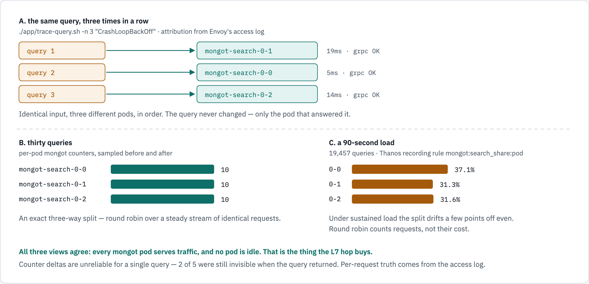

# The request path, in diagrams

The implementation diagrams for this deployment. Every label was read from the running
objects on CRC 4.22 on 2026-09-24 — not from the specification, and not from memory.

> **There is no Gateway API here.** No `Gateway`, no `GRPCRoute`, no `BackendTLSPolicy`.
> The load balancer is a plain Envoy that the MCK operator deploys itself when a
> `MongoDBSearch` declares `spec.clusters[].loadBalancer.managed`: a Deployment, a ConfigMap
> holding `bootstrap.json` / `cds.json` / `lds.json`, and nothing else.

| | |
|---|---|
| Figure source | [`docs/diagrams/grpc-through-envoy/source.html`](docs/diagrams/grpc-through-envoy/source.html) |
| Rendered | `request-path.{light,dark}.png`, `movement.{light,dark}.png` |
| Re-render | edit `source.html` and re-render both figures; never edit a PNG |

---

## Figure 1 — how a gRPC call reaches a `mongot` pod

<!-- markdownlint-disable MD033 -->
<picture>
  <source media="(prefers-color-scheme: dark)" srcset="docs/diagrams/grpc-through-envoy/request-path.dark.png">
  <source srcset="docs/diagrams/grpc-through-envoy/request-path.light.png">
  
</picture>
<!-- markdownlint-enable MD033 -->

*One connection in, three pods out. The passthrough default, `balance source`, pinned every
connection to one Envoy replica — which is why the second one logged nothing — so the Route
now carries `haproxy.router.openshift.io/balance: roundrobin`. The Envoy holding the live
connection round-robins the individual gRPC streams across all three `mongot` pods over a
second mutual-TLS leg.*

```text
  colima VM 192.168.64.4
    (1) mongod rs0, 3 members          mongotHost = grpc-search.apps-crc.testing:443
         |                             useGrpcForSearch = true, searchTLSMode = requireTLS
         | (2) ONE long-lived HTTP/2 connection   <- an L4 hop cannot split this
         v
  macOS host
    DNS -> 192.168.64.1 : 443          gvisor-tap-vsock forwards into CRC
         |                             (CRC has no host interface; this hop is the only stitch)
         v
  CRC, openshift-ingress
    (3) Route mongot-grpc, passthrough        be_tcp:mongodb-poc:mongot-grpc
         |                                    balance roundrobin  (set by annotation)
         |                                    the passthrough DEFAULT is `source`, which
         |                                    pinned every connection to ONE Envoy:
         | (4) mutual TLS 1.3 ends here       that gave 26,605 requests vs 0
         v
  CRC, namespace mongodb-poc
    (5) Envoy, Deployment mongot-search-lb-0, operator-owned, from a ConfigMap
         pod ...-5r4qg   holds the live connection, 26,605 requests, 1 client_id
         pod ...-v5ffh   0 requests, 5 connections - idle under the old default
         lds.json: bind :27028, require_client_cert, TLS min=max=v1.3, alpn h2, 300s
         cds.json: STRICT_DNS, lb_policy absent -> Envoy default ROUND_ROBIN,
                   retry_on 5 kinds incl. resource-exhausted, previous_hosts, 2 retries
         |
         | (6) STRICT_DNS on headless mongot-search-0-svc -> 3 pod IPs
         | (7) each gRPC STREAM to the next pod, second mutual-TLS leg, SNI = Service FQDN
         v
    mongot-search-0-0        mongot-search-0-1        mongot-search-0-2
    10.217.1.38:27028        10.217.1.37:27028        10.217.1.36:27028

    (8) reverse leg: each mongot opens its OWN change stream straight back to
        192.168.64.4:27017-19 - not through Envoy, not through the Route, not balanced.

    also deployed, carrying no traffic today:
        Service mongot-grpc-lb, MetalLB L2, 192.168.127.100:27028
```

### The two things the figure is really saying

1. **`mongod` opens one connection.** An L4 hop can only pin it to one backend. An L7 proxy
   reads the HTTP/2 framing, so it can send each gRPC stream inside that connection to a
   different pod.
2. **Both TLS legs are mutual.** Envoy requires a client certificate downstream
   (`require_client_certificate: true`, TLS 1.3 exactly) and presents one of its own upstream,
   with SNI set to the headless Service FQDN. Nothing on this path is cleartext.

---

## Figure 2 — the movement, measured

<!-- markdownlint-disable MD033 -->
<picture>
  <source media="(prefers-color-scheme: dark)" srcset="docs/diagrams/grpc-through-envoy/movement.dark.png">
  <source srcset="docs/diagrams/grpc-through-envoy/movement.light.png">
  
</picture>
<!-- markdownlint-enable MD033 -->

*Three independent measurements of the same claim.*

```text
A. the same query, three times          ./app/trace-query.sh -n 3 "CrashLoopBackOff"
   query 1 -> mongot-search-0-1   19ms  grpc OK
   query 2 -> mongot-search-0-0    5ms  grpc OK
   query 3 -> mongot-search-0-2   14ms  grpc OK
   identical input, three different pods, in order

B. thirty queries, per-pod counters     0-0: 10   0-1: 10   0-2: 10
   an exact three-way split

C. a 90s load, 19,457 queries           0-0: 37.1%   0-1: 31.3%   0-2: 31.6%
   Thanos recording rule mongot:search_share:pod
   under sustained load the split drifts a few points off even:
   round robin counts requests, not their cost
```

---

## Where each label comes from

| Label | Read from |
|---|---|
| `mongotHost`, `searchTLSMode`, `useGrpcForSearch` | `db.adminCommand({getCmdLineOpts:1})` on all three members |
| `grpc-search.apps-crc.testing` → `192.168.64.1` | `getent hosts` inside the `mongo1` container |
| Route is `passthrough`, targetPort 27028 | `oc get route -n mongodb-poc` |
| `balance roundrobin`, 2 servers | `be_tcp:mongodb-poc:mongot-grpc` in the router's `haproxy.config` |
| The router holds the connection | `ss -tn state established` in the router pod |
| Every client arrives as one peer address | `ss -tn` on the router frontend: all peers are `192.168.127.1` |
| Envoy listener: mTLS, TLS 1.3 exactly, ALPN h2, 300s | `lds.json` in ConfigMap `mongot-search-lb-0-config` |
| `STRICT_DNS`, upstream mTLS, SNI = Service FQDN | `cds.json` in the same ConfigMap |
| Round robin across `mongot` | `lb_policy` is **absent** from the cluster; `ROUND_ROBIN` is Envoy's default |
| Retries, `previous_hosts`, 2 attempts, 60s per try | `retry_policy` in `lds.json` |
| 26,605 vs 0 requests; one `client_id` | `oc logs` on both Envoy pods, counting `upstream_host` lines |
| 5/5 connection split after the change | `listener.0.0.0.0_27028.downstream_cx_total` on each Envoy |
| 10 / 10 / 10 and 37.1 / 31.3 / 31.6 % | `/metrics:9946` per pod; Thanos rule `mongot:search_share:pod` |
| MetalLB VIP `192.168.127.100:27028` | `oc get svc mongot-grpc-lb` — present, carrying no traffic |

---

## What these figures do **not** claim

- **That round robin balances cost.** It balances request counts. A 12-worker load test drove
  p99 to 16.3 s with an exact 1000/1000/1000 split and zero errors — perfectly even, and still
  saturated.
- **That the Route's `roundrobin` spreads requests.** HAProxy is in TCP mode: `balance` picks a
  backend **per connection**. It decides where the *next* connection lands, never where a
  request goes. See
  [Passthrough routes do honour the balance annotation](README.md#passthrough-routes-do-honour-the-balance-annotation).
- **That the MetalLB VIP is unused in general.** It is the alternative entry point and it
  works; this deployment points `mongotHost` at the Route, so the VIP carries nothing today.
  `./app/entry-path.sh` proves which one is live.
- **Anything about the reverse sync leg's balancing.** Each `mongot` opens its own change
  stream directly to the replica set; it does not pass through Envoy.

