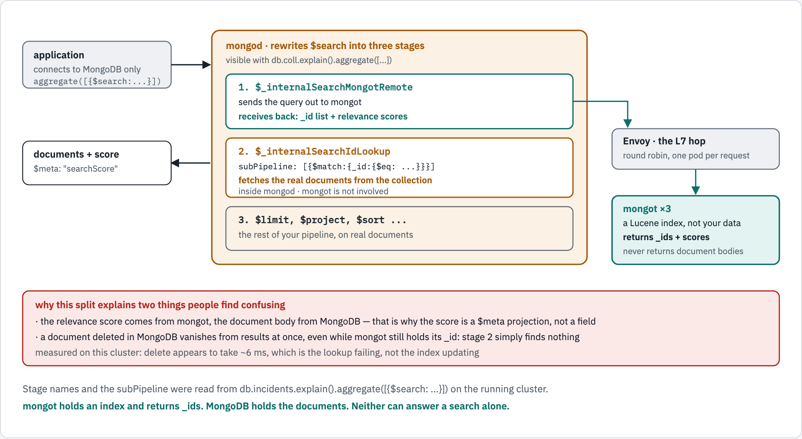
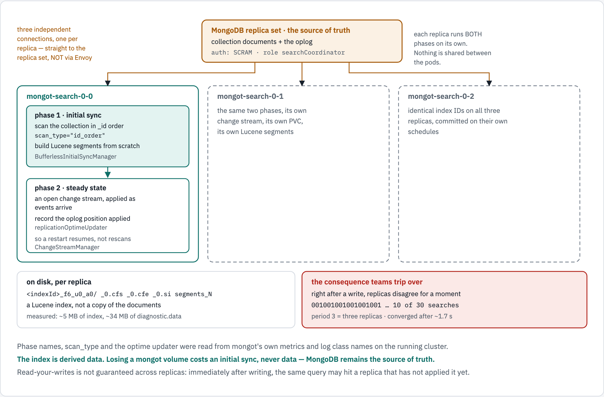

# How MongoDB Search works, and how the `mongot` data stays in sync

Written for a team that has the deployment running and does not yet have a mental model
of what is happening inside it. Every number and every claim below was measured on the
running cluster; the commands are included so you can reproduce them.

### The figures

Both diagrams in this document are in the repository and render inline below. To open them
full size, or to read the SVG source:

| | |
|---|---|
| Figure 1, how a search executes | [`search-execution.light.png`](docs/diagrams/search-and-sync/search-execution.light.png) · [dark](docs/diagrams/search-and-sync/search-execution.dark.png) |
| Figure 2, how the index syncs | [`index-sync.light.png`](docs/diagrams/search-and-sync/index-sync.light.png) · [dark](docs/diagrams/search-and-sync/index-sync.dark.png) |
| Source | [`docs/diagrams/search-and-sync/source.html`](docs/diagrams/search-and-sync/source.html) |

**The two questions this answers**

1. When an application runs `$search`, what actually executes?
2. The `mongot` StatefulSet has its own PersistentVolumes. What is in them, how did the
   data get there, and how does it stay current when MongoDB changes?

---

## The short answer

`mongot` is **not** a MongoDB replica. It is a **Lucene index** with its own storage,
built and maintained by reading from MongoDB. A search is a two-step operation split
across both processes, and the index is kept current by a **change stream**.

```text
                     mongot never stores your documents.
                     It stores an index, and returns _ids.

  $search  ->  mongod asks mongot            -> mongot returns matching _ids + scores
           ->  mongod looks those _ids up    -> mongod returns the actual documents
```

Everything else in this document is detail underneath those two sentences.

---

## Part 1 — what happens when you run `$search`

Run `explain()` on any `$search` pipeline and mongod shows you its own rewrite:

```javascript
db.incidents.explain().aggregate([
  { $search: { index: "incidents_text", text: { query: "pods", path: { wildcard: "*" } } } },
  { $limit: 2 }
])
```

```text
0. $_internalSearchMongotRemote
1. $_internalSearchIdLookup
2. $limit
```

and the lookup stage spells out exactly what it does:

```javascript
'$_internalSearchIdLookup': {
  limit: Long('2'),
  subPipeline: [ { '$match': { _id: { '$eq': '_id placeholder' } } } ]
}
```

So a search is:

<!-- markdownlint-disable MD033 -->
<picture>
  <source media="(prefers-color-scheme: dark)" srcset="docs/diagrams/search-and-sync/search-execution.dark.png">
  <source srcset="docs/diagrams/search-and-sync/search-execution.light.png">
  
</picture>
<!-- markdownlint-enable MD033 -->


| Stage | Where it runs | What it produces |
|---|---|---|
| `$_internalSearchMongotRemote` | **mongot** | matching `_id`s and relevance scores |
| `$_internalSearchIdLookup` | **mongod** | the real documents, fetched by `_id` |

**Three consequences worth internalising.**

- **The relevance score comes from mongot; the document body comes from MongoDB.** That is
  why `$meta: "searchScore"` exists as a separate projection — the score is not a field on
  your document.
- **A document deleted in MongoDB disappears from results immediately**, even if mongot's
  index still holds its `_id`. The lookup simply finds nothing. Deletion looks instant;
  that is the lookup, not the index.
- **mongot does not hold your data**, so it cannot serve a query on its own. This is also
  why the search tier does not need your backup or encryption story applied twice — but it
  does need the index rebuilt if you lose it.

---

## Part 2 — how the index gets built in the first place: initial sync

When a search index is created, each `mongot` connects to the replica set and **scans the
collection**. mongot's own metrics name the phase and the strategy:

```text
mongot_initialsync_dispatcher_collectionScan_total{replicationType="DEFAULT",scan_type="id_order"} 8
mongot_initialsync_dispatcher_syncSource_total{hostName="192.168.64.4"}                            8
mongot_initialsync_dispatcher_completedSyncDuration_seconds_count                                  8
```

`scan_type="id_order"` — the scan walks the collection in `_id` order, which gives it a
stable, resumable position. `syncSource_total` names the host it read from.

The Java classes in mongot's logs map the phases directly:

```text
com.xgen.mongot.replication.mongodb.initialsync.BufferlessInitialSyncManager
com.xgen.mongot.replication.mongodb.initialsync.InitialSyncQueue$InitialSyncDispatcher
com.xgen.mongot.replication.mongodb.steadystate.changestream.ChangeStreamManager
com.xgen.mongot.replication.mongodb.steadystate.changestream.SyncChangeStreamDispatcher
com.xgen.mongot.replication.mongodb.steadystate.changestream.TimedChangeStreamClient
com.xgen.mongot.replication.mongodb.common.ChangeStreamMongoCursorClient
```

Note the package names: **`initialsync`** and **`steadystate.changestream`**. Those are the
two phases, and replication is tracked **per index**, not per collection or per server —
`ReplicationIndexManager` is the class that owns it.

---

## Part 3 — how it stays current: a change stream

<!-- markdownlint-disable MD033 -->
<picture>
  <source media="(prefers-color-scheme: dark)" srcset="docs/diagrams/search-and-sync/index-sync.dark.png">
  <source srcset="docs/diagrams/search-and-sync/index-sync.light.png">
  
</picture>
<!-- markdownlint-enable MD033 -->

After initial sync, each `mongot` holds an open **change stream** against the replica set
and applies events as they arrive. The dispatcher metric climbs continuously:

```text
mongot_change_stream_sync_dispatcher_executor_completed_tasks_total   81935
mongot_change_stream_mode_selector_executor_completed_tasks_total       684
mongot_replicationOptimeUpdater_executor_completed_tasks_total         4101
mongot_replication_sessionRefresher_refreshes_total                      69
```

`replicationOptimeUpdater` is the part that matters for correctness: mongot records how far
through the oplog it has applied, so a restart resumes rather than rescans.

**This is the same mechanism MongoDB documents for Atlas Search.** Their term for how far
behind the index is running is *index replication lag*.

### The sync leg does not pass through Envoy

Worth stating because the architecture diagram makes it easy to assume otherwise. mongot's
own `config.yml` points straight at the replica set:

```yaml
syncSource:
  replicaSet:
    hostAndPort:
      - 192.168.64.4:27017
      - 192.168.64.4:27018
      - 192.168.64.4:27019
    scramAuth:
      authSource: admin
```

There is no Envoy address anywhere in that file. Envoy carries **queries in**; the sync leg
is mongot reaching **out** to MongoDB on its own connection, authenticated with SCRAM as a
user holding the built-in `searchCoordinator` role:

```text
user   : search-sync-source
roles  : searchCoordinator@admin
mechs  : SCRAM-SHA-1, SCRAM-SHA-256
```

---

## Part 4 — every replica syncs independently

This is the part teams are most often surprised by, and it is easy to demonstrate.

`$searchMeta` counts **inside mongot** without mongod's `_id` lookup, so each call reads
whichever replica Envoy picked. Insert a document, then run 30 rapid counts:

```bash
./app/sync-probe.sh -r
```

One observed run:

```text
  001001001001001001001001001001
  10 of 30 searches saw the new document

  all replicas agreed after 1757 ms
```

A **period-3 pattern across three replicas**. One pod had indexed the document; the other
two had not yet. Both facts are visible at once: Envoy is round-robining, and the replicas
are independent.

> **Read-your-writes is not guaranteed across replicas.** Immediately after a write, the
> same query can return a document and then not return it, depending on which replica
> answered. If your application needs certainty right after writing, wait for convergence
> or read the document by `_id` from MongoDB instead of searching for it.

The pattern is timing-dependent — another run showed `000000000000000000000000000000` with
convergence after 1244 ms, because no replica had caught up during the sampling window.
The stable observation is the **convergence time**, not the exact pattern.

---

## Part 5 — what is actually on the PersistentVolume

```bash
./app/index-storage.sh
```

Every replica holds **the same set of indexes, with identical IDs**:

```text
mongot-search-0-0      5 index directories
mongot-search-0-1      5 index directories
mongot-search-0-2      5 index directories
-> identical index IDs on every replica

  6ab4a700c424d22a4571ec9a_f6_u0_a0
  6ab4bc25d292ce5f25d1b708_f6_u0_a0
  6ab4bc25e23c685f383ecf12_f6_u0_a0
  6ab4c433cc8f211f8707387b_f6_u0_a0
  6ab4c433d292ce5f25d1b70b_f6_u0_a0
```

Five directories, five search indexes on the cluster — `sample_mflix.movies` (`default`,
`vector_index`), `platform_ops.incidents` (`incidents_text`, `incidents_vector`) and
`search_demo.movies` (`default`).

The `_f6_` in each name matches the format version mongot reports:

```text
5 directories named _f6_
mongot_configState_indexesInCatalog{Scope="replication",indexFormatVersion="5"} 0.0
mongot_configState_indexesInCatalog{Scope="replication",indexFormatVersion="6"} 5.0
```

Five at version 6, zero at version 5, five directories named `_f6_`. The counts line up
exactly, which is why the mapping is stated here as a match rather than as documented API.

### Inside one index directory

```text
mongot-search-0-0   _0.cfe=511 _0.cfs=4106 _0.si=349 segments_kv=372 write.lock=0
mongot-search-0-1   _0.cfe=511 _0.cfs=4106 _0.si=349 segments_kz=372 write.lock=0
mongot-search-0-2   _0.cfe=511 _0.cfs=4106 _0.si=349 segments_kv=372 write.lock=0
```

That is a **Lucene index**: `.cfs`/`.cfe` are compound segment files, `.si` is segment info,
`segments_N` is the commit point and `write.lock` is Lucene's single-writer lock. The
segment files are byte-for-byte the same size on all three replicas here; only the commit
generation differs (`segments_kv` against `segments_kz`), because each replica commits on
its own schedule.

### Where the disk really goes

```text
entry                                       pod0     pod1     pod2      KB
6ab4bc25d292ce5f25d1b708_f6_u0_a0           3888     3876     3792   differs
6ab4bc25e23c685f383ecf12_f6_u0_a0           1336     1332     1336   differs
diagnostic.data                            33988    33312    35140   differs
...
mongot-search-0-0   index data  5304 KB   diagnostic.data  33988 KB
mongot-search-0-1   index data  5288 KB   diagnostic.data  33312 KB
mongot-search-0-2   index data  5208 KB   diagnostic.data  35140 KB
```

**The index is the small part.** Roughly 5 MB of index against roughly 34 MB of
`diagnostic.data`, which is mongot's own telemetry. A PVC that looks large is not evidence
of a large index — compare the index directories, not the total.

The ~2% variation between replicas' index data is independent Lucene segment merging. The
indexed content is the same; the bytes on disk are not identical.

---

## Part 6 — how long does a write take to become searchable?

```bash
./app/sync-probe.sh -n 3
```

```text
run 1   insert  102 ms   update 1000 ms   delete  6 ms
run 2   insert 1013 ms   update  987 ms   delete  6 ms
run 3   insert  994 ms   update 1002 ms   delete  9 ms

insert   min   102 ms   median   994 ms   max  1013 ms
update   min   987 ms   median  1000 ms   max  1002 ms
delete   min     6 ms   median     6 ms   max     9 ms
```

Reading these honestly:

- **Insert and update cluster near 1000 ms.** That is the index refresh cadence, not
  network time — the change event reaches mongot quickly, but the document is not visible
  to a searcher until Lucene reopens its reader.
- **Delete is ~6 ms and is not a measure of the index at all.** It is the
  `$_internalSearchIdLookup` from Part 1: the document is gone from MongoDB, so the lookup
  returns nothing regardless of what mongot still holds. Do not read the delete number as
  "deletes replicate 100x faster".
- **These are single-document probes on an idle lab.** They are the right order of
  magnitude, not a capacity figure.

---

## Part 7 — seeing it live in the GUI

The GUI at `mongot-gui` is the fastest way to show someone the whole chain, because it
connects **only to MongoDB** and yet displays which `mongot` pod answered.

```bash
oc apply -f manifests/95-search-gui.yaml
echo "https://$(oc get route mongot-gui -n mongodb-poc -o jsonpath='{.spec.host}')"
```

Any search is a URL, so you can hand someone a link that reproduces exactly what you saw:

```text
.../?q=the&mode=text
.../?q=detective&mode=vector
```

**What it is really showing.** The app issues an ordinary `$search` against MongoDB. It has
no connection to mongot, Envoy or Kubernetes. To work out which pod answered, it reads each
`mongot` pod's Prometheus counter before and after the query and reports the one that moved.
That is why the panel is evidence rather than decoration — the app cannot know the answer
any other way.

Load the identical URL twice and a different pod lights up each time. That is Part 4's
independence and the L7 round robin, visible without a terminal.

> **One honest limit.** `mode=vector` has no embedding model behind it. It looks the query
> up in a ten-word table and falls back to a uniform vector on a miss, so `?q=the&mode=vector`
> returns eight results in a meaningless order while the pod attribution stays perfectly
> correct. See [OBSERVE.md](OBSERVE.md#one-honest-limit-of-modevector).

---

## Part 8 — what breaks, and what to watch

| Symptom | Likely cause | Where to look |
|---|---|---|
| A new document is searchable, then is not | replicas have not converged yet | `./app/sync-probe.sh -r` |
| Search returns nothing after creating an index | initial sync still running | `mongot_initialsync_dispatcher_inProgressSyncs` |
| Results are stale by minutes, not milliseconds | change stream stalled or re-establishing | `mongot_change_stream_sync_dispatcher_executor_completed_tasks_total` stops climbing |
| One pod serves every query | the L7 has been bypassed | [README](README.md#the-failure-that-produces-no-error), `./app/trace-query.sh` |
| PVC filling up | usually `diagnostic.data`, not the index | `./app/index-storage.sh` |
| Index missing after a pod is recreated | the PVC was deleted with it | PVCs outlive the StatefulSet by design |

The index is **derived data**. Losing a mongot PVC costs an initial sync, not data —
the source of truth is always MongoDB.

---

## Commands used in this document

```bash
# how a search is executed
db.incidents.explain().aggregate([{ $search: { ... } }])

# the sync phases and their counters
oc exec -n mongodb-poc <toolbox> -- \
  curl -s http://mongot-search-0-0.mongot-search-0-svc:9946/metrics \
  | grep -E 'initialsync|change_stream|replicationOptime'

# where mongot syncs from, and how it authenticates
oc get cm mongot-search-0-config -n mongodb-poc -o jsonpath='{.data.config\.yml}'

# write-to-searchable latency, and replica convergence
./app/sync-probe.sh -n 3
./app/sync-probe.sh -r

# what each replica stores
./app/index-storage.sh

# which pod answered a given query
./app/trace-query.sh "CrashLoopBackOff"
```

## Sources

- [MongoDB Change Streams](https://www.mongodb.com/docs/manual/changestreams/)
- [MongoDB Search deployment options](https://www.mongodb.com/docs/search/deployment/deployment-options/)
- [Fix MongoDB Search issues — index replication lag](https://docs.atlas.mongodb.com/reference/alert-resolutions/atlas-search-alerts/)
