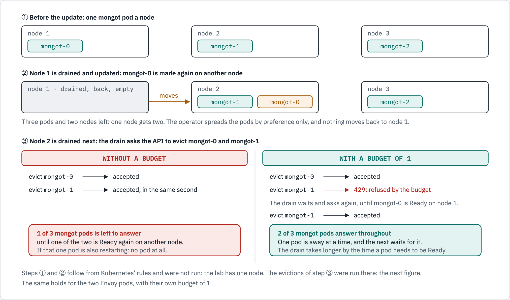
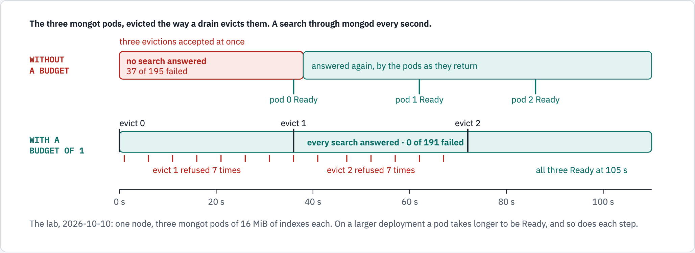

# Disruption budgets: what they do when nodes are drained

The chart creates two PodDisruptionBudgets, one for the mongot pods and one for the Envoy pods. Each lets a node
drain take down one pod of its kind at a time and makes the drain wait for that pod to be Ready again before it
takes the next. This page says why they are needed on a cluster of several nodes, what was measured with and
without them, and what they do not cover.

## In short

- **The operator creates no disruption budget, and spreads the pods over nodes by preference only.** MongoDB's
  documents say nothing on node drains or disruption budgets for mongot or for the load balancer.
- **During a rolling node update two mongot pods end up on one node**, and the next drain takes both at once.
- **With the budgets, one pod of each kind is away at a time.** On the lab the same evictions cost 37 failed
  searches of 195 without them and none of 191 with them.
- **A budget holds back evictions only**: a node drain, a node update, the cluster autoscaler. It does nothing
  about a rolling restart, a scale-down, a deleted pod or a node that fails.
- **A drain takes longer**, by the time each pod needs to be Ready again.

## What the chart sets

| Value | Default | What it does |
| --- | --- | --- |
| `search.podDisruptionBudget.enabled` | `true` | A PodDisruptionBudget named after the mongot StatefulSet, `<search.name>-search-0`, selecting its pods |
| `search.podDisruptionBudget.maxUnavailable` | `1` | How many mongot pods an eviction may leave away at once. A whole number of 1 or more: 0 would block every drain, and the chart refuses it |
| `loadBalancer.podDisruptionBudget.enabled` | `true` | The same for the Envoy pods, named after their Deployment, `<search.name>-search-lb-0` |
| `loadBalancer.podDisruptionBudget.maxUnavailable` | `1` | With two Envoy pods, one always stays to carry the searches |

Both carry `unhealthyPodEvictionPolicy: AlwaysAllow`, as Kubernetes recommends: "It is recommended to set
`AlwaysAllow` Unhealthy Pod Eviction Policy to your PodDisruptionBudgets to support eviction of misbehaving
applications during a node drain." A pod that is running and not Ready can then always be evicted, so a pod that
runs and never becomes Ready does not hold a drain for ever.

`maxUnavailable` and not `minAvailable`, again as Kubernetes recommends: "The use of `maxUnavailable` is
recommended as it automatically responds to changes in the number of replicas of the corresponding controller."
And no number of pods makes it refuse every eviction: with a single pod, that pod may still be evicted.

Under Argo CD the two budgets are in sync wave 1, with the MongoDBSearch. They are objects of the release like
the Route: an uninstall removes them, also when `search.keepOnUninstall` keeps the search.

## Why they are needed

| Fact | Source |
| --- | --- |
| The mongot pods and the Envoy pods each carry a *preferred* pod anti-affinity on the node's name, weight 100. Nothing requires them to be on different nodes | The lab's StatefulSet and Deployment; the operator's source at 1.13.0: mongot in `controllers/searchcontroller/search_construction.go`, lines 173 to 176 ("preferred, not required"); Envoy in `controllers/operator/mongodbsearchenvoy_controller.go`, lines 674 to 690 |
| The operator creates no PodDisruptionBudget | The lab: none in the namespace before this chart version. The operator's source at 1.13.0 has none for mongot or Envoy |
| MongoDB's documents do not mention disruption budgets, node drains or node maintenance for search | The search pages of the operator's documentation and of the self-managed search documentation, about forty in all, fetched and searched on 2026-10-10 |
| A drain evicts through the API, and the API refuses an eviction a budget does not allow: "`429 Too Many Requests`: the eviction is not currently allowed because of the configured PodDisruptionBudget. You may be able to attempt the eviction again later." | Kubernetes, [API-initiated Eviction](https://kubernetes.io/docs/concepts/scheduling-eviction/api-eviction/) |
| Drains that run at the same time are held to the same budget: "Multiple drain commands running concurrently will still respect the PodDisruptionBudget you specify" | Kubernetes, [Safely Drain a Node](https://kubernetes.io/docs/tasks/administer-cluster/safely-drain-node/) |

## A rolling node update on three nodes

<!-- markdownlint-disable MD033 -->

<!-- markdownlint-enable MD033 -->

*After the first node of a rolling update is drained, one of the other two holds two mongot pods. Draining that
node evicts both in the same second without a budget; with a budget of 1 the second eviction is refused until the
first pod is Ready again. Drawn from Kubernetes' rules for a cluster of three nodes; not run on one by this
repository.*

```text
1  Before the update      node 1: mongot-0      node 2: mongot-1             node 3: mongot-2
2  Node 1 is drained      node 1: empty         node 2: mongot-1, mongot-0   node 3: mongot-2
   Three pods and two nodes left: one node gets two. Nothing moves back when node 1 returns.
3  Node 2 is drained next: the drain asks the API to evict mongot-0 and mongot-1

   WITHOUT A BUDGET                           WITH A BUDGET OF 1
   evict mongot-0 -> accepted                 evict mongot-0 -> accepted
   evict mongot-1 -> accepted, same second    evict mongot-1 -> 429, refused by the budget
                                              the drain waits and asks again, until mongot-0 is Ready
                                              evict mongot-1 -> accepted
   1 of 3 mongot pods is left to answer       2 of 3 mongot pods answer throughout
```

Why step 2 happens whenever one of the other nodes has room for the pod: a drain makes its node unschedulable first, so the pod that is evicted has two nodes to
go to, and each already holds a mongot pod. The anti-affinity is a preference, so the pod is placed on one of
them. When the drained node returns it is empty, and Kubernetes does not move running pods back by itself. If
neither has room, the pod waits, `Pending`, and is placed on node 1 when it is schedulable again; then no node
holds two.

The two Envoy pods have a free node to go to on three nodes, which the scheduler prefers, so they are likely to
stay apart there. On two nodes, or when a
third cannot take the pod, they share a node in the same way, and a drain of that node takes both.

A pool that updates more than one node at a time, two drains started by hand, and a cluster autoscaler that
removes nodes all reach the same point sooner.

## The same evictions, measured

The lab has one node, so no node was drained. The evictions of a drain were made instead: for each pod of a kind,
the request `oc adm drain` sends to the API, and on a refusal a wait of 5 s and the request again. A search
through mongod was tried every second.

<!-- markdownlint-disable MD033 -->

<!-- markdownlint-enable MD033 -->

*Measured on the lab on 2026-10-10 by asking the API to evict the pods as a drain does. Without a budget the three
mongot pods went at once, and 37 of 195 searches failed over 37 seconds. With a budget of 1 they went one at a time, each waiting for the one before to be Ready,
and all 191 searches were answered.*

```text
WITHOUT A BUDGET   0 s   three evictions accepted at once
                   0 to 37 s   no search answered: 37 of 195 failed
                   36 s pod 0 Ready, 62 s pod 1 Ready, 86 s pod 2 Ready
WITH A BUDGET OF 1 0 s   evict pod 0: accepted; evict pod 1: refused 7 times
                   36 s  evict pod 1: accepted; evict pod 2: refused 7 times
                   72 s  evict pod 2: accepted; all three Ready at 105 s
                   every search answered: 0 of 191 failed
```

| Evicted, as a drain would | Budgets | Searches tried | Failed | Fewest pods of the kind Ready |
| --- | --- | --- | --- | --- |
| The three mongot pods | None | 195 | **37**, over 37 s | 0 |
| The three mongot pods | 1 | 191 | 0 | 2 |
| The two Envoy pods | None | 91 | **1**; no Envoy pod Ready for about 10 s | 0 |
| The two Envoy pods | 1 | 99 | 0 | 1 |
| Three Envoy pods | 1 | 107 | 0 | 2 |

- **The refusal**, each time: "Cannot evict pod as it would violate the pod's disruption budget."
- **The mongot pods** came back on their own volume claims, as a deleted pod does.
- **The Envoy pods** stop gracefully: the operator gives each 70 s in which it tells mongod to open new searches
  elsewhere and lets the ones in flight end. That is the likely reason losing both at once failed one search and
  not more; it was not shown.
- **Ready**, in the last column, leaves out a pod that is stopping: it is no longer sent new searches.
- **The times are the lab's**: three mongot pods of 16 MiB of indexes on one node. Where a pod takes longer to
  be Ready, the gap without a budget and the drain with one are both longer.

## Two Envoy pods, or three

MongoDB's default is one, and its one statement on more is in the operator's FAQ: "If you deploy multiple
`mongot` replicas behind the load balancer and also run more than one Envoy replica, queries continue to run while
the `mongot` or Envoy deployments undergo rolling restarts. With a single replica, queries see a brief gap until
the pod is ready again." It names no number beyond that, and gives no rule for when to add Envoy pods.

| | Two Envoy pods | Three Envoy pods |
| --- | --- | --- |
| During a drain, with the budget of 1 | One Envoy pod carries everything, with no second behind it (measured: 1 Ready at the lowest) | Two stay (measured: 2) |
| A node that fails | The connection of a mongod is cut if the node held the Envoy pod it was on; mongod opens it again on a pod that is left (not run) | The same; a given connection is on that node less often |
| How searches spread over the mongot pods | The same: each Envoy pod balances every search over all mongot pods, round robin | The same |
| How much one mongod can send | One mongod sends every search over one connection, through one Envoy pod. Under load on the lab the other pod carried nothing ([testing-envoy-under-load.md](../../docs/testing-envoy-under-load.md)) | The same: the third pod is one more standby, not capacity |
| Failed searches in the drain test | 0 of 99 | 0 of 107 |
| Cost a pod | 100m CPU and 128Mi requested, by the operator's defaults | The same, once more |

So a third Envoy pod buys redundancy during maintenance. It does not make
searches faster, and it did not change the count of failed searches on the lab. Whether Envoy is ever short of CPU
at a real load is a reading from the dashboard, section *Is Envoy healthy?*: MongoDB gives no sizing for it.

## What a budget does not do

Kubernetes: "Not all voluntary disruptions are constrained by Pod Disruption Budgets. For example, deleting
deployments or pods bypasses Pod Disruption Budgets."

| Event | Held back by the budget |
| --- | --- |
| A node drain, a node update, the cluster autoscaler removing a node | Yes |
| A rolling restart of mongot or of Envoy (a changed value, a new image) | No. The StatefulSet and the Deployment restart one pod at a time by themselves |
| `oc delete pod` | No |
| Fewer pods (`search.replicas` lowered), an uninstall | No. [volumes.md](volumes.md) |
| A node that fails | No. Nothing asks first |

What to expect from one:

- **A drain waits while a pod of the kind is not Ready.** With a budget of 1 and one mongot pod already away, for
  a restart or because it is building its indexes again, no other mongot pod is evicted until it is back. Where a
  rebuild takes hours ([volumes.md](volumes.md)), a node update waits that long. That is the budget working: the
  other two are what answers.
- **A pod that is not Ready can itself be evicted at any time** (`AlwaysAllow`), so the node it is on is not
  held.
- **`oc get pdb`** shows it: `ALLOWED DISRUPTIONS` is 1 when every pod is Ready and 0 while one is away. A drain
  that waits prints the refusal above and tries again.
- **The volume runbook is not affected.** Its StatefulSet step deletes the StatefulSet and leaves the pods, which
  are without an owner for a moment. On the lab, with the budgets in place, the mongot budget read 1 allowed and 3
  of 3 healthy at each of 253 readings taken through that step, about 0.3 s apart, and the sync passed.

## What was run, and where

All on the lab, 2026-10-10: OpenShift Local 4.22.7 (Kubernetes 1.35), one node, operator 1.13.0, under Argo CD.

| What | Result |
| --- | --- |
| The sync that created the two budgets | `Succeeded` in 49 s. Argo CD read both `Healthy`, "PodDisruptionBudget has SufficientPods". No pod restarted |
| Their status | mongot: 3 expected, 3 healthy, 2 desired, 1 allowed. Envoy: 2, 2, 1, 1 |
| The evictions, without the budgets and with them | The table above |
| A volume resize with the budgets in place, 7Gi to 8Gi | The runbook to its end; Argo CD's first retry passed the gate. The budget's status did not change |
| The templates | `test/chart.sh`: the two budgets, their switches and numbers, the selectors, a budget of 0 refused |

Not run:

- **A node drained.** The lab has one. Steps 1 and 2 of the first figure follow from how Kubernetes schedules and
  drains, and were not seen.
- **A pod that moves to another node with its volume**: on vSphere the disk is detached and attached again, which
  takes time the lab's NFS volumes do not show.
- **`AlwaysAllow` with a pod that is not Ready.**
- **A budget above 1, or more than three mongot pods.**

## Sources

- Kubernetes: [Safely Drain a Node](https://kubernetes.io/docs/tasks/administer-cluster/safely-drain-node/);
  [API-initiated Eviction](https://kubernetes.io/docs/concepts/scheduling-eviction/api-eviction/);
  [Specifying a Disruption Budget for your Application](https://kubernetes.io/docs/tasks/run-application/configure-pdb/);
  [Disruptions](https://kubernetes.io/docs/concepts/workloads/pods/disruptions/).
- MongoDB: [`mongot` Deployment Frequently Asked Questions](https://www.mongodb.com/docs/kubernetes/current/fts-vs/faq/)
  of the operator's documentation; [MongoDB Search and Vector Search Settings](https://www.mongodb.com/docs/kubernetes/current/reference/fts-vs-settings/)
  for the Envoy defaults.
- The operator's source, [mongodb/mongodb-kubernetes](https://github.com/mongodb/mongodb-kubernetes) at tag
  1.13.0: `controllers/operator/mongodbsearchenvoy_controller.go` (the anti-affinity, the drain on stop),
  `controllers/operator/envoy_config_builder.go` (round robin), `api/mongodb/v1/search/mongodbsearch_types.go`
  (the 60 s and 70 s).

## Diagram sources

The two figures are drawn in [docs/diagrams/disruption-budgets/source.html](../../docs/diagrams/disruption-budgets/source.html)
and rendered with [diagram-kit](https://github.com/ephico2real2/diagram-kit); [docs/diagrams/README.md](../../docs/diagrams/README.md)
has the command. A figure, its text twin here and its page change together.
