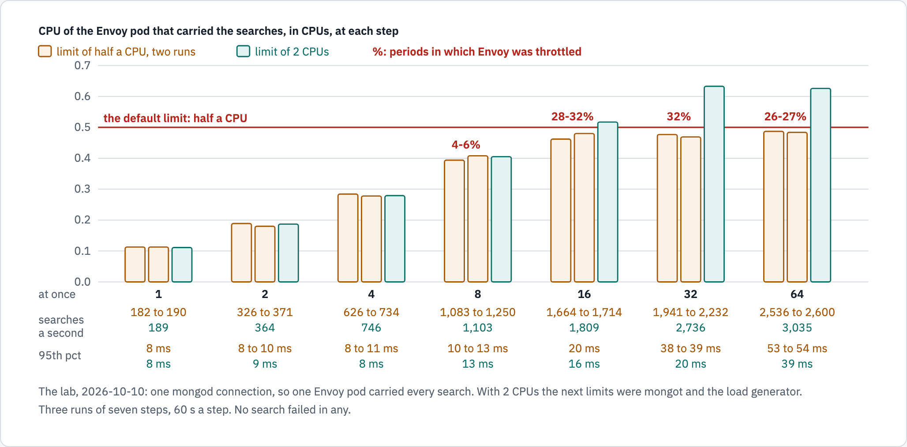
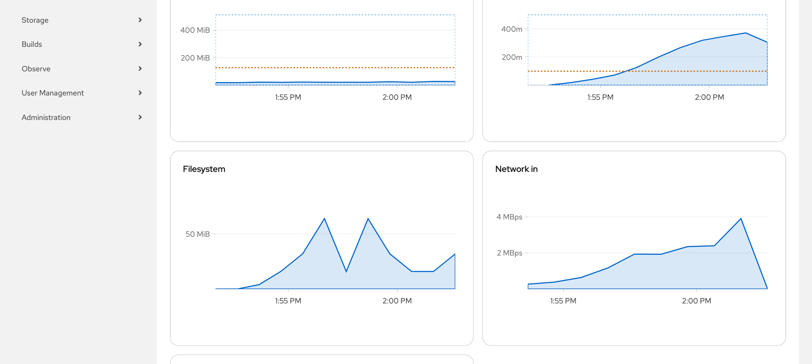
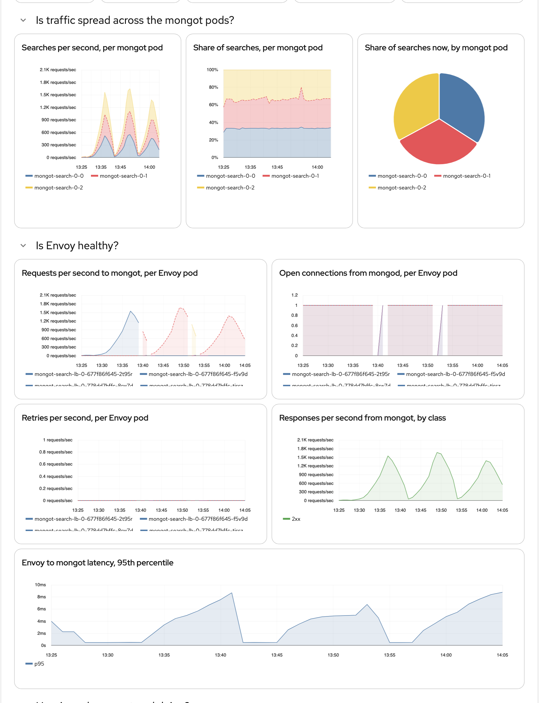

# Testing the managed Envoy under load

A load test of search on the lab, run on 2026-10-10, to see how the Envoy that the operator puts in front of mongot
behaves under concurrent searches: its CPU for each search, whether its CPU limit holds it back, its memory, and how
mongod's connection lands on the Envoy pods. It was run with the operator's default resources for Envoy and with the
starting point [production-settings.md](../chart/mongodb-search-helm/production-settings.md) gives for production.
The tool is in [test/load/](../test/load/), so the same test can be run on another cluster.

## The result

- **The default CPU limit holds Envoy back.** With the operator's half a CPU, the Envoy pod that carried the
  searches was throttled from 8 searches at once (about 1,100 a second) and in 26 to 32% of periods from 16 on.
  With a limit of 2 CPUs it was never throttled, and used up to 0.63 CPUs.
- **Searches got faster where it mattered**: at 32 at once the 95th percentile fell from 38 to 39 ms to 20 ms,
  and the searches a second rose from 1,941 to 2,232 to 2,736.
- **One mongod sends every search through one Envoy pod.** Each Envoy pod held one connection from mongod, and
  all the searches went down one of them. The other Envoy pod used 0.005 to 0.007 CPUs at every step of every
  run. A second or third Envoy pod stands by for that mongod; it does not add capacity for it.
- **Envoy's cost**: about 0.4 CPUs at 1,100 searches a second. For each search a second it used 0.6 thousandths
  of a CPU at low rates and 0.2 at the highest.
- **Envoy's memory stayed small**: 37.9 MiB at most.
- **Nothing failed**: 1,646,462 searches in the three runs, 0 failed, no retry by Envoy.
- **With Envoy's limit raised, the next limits were mongot and the load generator**, not Envoy.

<!-- markdownlint-disable MD033 -->

<!-- markdownlint-enable MD033 -->

*With the operator's default limit the busy Envoy pod was held at half a CPU from 16 searches at once and throttled
in up to 32% of periods; with 2 CPUs it was never throttled, used up to 0.63 CPUs, and the 95th percentile at 32 at
once fell from 38 to 39 ms to 20 ms. Measured on the lab, where one mongod connection carries every search.*

```text
At once                      1        2        4        8             16            32            64
Limit half a CPU, two runs
  busy Envoy pod, CPUs       0.11     0.18-0.19  0.28   0.39-0.41     0.46-0.48     0.47-0.48     0.48-0.49
  periods throttled          0        0        0        4-6%          28-32%        32%           26-27%
  searches a second          182-190  326-371  626-734  1,083-1,250   1,664-1,714   1,941-2,232   2,536-2,600
  95th percentile            8 ms     8-10 ms  8-11 ms  10-13 ms      20 ms         38-39 ms      53-54 ms
Limit 2 CPUs, one run
  busy Envoy pod, CPUs       0.11     0.19     0.28     0.41          0.52          0.63          0.63
  periods throttled          0        0        0        0             0             0             0
  searches a second          189      364      746      1,103         1,809         2,736         3,035
  95th percentile            8 ms     9 ms     8 ms     13 ms         16 ms         20 ms         39 ms
```

## The setup

| | |
| --- | --- |
| Cluster | OpenShift Local 4.22.7, one node of 12 CPUs, namespace `mongodb-poc` |
| Search | Chart `mongodb-search-helm` 0.3.23 under Argo CD, operator 1.13.0, mongot 1.70.1: three mongot pods (1 CPU at most each), two Envoy pods (Envoy 1.37.6) |
| Source | A replica set of three mongod on a virtual machine of the same workstation |
| Data | `sample_mflix.movies`, the index `default`: 16 MiB of indexes a mongot pod |
| The searches | `$search` for one of eight words over every field, the first 10 results, two fields of each. Small and quick on purpose: the test is of the path, not of the index |
| The generator | One pod in the namespace: one `mongosh` that keeps N searches in flight through the driver, N stepping 1, 2, 4, 8, 16, 32, 64, for 60 s a step with 15 s between |
| Read while it ran | From every Envoy pod, mongot pod and the generator, about every 10 s: the CPU time used, the periods and the throttled periods of the container, and its memory, from its cgroup. From Prometheus afterwards: Envoy's own counters |

The time of a search is as the generator saw it: through mongod, Envoy and mongot and back.

## The three runs

```bash
export TargetNamespace=mongodb-poc URI_SECRET=mongot-gui-mongo-uri
test/load/run.sh A-default 1,2,4,8,16,32,64 60 15       # Envoy at the operator's defaults
# loadBalancer.resources in git: 250m and 256Mi requested, 2 CPUs and 1Gi at most; Argo CD rolled the Envoy pods
test/load/run.sh B-production 1,2,4,8,16,32,64 60 15
# the values back as they were; Argo CD rolled the Envoy pods again
test/load/run.sh A2-default 1,2,4,8,16,32,64 60 15      # the first run again, to see how much two runs differ
python3 test/load/analyze.py A-default
```

### Envoy at the operator's defaults: 100m and 128Mi requested, 500m and 512Mi at most

18:28Z to 18:37Z. What the generator printed:

```console
{"step":"start","steps":[1,2,4,8,16,32,64],"seconds":60,"terms":8,"limit":10,"at":"2026-10-10T18:28:22.139Z"}
{"step":"done","concurrency":1,"start":"2026-10-10T18:28:22.140Z","end":"2026-10-10T18:29:22.329Z","ok":10924,"failed":0,"per_second":182.1,"docs":27320,"ms":{"p50":5.1,"p95":7.8,"p99":11.9,"max":59.2},"first_error":""}
{"step":"done","concurrency":2,"start":"2026-10-10T18:29:37.335Z","end":"2026-10-10T18:30:37.727Z","ok":19591,"failed":0,"per_second":326.5,"docs":48980,"ms":{"p50":5.3,"p95":10.3,"p99":20.2,"max":196.6},"first_error":""}
{"step":"done","concurrency":4,"start":"2026-10-10T18:30:52.733Z","end":"2026-10-10T18:31:53.735Z","ok":37589,"failed":0,"per_second":626.4,"docs":93980,"ms":{"p50":5.7,"p95":10.6,"p99":19.9,"max":203.7},"first_error":""}
{"step":"done","concurrency":8,"start":"2026-10-10T18:32:08.741Z","end":"2026-10-10T18:33:10.271Z","ok":75035,"failed":0,"per_second":1250.4,"docs":187570,"ms":{"p50":6,"p95":9.6,"p99":13.6,"max":165},"first_error":""}
{"step":"done","concurrency":16,"start":"2026-10-10T18:33:25.277Z","end":"2026-10-10T18:34:27.303Z","ok":102878,"failed":0,"per_second":1714.5,"docs":257190,"ms":{"p50":7.8,"p95":20.1,"p99":32.8,"max":182.5},"first_error":""}
{"step":"done","concurrency":32,"start":"2026-10-10T18:34:42.310Z","end":"2026-10-10T18:35:44.967Z","ok":133921,"failed":0,"per_second":2231.8,"docs":334800,"ms":{"p50":10.4,"p95":37.6,"p99":47.5,"max":185},"first_error":""}
{"step":"done","concurrency":64,"start":"2026-10-10T18:35:59.972Z","end":"2026-10-10T18:37:03.008Z","ok":156068,"failed":0,"per_second":2600,"docs":390160,"ms":{"p50":18.4,"p95":53.4,"p99":69.9,"max":355.2},"first_error":""}
{"step":"end","at":"2026-10-10T18:37:18.026Z"}
```

| At once | Searches | Failed | A second | p50 | p95 | p99 | Busy Envoy pod, CPUs | Idle Envoy pod | Envoy periods throttled | Envoy memory, most | Each mongot pod, CPUs | mongot periods throttled | Generator, CPUs |
| --- | --- | --- | --- | --- | --- | --- | --- | --- | --- | --- | --- | --- | --- |
| 1 | 10,924 | 0 | 182.1 | 5.1 ms | 7.8 ms | 11.9 ms | 0.113 | 0.005 | 0 of 524 (0%) | 31.1 MiB | 0.18 0.17 0.18 | 6 of 1571 (0%) | 0.11 |
| 2 | 19,591 | 0 | 326.5 | 5.3 ms | 10.3 ms | 20.2 ms | 0.189 | 0.006 | 0 of 547 (0%) | 26.0 MiB | 0.25 0.24 0.25 | 12 of 1641 (1%) | 0.17 |
| 4 | 37,589 | 0 | 626.4 | 5.7 ms | 10.6 ms | 19.9 ms | 0.284 | 0.006 | 0 of 599 (0%) | 32.9 MiB | 0.35 0.35 0.34 | 11 of 1803 (1%) | 0.29 |
| 8 | 75,035 | 0 | 1,250.4 | 6 ms | 9.6 ms | 13.6 ms | 0.394 | 0.006 | 26 of 585 (4%) | 30.5 MiB | 0.48 0.47 0.48 | 1 of 1769 (0%) | 0.43 |
| 16 | 102,878 | 0 | 1,714.5 | 7.8 ms | 20.1 ms | 32.8 ms | 0.462 | 0.006 | 185 of 587 (32%) | 32.2 MiB | 0.6 0.59 0.6 | 6 of 1800 (0%) | 0.57 |
| 32 | 133,921 | 0 | 2,231.8 | 10.4 ms | 37.6 ms | 47.5 ms | 0.477 | 0.006 | 174 of 541 (32%) | 27.2 MiB | 0.68 0.68 0.69 | 8 of 1624 (0%) | 0.64 |
| 64 | 156,068 | 0 | 2,600 | 18.4 ms | 53.4 ms | 69.9 ms | 0.487 | 0.006 | 148 of 553 (27%) | 34.1 MiB | 0.74 0.72 0.74 | 20 of 1658 (1%) | 0.83 |

### The same again

18:52Z to 19:01Z.

```console
{"step":"start","steps":[1,2,4,8,16,32,64],"seconds":60,"terms":8,"limit":10,"at":"2026-10-10T18:52:27.989Z"}
{"step":"done","concurrency":1,"start":"2026-10-10T18:52:27.990Z","end":"2026-10-10T18:53:28.339Z","ok":11428,"failed":0,"per_second":190.5,"docs":28580,"ms":{"p50":4.8,"p95":7.5,"p99":12.5,"max":82},"first_error":""}
{"step":"done","concurrency":2,"start":"2026-10-10T18:53:43.347Z","end":"2026-10-10T18:54:43.773Z","ok":22267,"failed":0,"per_second":371.1,"docs":55670,"ms":{"p50":4.8,"p95":8.1,"p99":15.6,"max":104.6},"first_error":""}
{"step":"done","concurrency":4,"start":"2026-10-10T18:54:58.778Z","end":"2026-10-10T18:56:01.389Z","ok":44151,"failed":0,"per_second":733.9,"docs":110390,"ms":{"p50":5,"p95":8.1,"p99":11.4,"max":321.7},"first_error":""}
{"step":"done","concurrency":8,"start":"2026-10-10T18:56:16.411Z","end":"2026-10-10T18:57:17.563Z","ok":64972,"failed":0,"per_second":1082.7,"docs":162430,"ms":{"p50":6.6,"p95":12.5,"p99":22,"max":198.9},"first_error":""}
{"step":"done","concurrency":16,"start":"2026-10-10T18:57:32.571Z","end":"2026-10-10T18:58:34.673Z","ok":99875,"failed":0,"per_second":1664.4,"docs":249690,"ms":{"p50":8.1,"p95":20.4,"p99":32.4,"max":229.5},"first_error":""}
{"step":"done","concurrency":32,"start":"2026-10-10T18:58:49.681Z","end":"2026-10-10T18:59:52.697Z","ok":116504,"failed":0,"per_second":1941.4,"docs":291270,"ms":{"p50":12.6,"p95":38.8,"p99":49.9,"max":200.8},"first_error":""}
{"step":"done","concurrency":64,"start":"2026-10-10T19:00:07.718Z","end":"2026-10-10T19:01:13.636Z","ok":152240,"failed":0,"per_second":2536.1,"docs":380610,"ms":{"p50":19.6,"p95":53.8,"p99":67.8,"max":215.9},"first_error":""}
{"step":"end","at":"2026-10-10T19:01:28.656Z"}
```

| At once | Searches | Failed | A second | p50 | p95 | p99 | Busy Envoy pod, CPUs | Idle Envoy pod | Envoy periods throttled | Envoy memory, most | Each mongot pod, CPUs | mongot periods throttled | Generator, CPUs |
| --- | --- | --- | --- | --- | --- | --- | --- | --- | --- | --- | --- | --- | --- |
| 1 | 11,428 | 0 | 190.5 | 4.8 ms | 7.5 ms | 12.5 ms | 0.113 | 0.005 | 0 of 522 (0%) | 30.2 MiB | 0.13 0.13 0.13 | 0 of 1561 (0%) | 0.12 |
| 2 | 22,267 | 0 | 371.1 | 4.8 ms | 8.1 ms | 15.6 ms | 0.180 | 0.005 | 0 of 533 (0%) | 30.7 MiB | 0.21 0.21 0.21 | 1 of 1599 (0%) | 0.17 |
| 4 | 44,151 | 0 | 733.9 | 5 ms | 8.1 ms | 11.4 ms | 0.278 | 0.005 | 0 of 531 (0%) | 28.1 MiB | 0.33 0.33 0.33 | 0 of 1594 (0%) | 0.28 |
| 8 | 64,972 | 0 | 1,082.7 | 6.6 ms | 12.5 ms | 22 ms | 0.408 | 0.006 | 31 of 547 (6%) | 31.7 MiB | 0.49 0.48 0.48 | 0 of 1635 (0%) | 0.4 |
| 16 | 99,875 | 0 | 1,664.4 | 8.1 ms | 20.4 ms | 32.4 ms | 0.480 | 0.006 | 168 of 603 (28%) | 37.9 MiB | 0.62 0.61 0.61 | 0 of 1823 (0%) | 0.6 |
| 32 | 116,504 | 0 | 1,941.4 | 12.6 ms | 38.8 ms | 49.9 ms | 0.469 | 0.006 | 180 of 558 (32%) | 31.0 MiB | 0.65 0.65 0.66 | 2 of 1671 (0%) | 0.68 |
| 64 | 152,240 | 0 | 2,536.1 | 19.6 ms | 53.8 ms | 67.8 ms | 0.484 | 0.006 | 146 of 568 (26%) | 33.6 MiB | 0.72 0.71 0.73 | 18 of 1736 (1%) | 0.86 |

### Envoy with 250m and 256Mi requested, 2 CPUs and 1Gi at most

18:40Z to 18:49Z.

```console
{"step":"start","steps":[1,2,4,8,16,32,64],"seconds":60,"terms":8,"limit":10,"at":"2026-10-10T18:40:33.323Z"}
{"step":"done","concurrency":1,"start":"2026-10-10T18:40:33.323Z","end":"2026-10-10T18:41:33.534Z","ok":11331,"failed":0,"per_second":188.8,"docs":28330,"ms":{"p50":4.8,"p95":7.9,"p99":15.2,"max":64.6},"first_error":""}
{"step":"done","concurrency":2,"start":"2026-10-10T18:41:48.540Z","end":"2026-10-10T18:42:48.884Z","ok":21823,"failed":0,"per_second":363.7,"docs":54570,"ms":{"p50":4.9,"p95":8.9,"p99":15.8,"max":69.3},"first_error":""}
{"step":"done","concurrency":4,"start":"2026-10-10T18:43:03.890Z","end":"2026-10-10T18:44:04.677Z","ok":44737,"failed":0,"per_second":745.6,"docs":111850,"ms":{"p50":4.9,"p95":8.1,"p99":11.6,"max":100.7},"first_error":""}
{"step":"done","concurrency":8,"start":"2026-10-10T18:44:19.683Z","end":"2026-10-10T18:45:22.096Z","ok":66261,"failed":0,"per_second":1103.4,"docs":165650,"ms":{"p50":6.5,"p95":12.5,"p99":23.1,"max":132.5},"first_error":""}
{"step":"done","concurrency":16,"start":"2026-10-10T18:45:37.107Z","end":"2026-10-10T18:46:40.641Z","ok":108554,"failed":0,"per_second":1809,"docs":271400,"ms":{"p50":7.9,"p95":15.5,"p99":25.5,"max":179.7},"first_error":""}
{"step":"done","concurrency":32,"start":"2026-10-10T18:46:55.656Z","end":"2026-10-10T18:47:59.336Z","ok":164190,"failed":0,"per_second":2736.2,"docs":410470,"ms":{"p50":10.5,"p95":19.9,"p99":29.3,"max":218.1},"first_error":""}
{"step":"done","concurrency":64,"start":"2026-10-10T18:48:14.354Z","end":"2026-10-10T18:49:18.076Z","ok":182123,"failed":0,"per_second":3035,"docs":455320,"ms":{"p50":18.5,"p95":38.7,"p99":63.2,"max":254},"first_error":""}
{"step":"end","at":"2026-10-10T18:49:33.108Z"}
```

| At once | Searches | Failed | A second | p50 | p95 | p99 | Busy Envoy pod, CPUs | Idle Envoy pod | Envoy periods throttled | Envoy memory, most | Each mongot pod, CPUs | mongot periods throttled | Generator, CPUs |
| --- | --- | --- | --- | --- | --- | --- | --- | --- | --- | --- | --- | --- | --- |
| 1 | 11,331 | 0 | 188.8 | 4.8 ms | 7.9 ms | 15.2 ms | 0.111 | 0.005 | 0 of 526 (0%) | 30.4 MiB | 0.12 0.12 0.12 | 0 of 1578 (0%) | 0.11 |
| 2 | 21,823 | 0 | 363.7 | 4.9 ms | 8.9 ms | 15.8 ms | 0.187 | 0.006 | 0 of 539 (0%) | 29.5 MiB | 0.21 0.21 0.21 | 0 of 1615 (0%) | 0.17 |
| 4 | 44,737 | 0 | 745.6 | 4.9 ms | 8.1 ms | 11.6 ms | 0.279 | 0.005 | 0 of 583 (0%) | 27.5 MiB | 0.33 0.32 0.33 | 0 of 1752 (0%) | 0.27 |
| 8 | 66,261 | 0 | 1,103.4 | 6.5 ms | 12.5 ms | 23.1 ms | 0.405 | 0.006 | 0 of 605 (0%) | 30.5 MiB | 0.47 0.47 0.48 | 0 of 1819 (0%) | 0.43 |
| 16 | 108,554 | 0 | 1,809 | 7.9 ms | 15.5 ms | 25.5 ms | 0.517 | 0.006 | 0 of 603 (0%) | 32.2 MiB | 0.65 0.64 0.64 | 7 of 1827 (0%) | 0.63 |
| 32 | 164,190 | 0 | 2,736.2 | 10.5 ms | 19.9 ms | 29.3 ms | 0.633 | 0.006 | 0 of 608 (0%) | 31.9 MiB | 0.84 0.84 0.84 | 169 of 1851 (9%) | 0.95 |
| 64 | 182,123 | 0 | 3,035 | 18.5 ms | 38.7 ms | 63.2 ms | 0.626 | 0.007 | 0 of 614 (0%) | 31.7 MiB | 0.84 0.83 0.83 | 718 of 1900 (38%) | 1.1 |

The control plane's restart counts were read before and after each run and did not move.

## What the console showed

<!-- markdownlint-disable MD033 -->

<!-- markdownlint-enable MD033 -->

*The Envoy pod that carried the third run, in the console: its CPU climbs toward its limit, the upper dashed line.
The console draws an average over minutes, so it reads lower than the counts above. Its memory does not move.*

<!-- markdownlint-disable MD033 -->

<!-- markdownlint-enable MD033 -->

*The dashboard over the three runs. Each hump of requests is one Envoy pod; each Envoy pod holds one connection from mongod; the three mongot pods take a third of the searches each; no retries. The second hump is the run with 2 CPUs.*

## What it means

1. **Envoy's CPU limit, not its request, is the number to set.** The operator's default limit is half a CPU. On the
   lab that was reached at about 1,100 searches a second, and from there Envoy was stopped for part of every
   tenth of a second while searches waited. `loadBalancer.resources` with a limit of 2 CPUs removed it.
2. **More Envoy pods do not help one mongod.** mongod holds one connection to the load balancer's address and sends
   every search over it, so every search of that mongod goes through the one Envoy pod the connection landed on
   ([mongot-route-balance-rationale.md](mongot-route-balance-rationale.md)). The second Envoy pod is what takes the
   connection when the first goes: see [disruption-budgets.md](../chart/mongodb-search-helm/disruption-budgets.md).
3. **One connection is one of Envoy's worker threads** (Envoy's documentation), so one Envoy pod can use at most
   about one CPU for one mongod. The busy pod reached 0.63. A limit of 2 leaves room for that thread and for the
   rest of the process; more than 2 would not be used by one mongod.
4. **Each mongot pod took a third of the searches** at every step: Envoy's round robin, as before.

## What this test does not show

- **A production capacity.** The indexes are 16 MiB a pod, the searches return ten small results, and mongod, the
  cluster and the generator share one workstation. The rates are the lab's.
- **Envoy's ceiling.** With 2 CPUs Envoy was not the limit: at 64 at once the mongot pods were throttled at their
  own limit of 1 CPU in 38% of periods and the generator used 1.1 CPUs, about all one `mongosh` can.
- **More than one connection.** One mongod answered every search. Searches sent to several members, or through
  several `mongos`, come over several connections and may land on different Envoy pods.
- **Large results, vector searches, or a node with many more CPUs**, where Envoy starts one worker thread for each.
- **Two runs differ**: the two runs at the default limit were 3 to 17% apart in searches a second at the same
  step. The throttled periods and the CPU at the limit were the same in both.

## Running it elsewhere

```bash
export TargetNamespace=<the namespace>
export URI_SECRET=<a Secret there whose key "uri" is a connection string of the source deployment>
DB=<database> COLL=<collection> INDEX=<search index> TERMS=<word,word,...> test/load/run.sh first 1,2,4,8,16 60 15
python3 test/load/analyze.py first
```

It creates one Job and one ConfigMap, `search-load`, and reads the pods' counters with `cat`. Start with a few
steps: it is a real load on the source deployment and on mongot. The connection string stays in the Secret.

## Diagram sources

The figure is drawn in [diagrams/envoy-load/source.html](diagrams/envoy-load/source.html) from the three result
files and rendered with [diagram-kit](https://github.com/ephico2real2/diagram-kit); [diagrams/README.md](diagrams/README.md)
has the command. The figure, its text twin here and its page change together.
