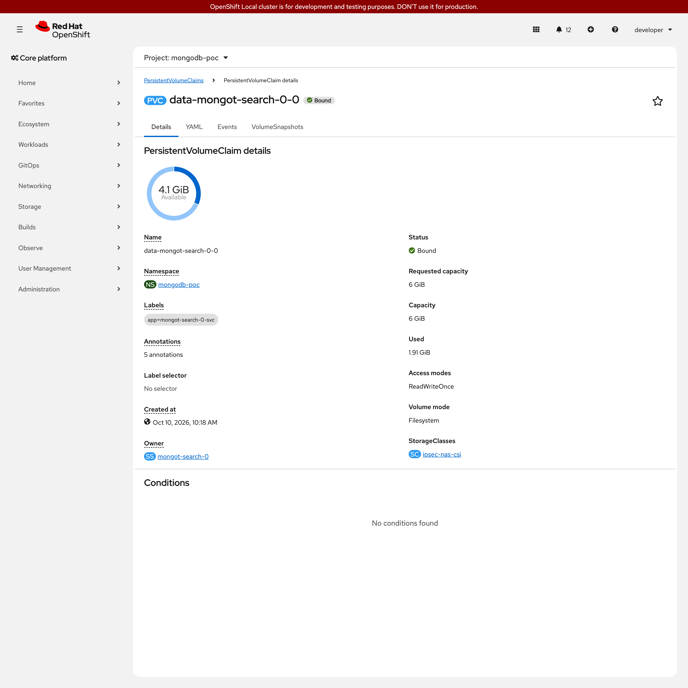
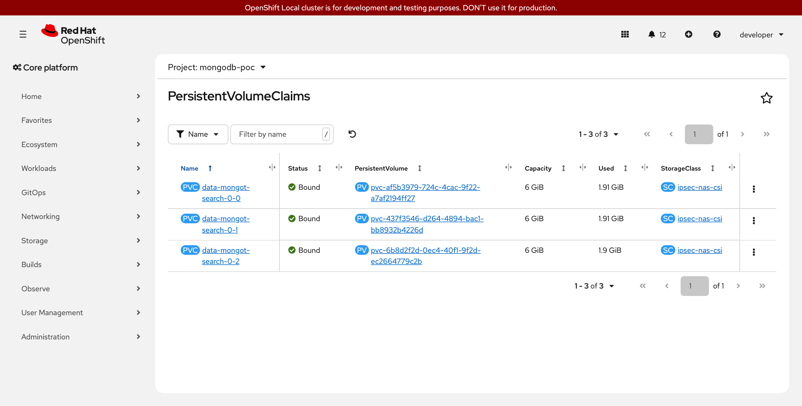
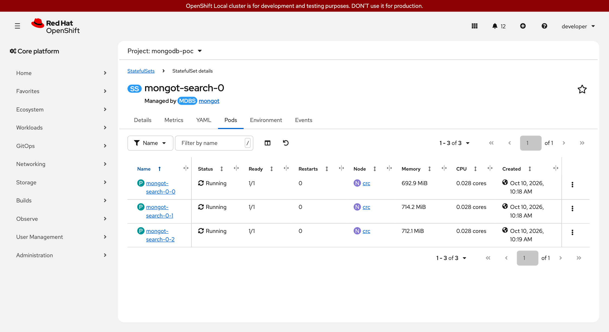
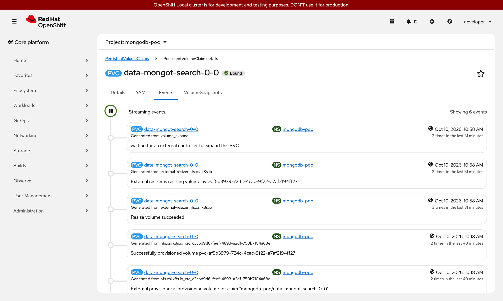
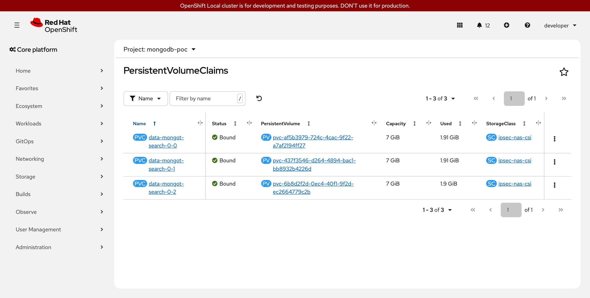
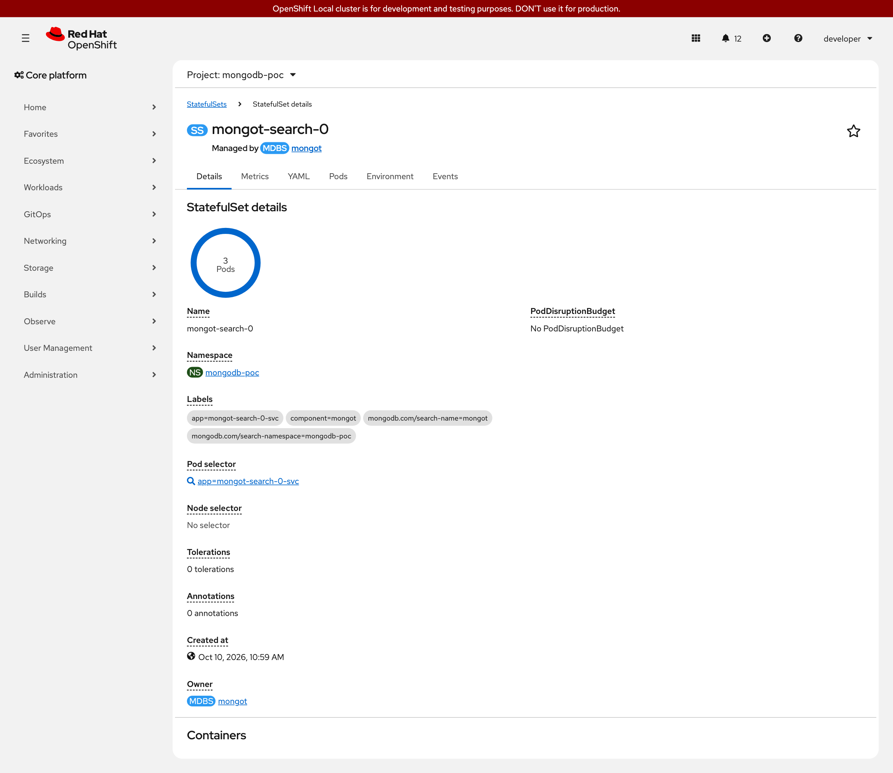
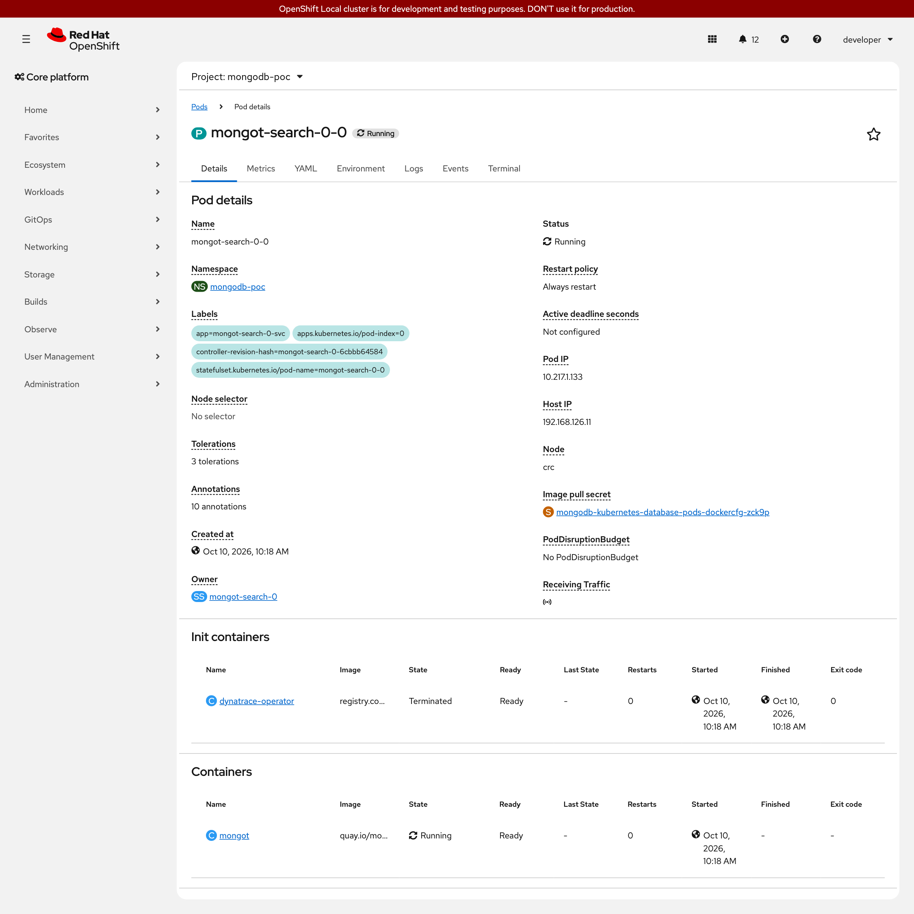

# Testing a mongot storage resize

One resize of mongot's volumes, from 6Gi to 7Gi, run on the lab on 2026-10-10 from start to finish: every command
with what it printed, and the OpenShift console at each stage. It follows
[volume-expansion-runbook.md](../chart/mongodb-search-helm/volume-expansion-runbook.md) in the order of that
runbook, and every step by hand was done with the chart's script,
[expand-mongot-volumes.sh](../chart/mongodb-search-helm/expand-mongot-volumes.sh). No claim was patched and no
StatefulSet was deleted by a command typed by hand.

## The result

- The three claims went from 6Gi to 7Gi, and the StatefulSet and the MongoDBSearch name 7Gi.
- **No mongot pod was restarted**: the same three pods, started at 15:18Z, with 0 restarts, before and after.
- **The same three claims and volumes**, before and after.
- **Searches were answered throughout**: 42 searches through mongod, one every 5 to 6 s from the push to the end,
  each with its 8 results.
- From the push of the new size to the sync passing: 3 min 36 s, the pictures included.

## The setup

| | |
| --- | --- |
| Cluster | OpenShift Local 4.22.7, namespace `mongodb-poc` |
| Search | Chart `mongodb-search-helm` 0.3.19, operator MongoDB Controllers for Kubernetes 1.13.0, mongot 1.70.1, three mongot pods |
| Managed by | Argo CD (OpenShift GitOps 1.22.0), the Application `mongodb-search` with automated sync, following a branch of this repository |
| Storage class | `ipsec-nas-csi`: NFS, driver `nfs.csi.k8s.io` (csi-driver-nfs 4.13.4 with csi-resizer 2.2.0), `allowVolumeExpansion: true` |
| Commands | As a cluster administrator |
| Pictures | The console as the lab's `developer` user, who can only view the namespace. The console shows local time, five hours behind the UTC of the commands: 10:58 AM is 15:58Z |

```bash
export TargetNamespace=mongodb-poc
X=chart/mongodb-search-helm/expand-mongot-volumes.sh
```

The script was run with `--yes`, which skips typing the namespace back. On a real cluster leave it out.

## The order

| # | Step | Done by |
| --- | --- | --- |
| 0 | Check before starting | The script, `--check` |
| 1 | The new size in the values, in git | A commit |
| 2 | Argo CD syncs: the MongoDBSearch asks for the new size, and the sync stops at the chart's gate | Argo CD |
| 3 | Grow each claim, one pod at a time | The script, `--expand` |
| 4 | Make the StatefulSet again, leaving its pods and claims | The script, `--recreate-statefulset` |
| 5 | The sync passes | Argo CD |
| 6 | Check after | The script, `--check` |

## 0. Before

```console
$ date -u +%H:%M:%SZ
15:56:24Z
$ bash $X --check --statefulset mongot-search-0
namespace mongodb-poc, on https://api.crc.testing:6443 as kubeadmin
StatefulSet mongot-search-0: 3 of 3 pods ready, volume claim template data at 6Gi
MongoDBSearch mongot: asks for 6Gi, is Running
  pod 0: claim data-mongot-search-0-0 Bound, asks 6Gi, has 6Gi, class ipsec-nas-csi (expands: true), conditions [], pod Ready
         volume pvc-af5b3979-724c-4cac-9f22-a7af2194ff27, reclaim policy Delete; the pod's file system: 9.8G at /mongot/data, 20% used
  pod 1: claim data-mongot-search-0-1 Bound, asks 6Gi, has 6Gi, class ipsec-nas-csi (expands: true), conditions [], pod Ready
         volume pvc-437f3546-d264-4894-bac1-bb8932b4226d, reclaim policy Delete; the pod's file system: 9.8G at /mongot/data, 20% used
  pod 2: claim data-mongot-search-0-2 Bound, asks 6Gi, has 6Gi, class ipsec-nas-csi (expands: true), conditions [], pod Ready
         volume pvc-6b8d2f2d-0ec4-40f1-9f2d-ec2664779c2b, reclaim policy Delete; the pod's file system: 9.8G at /mongot/data, 20% used
$ oc get pvc -n mongodb-poc
NAME                     STATUS   VOLUME                                     CAPACITY   ACCESS MODES   STORAGECLASS    VOLUMEATTRIBUTESCLASS   AGE
data-mongot-search-0-0   Bound    pvc-af5b3979-724c-4cac-9f22-a7af2194ff27   6Gi        RWO            ipsec-nas-csi   <unset>                 38m
data-mongot-search-0-1   Bound    pvc-437f3546-d264-4894-bac1-bb8932b4226d   6Gi        RWO            ipsec-nas-csi   <unset>                 37m
data-mongot-search-0-2   Bound    pvc-6b8d2f2d-0ec4-40f1-9f2d-ec2664779c2b   6Gi        RWO            ipsec-nas-csi   <unset>                 37m
$ oc get pods -n mongodb-poc -l app=mongot-search-0-svc -o wide
NAME                READY   STATUS    RESTARTS   AGE   IP             NODE   NOMINATED NODE   READINESS GATES
mongot-search-0-0   1/1     Running   0          38m   10.217.1.133   crc    <none>           <none>
mongot-search-0-1   1/1     Running   0          37m   10.217.1.135   crc    <none>           <none>
mongot-search-0-2   1/1     Running   0          37m   10.217.1.136   crc    <none>           <none>
$ oc get statefulset mongot-search-0 -n mongodb-poc -o custom-columns='NAME:.metadata.name,READY:.status.readyReplicas,CREATED:.metadata.creationTimestamp,UID:.metadata.uid,TEMPLATE-SIZE:.spec.volumeClaimTemplates[0].spec.resources.requests.storage'
NAME              READY   CREATED                UID                                    TEMPLATE-SIZE
mongot-search-0   3       2026-10-10T15:44:42Z   12dc0dba-48e9-4406-ab17-9663c87a253d   6Gi
```

Every line of the check holds what the runbook asks for: three of three pods ready, the resource `Running`, the
class expands, no resize under way.

<!-- markdownlint-disable MD033 -->

<!-- markdownlint-enable MD033 -->

*The claim of pod 0 before: requested 6 GiB, capacity 6 GiB.*

<!-- markdownlint-disable MD033 -->

<!-- markdownlint-enable MD033 -->

*Pod 0 before: created 10:18 AM, 0 restarts.*

<!-- markdownlint-disable MD033 -->

<!-- markdownlint-enable MD033 -->

*The three claims before: 6 GiB each.*

<!-- markdownlint-disable MD033 -->

<!-- markdownlint-enable MD033 -->

*The StatefulSet before: created 10:44 AM.*

## 1. The new size in git

One line of the lab's values file, and nothing else in the same commit:

```console
$ git diff -U1 -- chart/mongodb-search-helm/examples/values-crc.yaml
+++ b/chart/mongodb-search-helm/examples/values-crc.yaml
@@ -9,3 +9,3 @@ search:
   persistence:
-    storage: 6Gi
+    storage: 7Gi
     storageClass: ipsec-nas-csi
$ git log --oneline -1
2537923 TEST ONLY (issue #108): the lab's mongot volumes from 6Gi to 7Gi
$ date -u +%H:%M:%SZ
15:57:06Z
```

## 2. Argo CD syncs, and stops at the gate

Argo CD began the sync by itself at 15:57:08Z. The MongoDBSearch took the new size and read `Failed`: the operator
cannot change the size in a StatefulSet that exists. The chart's gate then stopped the sync and said what to do.
**This is the expected state, not a fault**: the pods run and answer.

```console
$ date -u +%H:%M:%SZ
15:58:01Z
$ oc logs -n mongodb-poc job/mongot-mongodb-search-helm-wait | tail -3
[wait] STOPPED: search.persistence.storage is now 7Gi and the StatefulSet mongot-search-0 still has 6Gi.
[wait] Nothing is broken: the mongot pods run and answer as before. The operator cannot change the size of a running StatefulSet.
[wait] Next: volume-expansion-runbook.md in the chart, from "After the sync". Then sync or upgrade again, and this gate passes.
$ oc get application mongodb-search -n openshift-gitops -o jsonpath='{.status.sync.status} {.status.health.status} | {.status.operationState.phase}: {.status.operationState.message}'
Synced Healthy | Running: one or more synchronization tasks completed unsuccessfully. Retrying attempt #1 at 3:58PM.
$ oc get mongodbsearch mongot -n mongodb-poc
NAME     PHASE    VERSION   LOADBALANCER   METRICSFORWARDER   AGE
mongot   Failed   1.70.1    Running        Running            39m
$ oc get mongodbsearch mongot -n mongodb-poc -o jsonpath='{.status.message}'
1 error occurred:
	* error creating/updating search statefulset mongodb-poc/mongot-search-0: StatefulSet.apps "mongot-search-0" is invalid: spec: Forbidden: updates to statefulset spec for fields other than 'replicas', 'ordinals', 'template', 'updateStrategy', 'revisionHistoryLimit', 'persistentVolumeClaimRetentionPolicy' and 'minReadySeconds' are forbidden
$ oc get pvc -n mongodb-poc
NAME                     STATUS   VOLUME                                     CAPACITY   ACCESS MODES   STORAGECLASS    VOLUMEATTRIBUTESCLASS   AGE
data-mongot-search-0-0   Bound    pvc-af5b3979-724c-4cac-9f22-a7af2194ff27   6Gi        RWO            ipsec-nas-csi   <unset>                 39m
data-mongot-search-0-1   Bound    pvc-437f3546-d264-4894-bac1-bb8932b4226d   6Gi        RWO            ipsec-nas-csi   <unset>                 39m
data-mongot-search-0-2   Bound    pvc-6b8d2f2d-0ec4-40f1-9f2d-ec2664779c2b   6Gi        RWO            ipsec-nas-csi   <unset>                 38m
$ oc get pods -n mongodb-poc -l app=mongot-search-0-svc
NAME                READY   STATUS    RESTARTS   AGE
mongot-search-0-0   1/1     Running   0          39m
mongot-search-0-1   1/1     Running   0          39m
mongot-search-0-2   1/1     Running   0          38m
```

The Application reads `Synced` and `Healthy` here while its sync is failing: read the operation, as above. With
automated sync Argo CD tries the failed sync again by itself, five times over about 11 minutes.

<!-- markdownlint-disable MD033 -->

<!-- markdownlint-enable MD033 -->

*The pods while the resource reads Failed: all three running, 0 restarts.*

## 3. Grow the claims, with the script

First what it would do, changing nothing; then pod 0 alone:

```console
$ date -u +%H:%M:%SZ
15:58:26Z
$ bash $X --expand --statefulset mongot-search-0 --dry-run
pod 0: would ask claim data-mongot-search-0-0 for 7Gi (it asks 6Gi, has 6Gi; class ipsec-nas-csi expands):
    oc patch persistentvolumeclaim data-mongot-search-0-0 -n mongodb-poc --type=merge -p '{"spec":{"resources":{"requests":{"storage":"7Gi"}}}}'
  and would wait up to 900 s for its capacity, and for pod mongot-search-0-0 to be Ready
pod 1: would ask claim data-mongot-search-0-1 for 7Gi (it asks 6Gi, has 6Gi; class ipsec-nas-csi expands):
    oc patch persistentvolumeclaim data-mongot-search-0-1 -n mongodb-poc --type=merge -p '{"spec":{"resources":{"requests":{"storage":"7Gi"}}}}'
  and would wait up to 900 s for its capacity, and for pod mongot-search-0-1 to be Ready
pod 2: would ask claim data-mongot-search-0-2 for 7Gi (it asks 6Gi, has 6Gi; class ipsec-nas-csi expands):
    oc patch persistentvolumeclaim data-mongot-search-0-2 -n mongodb-poc --type=merge -p '{"spec":{"resources":{"requests":{"storage":"7Gi"}}}}'
  and would wait up to 900 s for its capacity, and for pod mongot-search-0-2 to be Ready
dry run: nothing was changed
$ bash $X --expand --statefulset mongot-search-0 --pod 0 --apply --yes
About to grow the volume claims of StatefulSet mongot-search-0, pod 0 to 0, to 7Gi, one at a time.
  cluster https://api.crc.testing:6443, as kubeadmin, namespace mongodb-poc
pod 0: asking claim data-mongot-search-0-0 for 7Gi (it asks 6Gi, has 6Gi)
  data-mongot-search-0-0: has 7Gi
pod 0: claim data-mongot-search-0-0 has 7Gi, pod mongot-search-0-0 is Ready; the pod's file system: 9.8G at /mongot/data, 20% used
done. When every claim of mongot-search-0 has 7Gi and the values ask for it: --recreate-statefulset
$ date -u +%H:%M:%SZ
15:58:31Z
$ oc get pvc -n mongodb-poc
NAME                     STATUS   VOLUME                                     CAPACITY   ACCESS MODES   STORAGECLASS    VOLUMEATTRIBUTESCLASS   AGE
data-mongot-search-0-0   Bound    pvc-af5b3979-724c-4cac-9f22-a7af2194ff27   7Gi        RWO            ipsec-nas-csi   <unset>                 40m
data-mongot-search-0-1   Bound    pvc-437f3546-d264-4894-bac1-bb8932b4226d   6Gi        RWO            ipsec-nas-csi   <unset>                 39m
data-mongot-search-0-2   Bound    pvc-6b8d2f2d-0ec4-40f1-9f2d-ec2664779c2b   6Gi        RWO            ipsec-nas-csi   <unset>                 39m
$ oc get events -n mongodb-poc --field-selector involvedObject.name=data-mongot-search-0-0,involvedObject.kind=PersistentVolumeClaim | grep -i resiz
LAST SEEN              COUNT   TYPE     REASON                   MESSAGE
2026-10-10T15:58:31Z   3       Normal   Resizing                 External resizer is resizing volume pvc-af5b3979-724c-4cac-9f22-a7af2194ff27
2026-10-10T15:58:31Z   3       Normal   VolumeResizeSuccessful   Resize volume succeeded
$ oc exec mongot-search-0-0 -n mongodb-poc -c mongot -- df -h /mongot/data
Filesystem                                                        Size  Used Avail Use% Mounted on
192.168.64.8:/export/csi/mongodb-poc/data-mongot-search-0-0/data  9.8G  2.0G  7.9G  20% /mongot/data
```

The claim had 7Gi at the script's first look after asking, with the events `Resizing` and `VolumeResizeSuccessful`
in the same second. Their count of 3 is this claim's three resizes that hour; this one is the third.

<!-- markdownlint-disable MD033 -->

<!-- markdownlint-enable MD033 -->

*The claim of pod 0 after `--expand --pod 0`: requested 7 GiB, capacity 7 GiB, the same claim.*

<!-- markdownlint-disable MD033 -->

<!-- markdownlint-enable MD033 -->

*The claim's events: the resizer took the request and reported success at 10:58 AM.*

<!-- markdownlint-disable MD033 -->

<!-- markdownlint-enable MD033 -->

*Mid-way: one claim at 7 GiB, two still at 6 GiB. One volume at a time.*

Then the other two. The script skips the claim that is done:

```console
$ date -u +%H:%M:%SZ
15:59:04Z
$ bash $X --expand --statefulset mongot-search-0 --apply --yes
About to grow the volume claims of StatefulSet mongot-search-0, pod 0 to 2, to 7Gi, one at a time.
  cluster https://api.crc.testing:6443, as kubeadmin, namespace mongodb-poc
pod 0: claim data-mongot-search-0-0 has 7Gi already: nothing to do
pod 1: asking claim data-mongot-search-0-1 for 7Gi (it asks 6Gi, has 6Gi)
  data-mongot-search-0-1: has 7Gi
pod 1: claim data-mongot-search-0-1 has 7Gi, pod mongot-search-0-1 is Ready; the pod's file system: 9.8G at /mongot/data, 20% used
pod 2: asking claim data-mongot-search-0-2 for 7Gi (it asks 6Gi, has 6Gi)
  data-mongot-search-0-2: has 7Gi
pod 2: claim data-mongot-search-0-2 has 7Gi, pod mongot-search-0-2 is Ready; the pod's file system: 9.8G at /mongot/data, 20% used
done. When every claim of mongot-search-0 has 7Gi and the values ask for it: --recreate-statefulset
$ oc get pvc -n mongodb-poc
NAME                     STATUS   VOLUME                                     CAPACITY   ACCESS MODES   STORAGECLASS    VOLUMEATTRIBUTESCLASS   AGE
data-mongot-search-0-0   Bound    pvc-af5b3979-724c-4cac-9f22-a7af2194ff27   7Gi        RWO            ipsec-nas-csi   <unset>                 40m
data-mongot-search-0-1   Bound    pvc-437f3546-d264-4894-bac1-bb8932b4226d   7Gi        RWO            ipsec-nas-csi   <unset>                 40m
data-mongot-search-0-2   Bound    pvc-6b8d2f2d-0ec4-40f1-9f2d-ec2664779c2b   7Gi        RWO            ipsec-nas-csi   <unset>                 39m
```

<!-- markdownlint-disable MD033 -->

<!-- markdownlint-enable MD033 -->

*All three claims at 7 GiB, on the same volumes.*

## 4. Make the StatefulSet again, with the script

The claims have 7Gi; the StatefulSet's template still says 6Gi, and Kubernetes does not let that field change. So
the StatefulSet object is deleted with `--cascade=orphan`, which leaves its pods and claims, and the operator
makes it again at 7Gi. The script does the one delete, and compares the pods and claims with what they were:

```console
$ date -u +%H:%M:%SZ
15:59:17Z
$ oc get application mongodb-search -n openshift-gitops -o jsonpath='{.status.operationState.phase}: {.status.operationState.message}'
Running: one or more synchronization tasks completed unsuccessfully. Retrying attempt #2 at 3:59PM.
$ bash $X --recreate-statefulset --statefulset mongot-search-0 --dry-run
would delete StatefulSet mongot-search-0 and leave its pods and claims (the operator makes it again at 7Gi):
    oc delete statefulset mongot-search-0 -n mongodb-poc --cascade=orphan
dry run: nothing was changed
$ bash $X --recreate-statefulset --statefulset mongot-search-0 --apply --yes
About to delete StatefulSet mongot-search-0 with --cascade=orphan. Its 3 pods and their claims stay; the operator makes the StatefulSet again at 7Gi.
  cluster https://api.crc.testing:6443, as kubeadmin, namespace mongodb-poc
StatefulSet mongot-search-0 was made again at 7Gi; MongoDBSearch mongot is Running
the pods are the same pods: none was restarted
the volume claims are the same claims
done. Sync or upgrade the chart again: its gate passes now
$ date -u +%H:%M:%SZ
15:59:20Z
$ oc get statefulset mongot-search-0 -n mongodb-poc -o custom-columns='NAME:.metadata.name,READY:.status.readyReplicas,CREATED:.metadata.creationTimestamp,UID:.metadata.uid,TEMPLATE-SIZE:.spec.volumeClaimTemplates[0].spec.resources.requests.storage'
NAME              READY   CREATED                UID                                    TEMPLATE-SIZE
mongot-search-0   3       2026-10-10T15:59:20Z   979d54f6-41f2-4dfa-973a-df3557484e20   7Gi
$ oc get mongodbsearch mongot -n mongodb-poc
NAME     PHASE     VERSION   LOADBALANCER   METRICSFORWARDER   AGE
mongot   Running   1.70.1    Running        Running            40m
$ oc get pods -n mongodb-poc -l app=mongot-search-0-svc
NAME                READY   STATUS    RESTARTS   AGE
mongot-search-0-0   1/1     Running   0          40m
mongot-search-0-1   1/1     Running   0          40m
mongot-search-0-2   1/1     Running   0          40m
```

The dry run and the real run together took 3 seconds. The StatefulSet is a new object (a new uid, created
15:59:20Z); the pods are not.

<!-- markdownlint-disable MD033 -->

<!-- markdownlint-enable MD033 -->

*The StatefulSet after: created 10:59 AM, where it read 10:44 AM before. 3 pods.*

<!-- markdownlint-disable MD033 -->

<!-- markdownlint-enable MD033 -->

*Its pods: the same three, created 10:18 and 10:19 AM, 0 restarts. They are older than the StatefulSet that owns them.*

## 5. The sync passes

Argo CD's second retry was running when step 4 ended. It reached the gate, which passed. No sync by hand:

```console
$ oc get application mongodb-search -n openshift-gitops -o jsonpath='{.status.sync.status} {.status.health.status} | {.status.operationState.phase}: {.status.operationState.message} | {.status.operationState.startedAt} to {.status.operationState.finishedAt}, retries {.status.operationState.retryCount}'
Synced Healthy | Succeeded: successfully synced (no more tasks) | 2026-10-10T15:57:08Z to 2026-10-10T16:00:42Z, retries 2
```

When the steps by hand take longer than Argo CD's five retries, the operation ends as `Failed` and Argo CD does
not try again by itself: step 5 is then one sync by hand. That was run earlier the same day, and passed in 63 s
([argocd.md](../chart/mongodb-search-helm/argocd.md), "Growing the volumes to the end").

## 6. After

```console
$ bash $X --check --statefulset mongot-search-0
namespace mongodb-poc, on https://api.crc.testing:6443 as kubeadmin
StatefulSet mongot-search-0: 3 of 3 pods ready, volume claim template data at 7Gi
MongoDBSearch mongot: asks for 7Gi, is Running
  pod 0: claim data-mongot-search-0-0 Bound, asks 7Gi, has 7Gi, class ipsec-nas-csi (expands: true), conditions [], pod Ready
         volume pvc-af5b3979-724c-4cac-9f22-a7af2194ff27, reclaim policy Delete; the pod's file system: 9.8G at /mongot/data, 20% used
  pod 1: claim data-mongot-search-0-1 Bound, asks 7Gi, has 7Gi, class ipsec-nas-csi (expands: true), conditions [], pod Ready
         volume pvc-437f3546-d264-4894-bac1-bb8932b4226d, reclaim policy Delete; the pod's file system: 9.8G at /mongot/data, 20% used
  pod 2: claim data-mongot-search-0-2 Bound, asks 7Gi, has 7Gi, class ipsec-nas-csi (expands: true), conditions [], pod Ready
         volume pvc-6b8d2f2d-0ec4-40f1-9f2d-ec2664779c2b, reclaim policy Delete; the pod's file system: 9.8G at /mongot/data, 20% used
$ oc get pods -n mongodb-poc -l app=mongot-search-0-svc -o custom-columns=NAME:.metadata.name,UID:.metadata.uid,STARTED:.status.startTime,RESTARTS:.status.containerStatuses[0].restartCount
NAME                UID                                    STARTED                RESTARTS
mongot-search-0-0   1931f502-6ed1-4942-8deb-cb9a37ad7aec   2026-10-10T15:18:29Z   0
mongot-search-0-1   818d0d88-173b-4ac7-a960-9a696fbf375d   2026-10-10T15:18:53Z   0
mongot-search-0-2   0be7090d-9f73-4b4e-8daa-f74d151b9120   2026-10-10T15:19:17Z   0
$ bash test/run.sh search | tail -1
  15 passed   0 failed   0 skipped
```

The pods' uids and start times are those of the first install on this class, 40 minutes before.

<!-- markdownlint-disable MD033 -->

<!-- markdownlint-enable MD033 -->

*Pod 0 after: still created 10:18 AM, still 0 restarts.*

## What this test does not show

The lab's class is NFS: a claim there is a directory of one export, and its size is a number.

- **The file system did not grow.** The pods read `9.8G` at `/mongot/data`, 20% used, before and after: that is
  the NAS export. The driver's answer to a resize is the size it was asked for and nothing else. In the console,
  "Used 1.91 GiB" is the export's use too.
- **So it does not show a disk growing**, as on vSphere: the time that takes, a claim that waits for its pod to be
  started again (`FileSystemResizePending`), a resize that fails, or *Data volume used* falling on the dashboard.
  The runbook says what to do for each; none of them was seen here.
- **The lab's indexes are 16 MiB a pod.** Nothing here measures a cluster with 180 GB of them.

What it does show holds on any class: the order of the steps, the gate stopping the sync and saying why, the
script growing one claim at a time and refusing what is unsafe, the StatefulSet made again around pods that keep
running, and Argo CD passing the same sync afterwards.

## The other runs that day

Two more resizes were run on the same search before this one, 4Gi to 5Gi and 5Gi to 6Gi, the second with the
claims grown before the values and with Argo CD's retries left to run out. They are in the runbook's last table,
[What was run, and where](../chart/mongodb-search-helm/volume-expansion-runbook.md#what-was-run-and-where).
