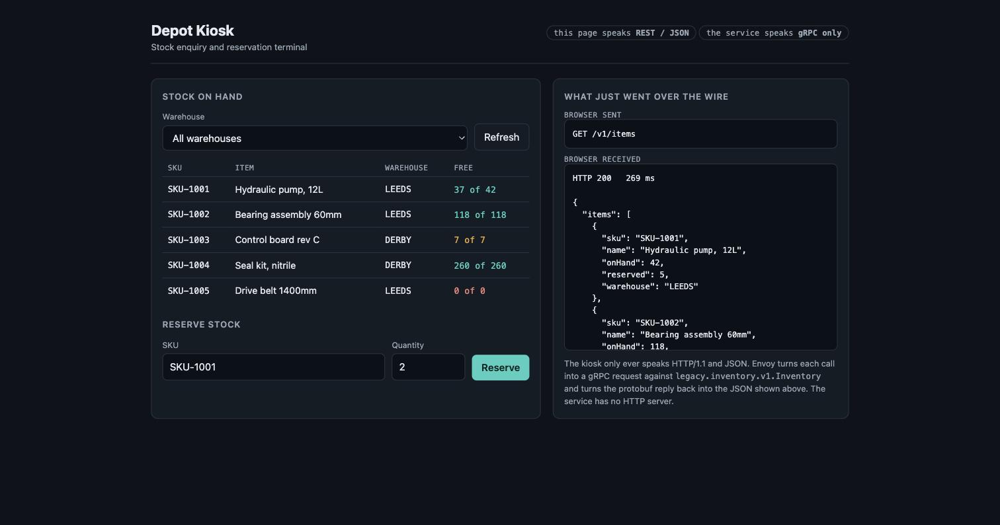
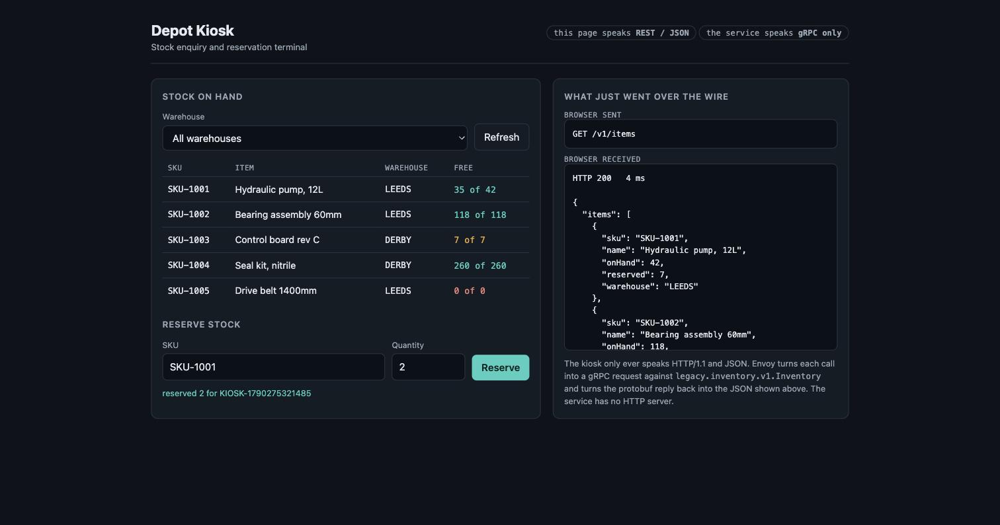

# Modernising a gRPC-only service with Envoy

A service that speaks **gRPC and nothing else** — no HTTP server, no JSON, no CORS — made
reachable from a browser, **without changing a line of it**. Envoy sits in front as its own
Deployment and synthesises the modern interface from the service's own `.proto`.

This is the same shape as the `mongot` deployment in this repository: Envoy as a separate
Deployment rather than a sidecar. The difference is that this one is yours — you choose the
version and the filter chain, rather than the operator choosing for you.

```text
  +--------------------------------------------------------------+
  | kiosk  -  a browser page                                      |
  | speaks HTTP/1.1 and JSON only                                 |
  | GET /v1/items    POST /v1/items/{sku}:reserve                 |
  +--------------------------------------------------------------+
                                  |
                                  v
  +--------------------------------------------------------------+
  | Envoy  -  its own Deployment, config from a ConfigMap         |   <-- you own this
  | cors -> grpc_web -> grpc_json_transcoder -> router            |
  | reads inventory.pb and builds the REST surface from it        |
  +--------------------------------------------------------------+
                                  |
                                  v
  +--------------------------------------------------------------+
  | inventory  -  gRPC only                                       |
  | legacy.inventory.v1.Inventory on :50051                       |
  | no HTTP server, no JSON, no CORS, no web anything             |
  +--------------------------------------------------------------+
```

## What it proves



The badges are the whole point: the page speaks REST/JSON, the service speaks gRPC only, and
the right-hand panel shows exactly what crossed the wire. Reserving stock mutates real state
on the gRPC service:



`reserved 2 for KIOSK-...`, and SKU-1001 drops from 37 free to 35.

## Run it

```bash
./demo.sh deploy     # namespace, ConfigMaps, three Deployments, the Route
./demo.sh test       # exercise every endpoint through Envoy
./demo.sh url        # print the kiosk URL
./demo.sh clean      # delete the namespace
```

Measured on CRC 4.22:

```text
GET  /v1/items                      -> ListItems     200, five items
GET  /v1/items/SKU-1003             -> GetItem       200, path parameter bound to sku
GET  /v1/items?warehouse=DERBY      -> ListItems     200, query parameter bound to warehouse
POST /v1/items/SKU-1001:reserve     -> ReserveStock  200, JSON body bound to the message
GET  /v1/items/NOPE                 -> GetItem       404, from gRPC NOT_FOUND

what the service logged:
  ListItems warehouse='' page_size=0
  GetItem sku=SKU-1003
  ListItems warehouse='DERBY' page_size=0
  ReserveStock sku=SKU-1001 qty=5 order=CURL-001
  GetItem sku=NOPE
```

Only gRPC method calls. The service never saw a URL, a query string or a JSON body.

## How the REST surface is defined

Entirely in the proto. The service code never reads these annotations — Envoy does:

```protobuf
service Inventory {
  rpc GetItem (GetItemRequest) returns (Item) {
    option (google.api.http) = { get: "/v1/items/{sku}" };
  }
  rpc ReserveStock (ReserveStockRequest) returns (ReserveStockResponse) {
    option (google.api.http) = { post: "/v1/items/{sku}:reserve" body: "*" };
  }
}
```

Envoy needs these compiled into a descriptor set, which is what it actually reads:

```bash
python -m grpc_tools.protoc -Iproto \
  --include_imports --include_source_info \
  --descriptor_set_out=proto/inventory.pb \
  --python_out=app --grpc_python_out=app \
  proto/inventory.proto
```

`--include_imports` is not optional: without it the descriptor lacks
`google/api/annotations.proto` and Envoy rejects the config.

## Three things that will catch you

**Route on the gRPC path, not the REST path.** `grpc_json_transcoder` rewrites the request
*before* the router picks a route. `GET /v1/items` becomes
`POST /legacy.inventory.v1.Inventory/ListItems`, so a route matching `/v1/` never fires. The
first version of this demo routed everything to the kiosk and returned
`501 Unsupported method ('POST')` from a Python static file server — which is a confusing way
to discover it. Match `/legacy.inventory.v1.Inventory/` instead.

**The upstream cluster must be HTTP/2.** gRPC is HTTP/2. Leave
`http2_protocol_options` off the cluster and Envoy speaks HTTP/1.1 upstream and every call
fails.

**pip cannot write `/.local` on OpenShift.** Containers run with a random UID and no writable
home, so a plain `pip install` fails with `Permission denied: '/.local'`. Install with
`--target` into an `emptyDir` and put it on `PYTHONPATH`.

## What Envoy adds here, and what it does not

| Added by Envoy | How |
|---|---|
| REST + JSON | `grpc_json_transcoder`, driven by the proto's `google.api.http` options |
| Browser access | `grpc_web`, for clients that want gRPC-Web rather than REST |
| CORS | `cors` filter, needed only if the page is served from another origin |
| Load balancing | `STRICT_DNS` + `ROUND_ROBIN` across backend replicas |
| One TLS edge | the OpenShift Route terminates; the backend stays plaintext inside the cluster |

It does **not** add authentication, rate limiting or observability to your service by magic —
those are further filters you would choose deliberately. And it cannot invent an API: the REST
surface exists only because the proto describes it.

## Layout

| Path | What |
|---|---|
| `proto/inventory.proto` | the service contract, including the HTTP mapping |
| `proto/inventory.pb` | compiled descriptor set, what Envoy actually reads |
| `app/server.py` | the gRPC-only service |
| `kiosk/index.html` | the browser front end, REST and JSON only |
| `manifests/10-inventory.yaml` | layer 1, the backend |
| `manifests/20-envoy-config.yaml` | Envoy's whole configuration |
| `manifests/30-envoy.yaml` | layer 2, Envoy as its own Deployment |
| `manifests/40-kiosk.yaml` | layer 3, the kiosk, and the Route |
| `demo.sh` | deploy, test, url, clean |

Nothing is built or pushed: both images (`python:3.12-slim`, `envoyproxy/envoy:v1.39-latest`)
are public, and all source ships in ConfigMaps — the same pattern as the search GUI in the
parent repository.
